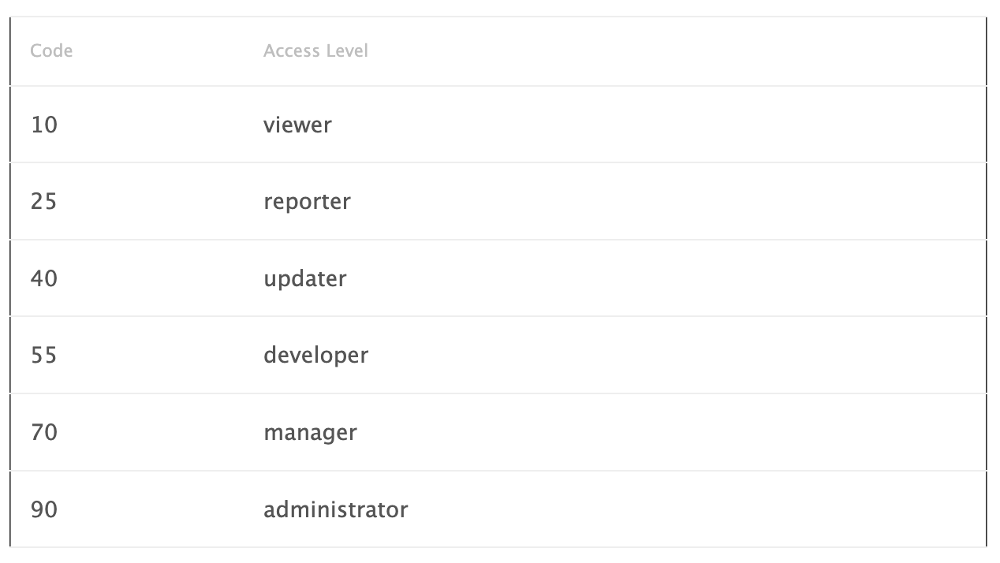

# Access Levels

In some cases it is required to type in access level codes in the configuration page. Following is a table that provides a mapping of the access levels to their codes:

For features that use a threshold to enable them, you can set the threshold to 0 to enable the feature for everyone or 100 to disable the feature for everyone.