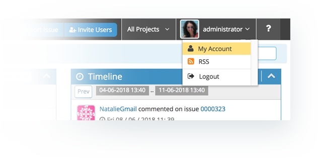
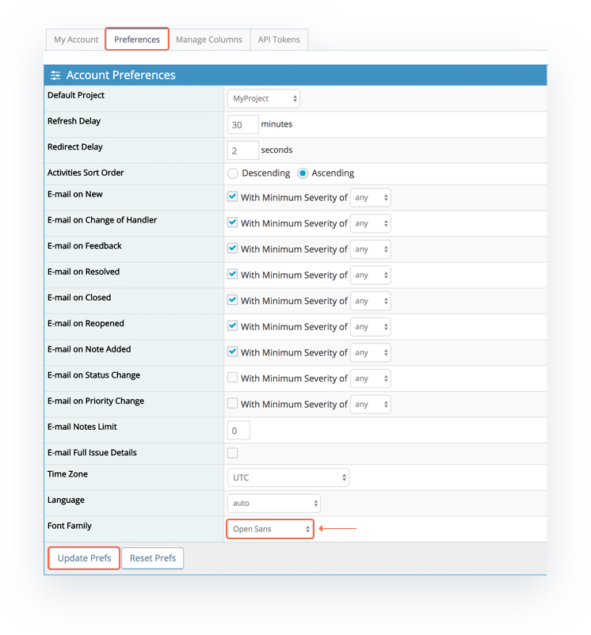
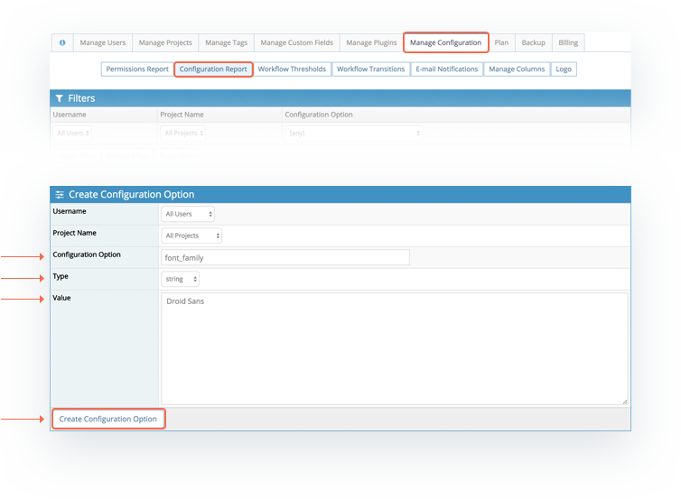
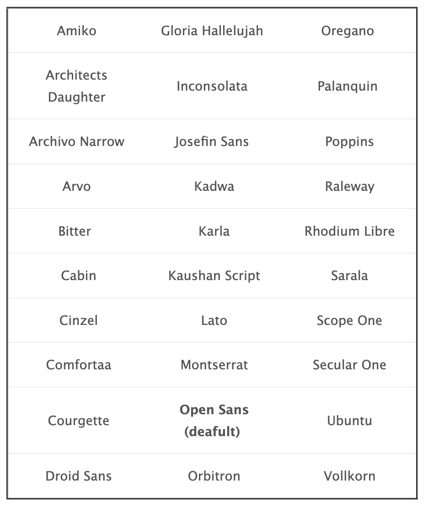

# Changing Font

The default font used in MantisHub instances is 'Open Sans' but you can change this either within your personal preferences or set the default across the whole system using config options. 

**Personal Preferences**

To adjust your personal account font setting, click on your username in the top right and select *My Account* from the dropdown list.

Then select the preferences tab and scroll down to the Font Family field. Select the desired font from the list provided and click Update preferences. 

**System Setting**

You can also set the default font for all user accounts. However, do note that if a user has set their personal preference this will override the system setting for their account.

To change the default font, just head to *Manage - Manage Configuration - Configuration Report* and create a new configuration option as below:

**Username:** *All Users*

**Projects:** *All Projects*

**Configuration Option:** *font_family*

**Type:** *string* 

**Value:** *< choose from fonts listed below >*

**Font Choices**

