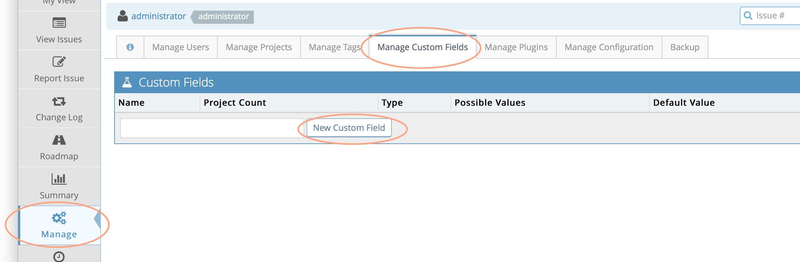
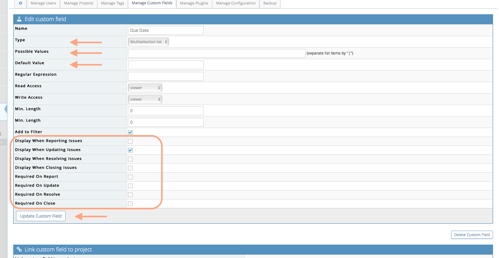
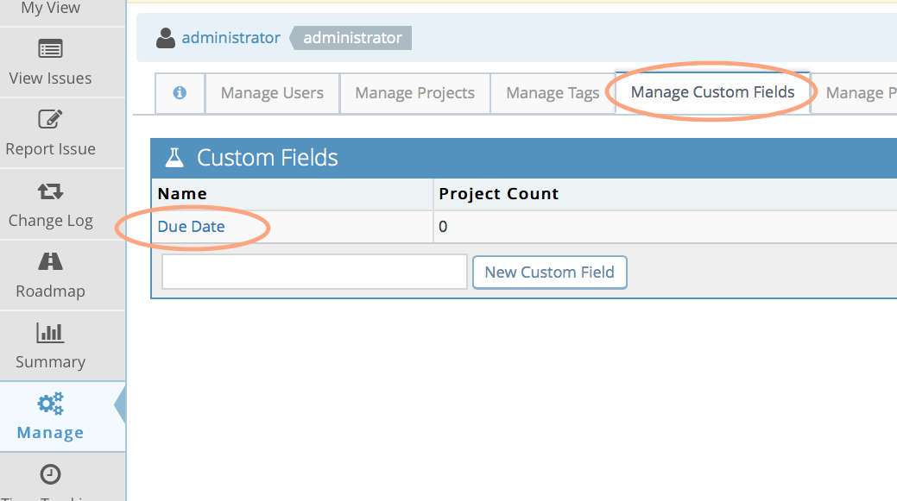
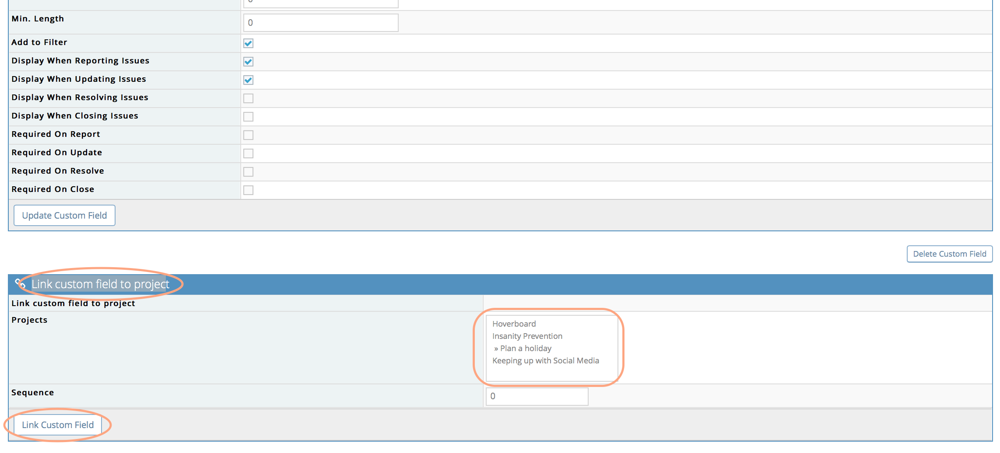
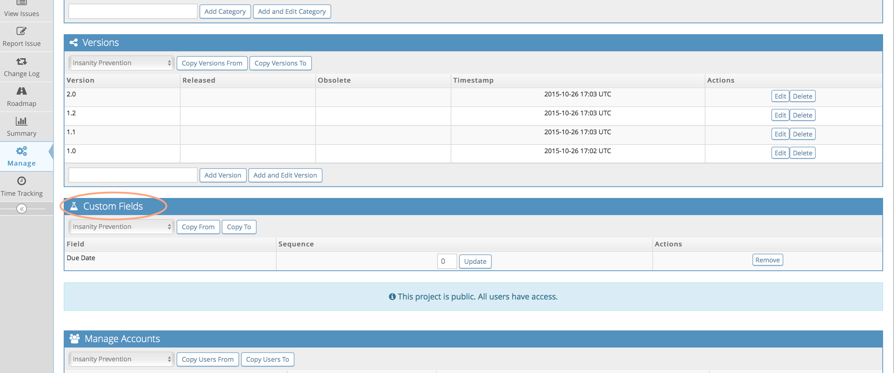

# Adding Custom Fields

The process of adding custom fields includes first defining the custom field and then linking it to the appropriate projects.
To create a custom field go to your Manage page and select the 'Manage Custom Fields' tab. Enter the field name and click 'New Custom Field'.

You need to select a type for the field from the drop down list (e.g. date, string, list etc).

For custom field types that allow selection from a set of values, you need to define 'Possible Values'. Use the ‘|’ character to separate the different values. 

You can also reference your versions and categories fields as possible values of a custom field. When defining your custom field. Within the 'Possible Values' setting, you can define the following options:

- *'=users'* will list users with access to the project + empty/none option
- *'=handlers'* will list users with access to be assigned issues in the project + empty/none option
- *'=versions'* will lists all non-obsolete versions
- *'=released_versions'* will list all released versions
- *'=future_versions'* will list all non-released, non-obsolete versions
- *'=categories'* will use your list of categories. Great for defining a sub-category. 

Custom field types that allow possible value lists include: enumeration, checkbox, list, multi-selection list, and radio.

The 'Default Value' definition allows the custom field to have a suitable default value based on the field type. In most cases, it is a simple value like a string, a number, or a value from the list of possible values. However, for the Date type, the possible values can include values like: {today}, {tomorrow}, {+3 days}, {-7 days}, {next week}, {15 December 2013}, etc. Basically any format understood by PHP's [strftim()](http://us2.php.net/manual/en/function.strtotime.php) method can be placed inside curly brackets and used here.

Make sure to check the boxes specifying the pages on which the custom field should appear and is required.

Once you have defined the custom field, you then need to link it to the appropriate projects. You can do this while defining the new field or by going to the 'Manage Custom Fields' tab and clicking on the custom field name.

Scroll to bottom of the 'Edit Custom Field' page to the 'Link custom field to project' section. Select the projects from the displayed list and click 'Link Custom Fields.

The sequence number is used to determine the relative order of custom fields to each other. Smaller sequence numbers are shown first. It is also possible to link, unlink or re-order custom fields from project page (Manage - Manage Projects - click project name).

