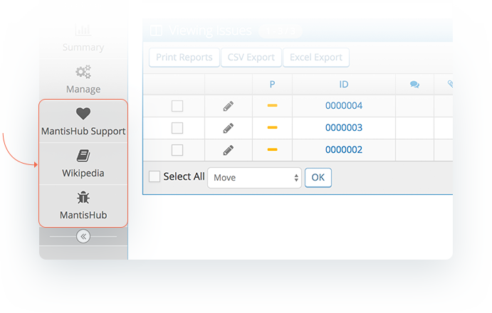
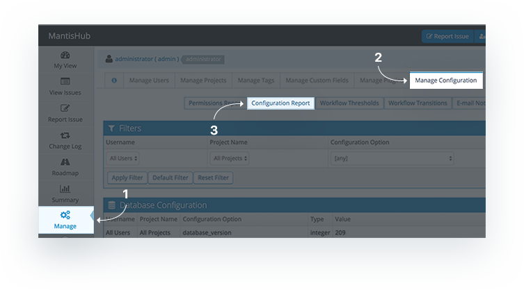
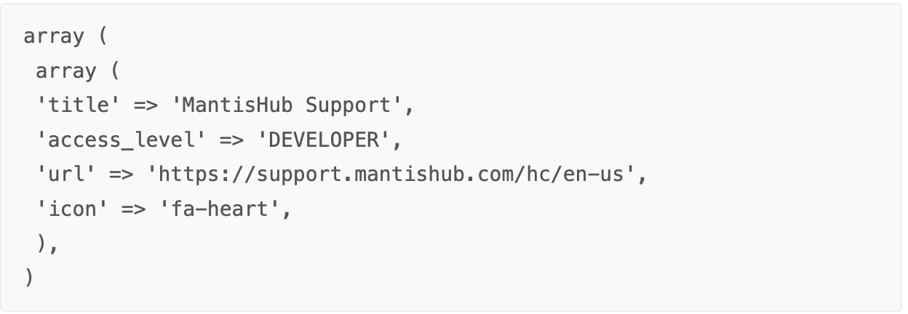
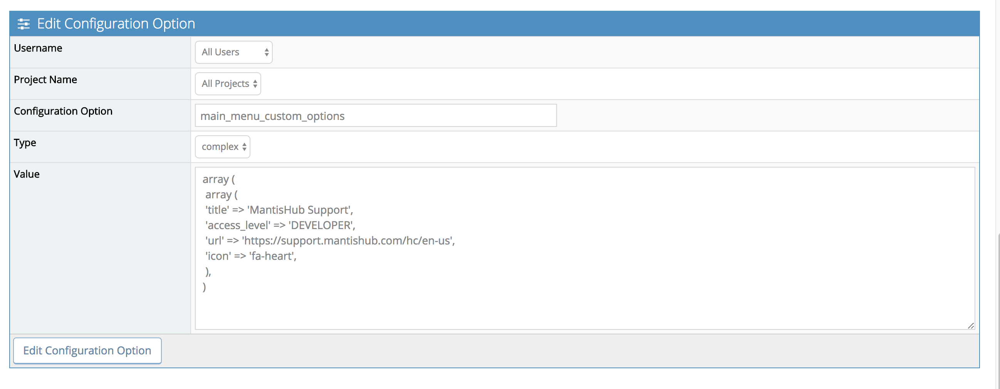
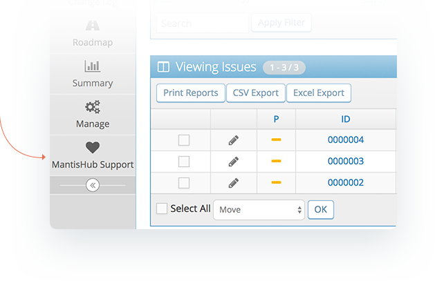
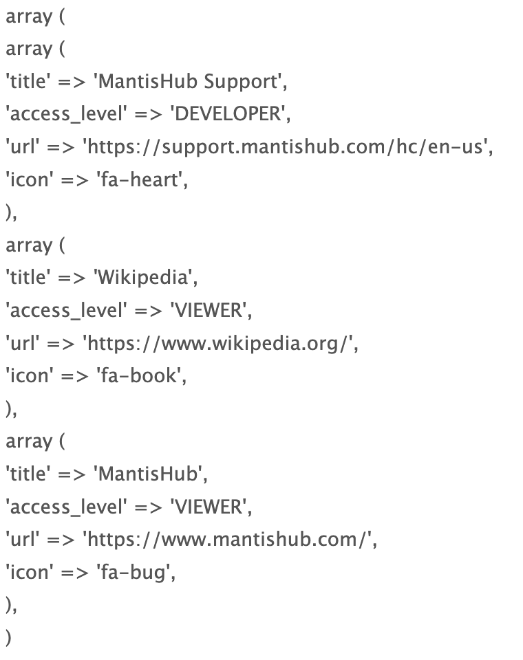

# Adding Custom Main Menu Options

If you would like to add your own custom main menu option that links to an external website you can do so by creating a new configuration option. 

Here is the information you need to create a custom main menu option:

- The name of the new main menu option.
- The website you would like the user directed to.
- The access level which can view/utilize the menu option.
    - You can enter this in with either the access level name or code, i.e. DEVELOPER (case sensitive) or 55. See the [Access Levels](/customizations/access_levels) article for a full list.
- An icon to display in the menu
    - Go to the [Font Awesome](http://fontawesome.io/icons/) website to choose an icon. Then when entering it in the configuration option add 'fa-' as a pre-fix to the icon name, for example if you choose the 'heart' icon you would enter 'fa-heart'.
        - Note: The most recently added icons to Font Awesome may not be available. If you add an icon and it does not appear upon creating the configuration you may need to choose an icon that is not in the 'New Icons' list.
- The project(s) which will display the menu option.
    - You can choose to make the menu option visible to 'All Projects' or an individual project.

Simply, go to 'Manage' - 'Manage Configuration' - 'Configuration Report' scroll to the 'Create Configuration Option' section and enter:    

**Username**: All Users

**Project Name:** Either 'All Projects' or the name of the project you want the menu option displayed for.

**Configuration Option:** main_menu_custom_options

**Type**: complex

**Value**: (EXAMPLE) 

Then hit 'Create Configuration Option' and you should immediately see your new menu option and icon on the left hand side of your screen.

If you would like to create more than one main menu option or add another main menu option at a later time you will simply need to EDIT the existing configuration value. If you recreate the configuration option it will over-write the existing one. 

**Value**: (EXAMPLE OF MULTIPLE MAIN MENU OPTIONS)

