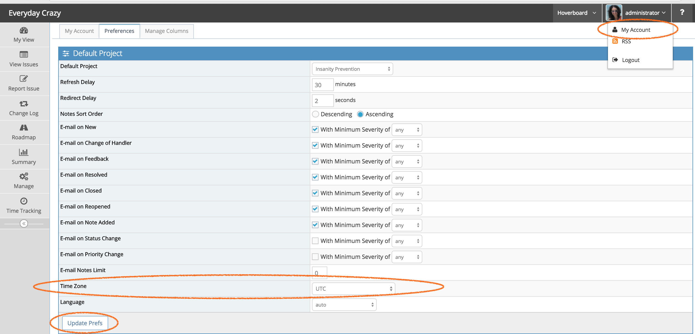
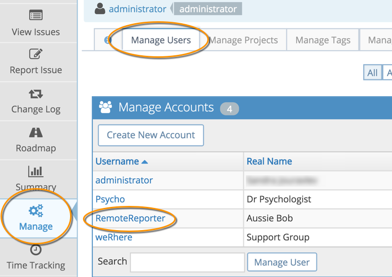
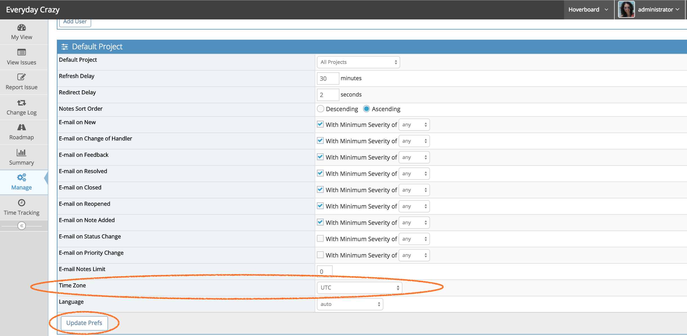

# Changing Timezone

MantisHub internally uses UTC timezone to store all time stamps.  However, when displaying such time stamps it maps them to the timezone of the logged in user.  The default timezone for users is set to UTC as well so you may wish to have this changed to your local time if your users are all in one place.

To setup your MantisHub with a specific timezone it's as simple as emailing our support team with your preference and we'll apply the change. You can find a list of the timezones [here](http://php.net/manual/en/timezones.php). Drill into the region and you will get all the possible timezone values.

The support team change will set the default timezone for all new users. If existing users need to change their timezone, this will need to be done manually. 

They can do this themselves by going to 'My Account' from the user drop down box in the top right hand corner. Then select the 'Preferences' tab, update the timezone field and click 'Update Prefs'.

Alternatively, the administrator can go in and change it for them via the 'Manage User' tab on the 'Manage' page.

Scroll down to 'Default Project' settings. Change the timezone setting here and click "Update Prefs'.

