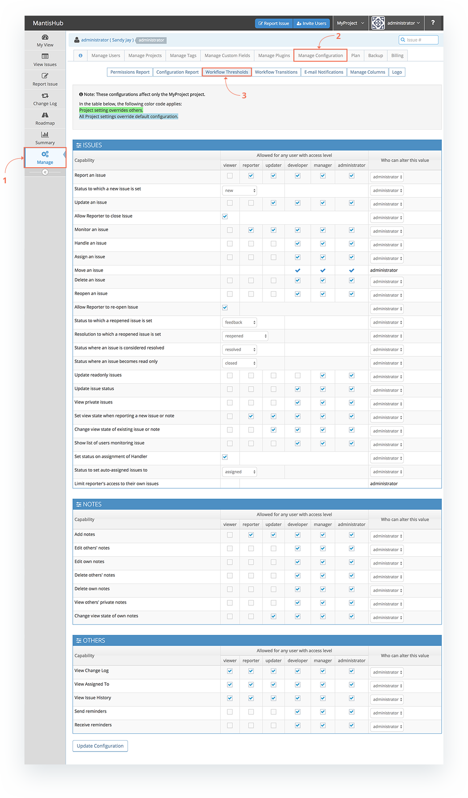
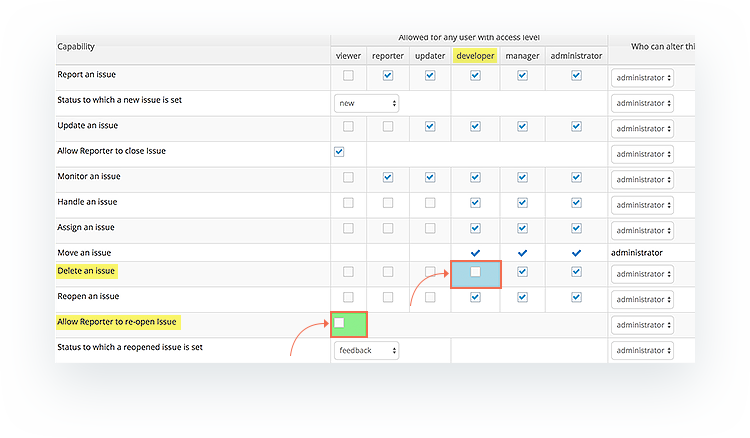
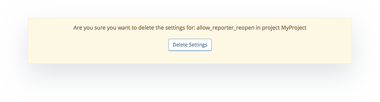

# Workflow Thresholds

Workflow Thresholds can be found on your *Manage* page in the *Manage Configuration* tab and allow you to customize your user access level permissions. 

Access levels permissions within MantisHub closely resemble the access level name. For example *viewer* access level can't change issue fields or status or even create an issue but can only view public issues and your *administrator* has full access. MantisHub have defined the [functionality for each level](/user_management/auth_access_levels) to best fit the general workflow and requirements for issue tracking. What a specific user can do, closely relates to their role within the workflow. Check out our [Authorization and Access level](/user_management/auth_access_levels) article for more details on who can do what. 

Most of the time, these shouldn't need to be changed but MantisHub does recognize that every team is unique and there may be a need to tweak these permissions. In the event you wish to alter what each access level is permitted to do, then administrators can change these via Workflow Thresholds.

To change these permissions, head to *Manage - Manage Configuration* and select the *Worfklow Thresholds* tab. Check and uncheck box boxes as needed to address your permission requirements. Make sure to take note of the project selector which indicates which projects the displayed settings relate to.

All projects will initially have the default settings shown in the image above. If settings are altered from the default for a specific project, the setting will be highlighted green. If the settings are altered from the default for 'All Projects' these settings will be highlighted blue.

For example, If what I need is that 1. Developers should NOT be able to delete issues for any projects, AND 2. Reporters of an issue should NOT be able to re-open issues but only for 'MyProject'. For all other projects I'm happy for Reporters to re-open.

I would navigate to my Workflow Thresholds page and:

1. Make sure the project selector is set to 'All Projects', Uncheck the check box under developer for the 'Delete an Issue' capability, and Click 'Update Configuration'.

2. Then after changing my project selector to 'MyProject', I can untick the 'Allow Reporter to re-open an issue' check box.

You can see in the image below where project selector is set to 'MyProject'. The 'All Projects' non-default setting is highlighted blue and the project specific setting is highlighted green. Note that if there is any conflict in All Project vs specific project settings then the specific project setting takes precedence. I.E. green changes will override blue changes which overrides default settings. 

At anytime you can revert back to default settings by click the 'Delete Project Specific Settings' button at the bottom of the page for project specific changes and/or the 'Delete All Projects Settings' button at the bottom of the page when the project selector is set to 'All Projects'. 

As well as changes to access level permissions, there are some option here to define status related configuration such as, at what status an issue becomes read only or what resolution is set for a re-opened status. However most other status related configuration is set in the [Workflow Transitions](/customizations/wf_trans).