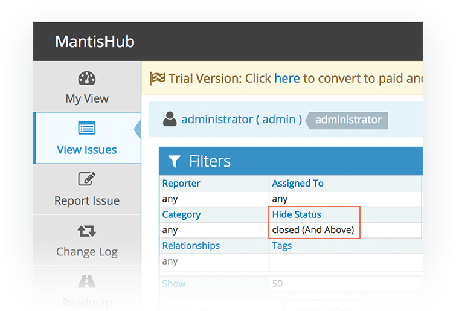
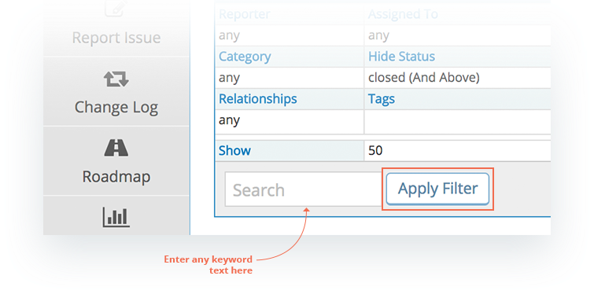
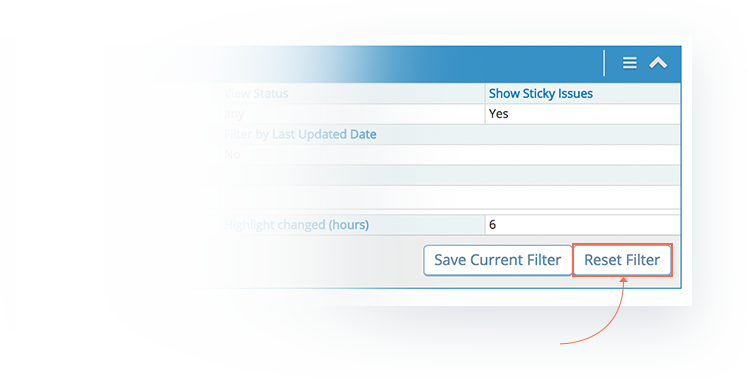
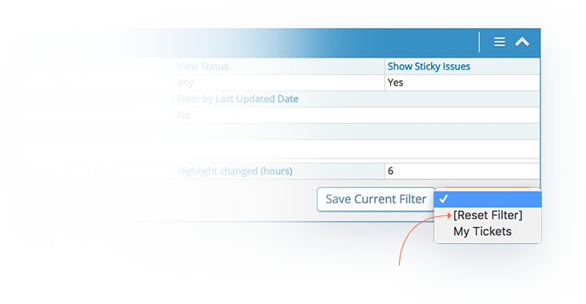
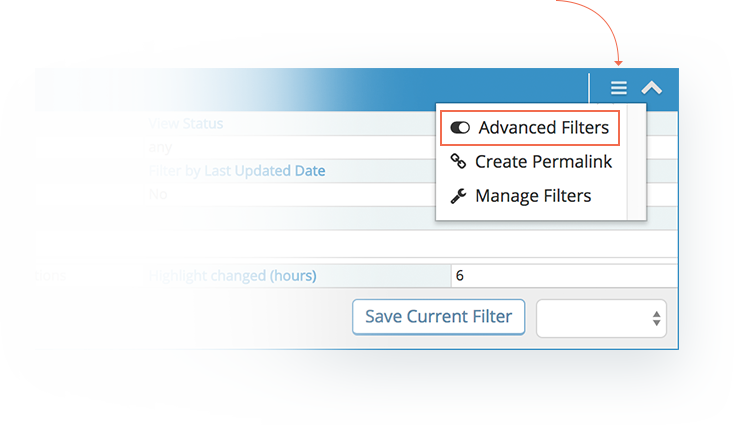
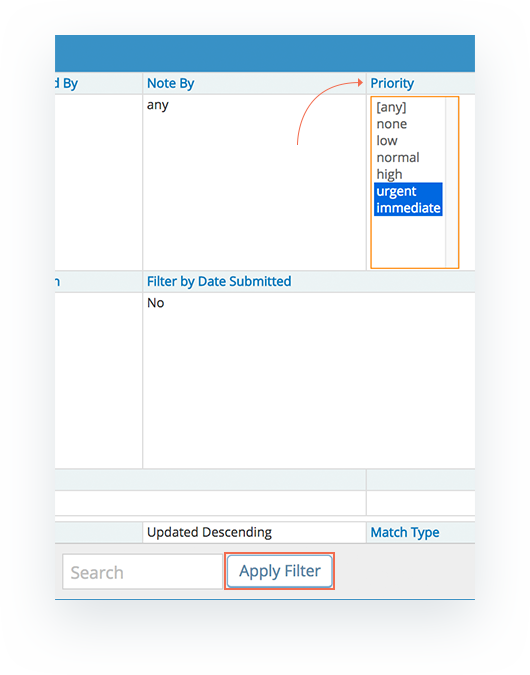

# Using Filters

[Video Tutorial](https://www.youtube.com/watch?v=w9Wanmi22do)

<iframe width="560" height="315" src="https://www.youtube.com/embed/w9Wanmi22do?si=RmtUlQuj8QGoDMvP" title="YouTube video player" frameborder="0" allow="accelerometer; autoplay; clipboard-write; encrypted-media; gyroscope; picture-in-picture; web-share" referrerpolicy="strict-origin-when-cross-origin" allowfullscreen></iframe>

The 'View Issues' page contains a filter to allow you to restrict the list of issues. You can restrict this list down to a specific project by using the [project selector](/project_management/project_selector).    Or you can use the fields shown in the filter.

By default all issues with status 'closed' are hidden but you can change this by amending the 'Hide Status' field.  For example, selecting 'resolved' to hide all resolved and closed issues.

You can filter on any of the displayed fields or you can do a simple keyword search using the text box. When you have filled in the field(s) you want, simply click the 'Apply filter' button to search your issues.

To reset the filter back to default you will either see a 'Reset Filter' button or if you have [saved or shared filters](/filters/saving_sharing_filters) you will need to select the "Reset Filter" option from the drop down box. 

You also have the option to use simple or advanced filters. By default the filter is set to simple which will only allow you to have one selected value per field. To switch to advanced filters select the menu icon and hit 'Advanced Filters'. 

If you need to be able to select multiple items within a field (e.g. priority=urgent OR immediate) you can switch to advanced filters. Once it is turned on select the field (e.g. priority) to view the full list of options, select all the options you want to filter on and then 'Apply Filter'. 

