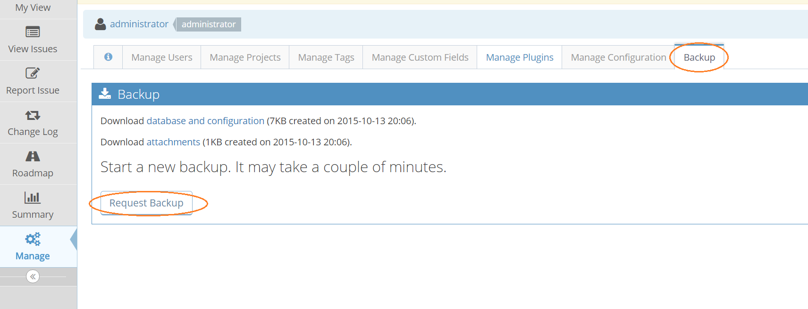
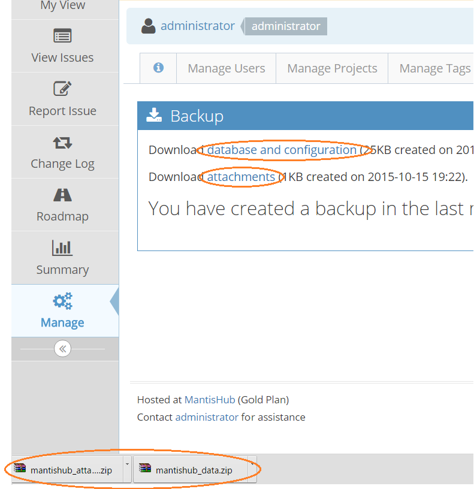

# Backing up & Downloading Your Data

As part of MantisHub service, we automatically backup your data daily. However, administrators often like to get regular snapshots of their own data. MantisHub makes it easy to download backups.

Login as administrator, go to your 'Manage' page and select the 'Backup' tab. Displayed will be the last backup you requested. To create a fresh one, click the 'Request Backup' button.

This will create two zip files.

1. 'database and configuration' containing a dump of the [MySql](http://www.mysql.com/) database as well as the configuration files.
2. 'attachments' containing any relevant attachments.

Click on the links to download these via your browser. 

You will have 7 days to download the backup before the provided links expire. If links have expired you would need to re-generate a new backup. If you have a large amount of data (check our your [Plan page](/plans_billing/plan) to see how much data you are using) then reach out to the support team to arrange access to a backup. 