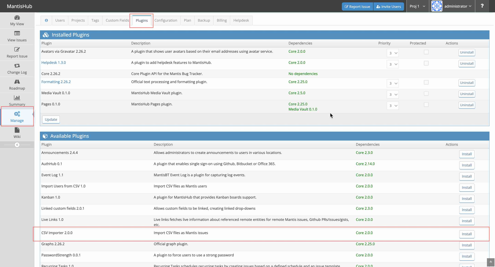
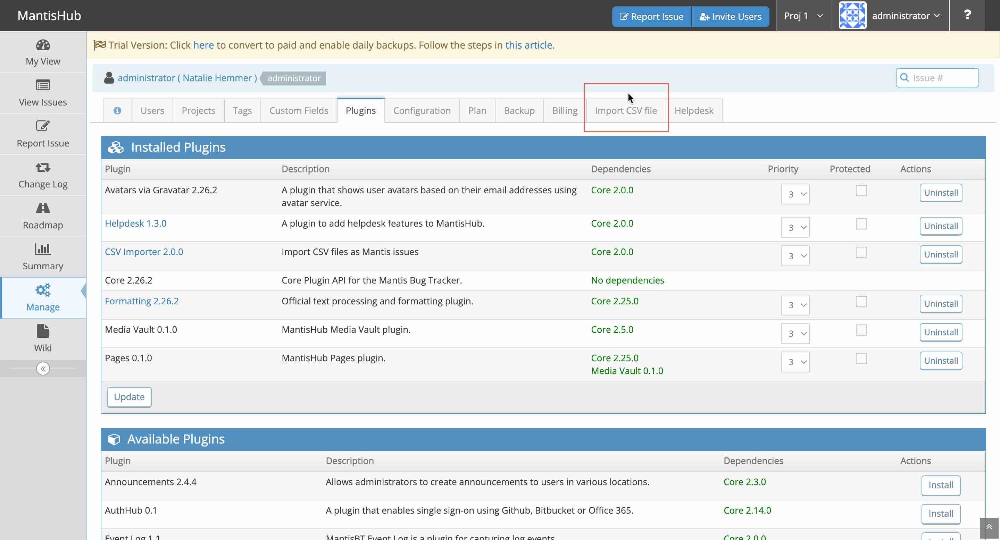

# Importing Issues From CSV Files

**The CSV Import supports the following functionality:**
- Supports auto-creating users as part of import.
- Supports auto-creating categories as part of import.
- Supports custom field importing.
- Supports importing as new issues.
- Supports updating issues based on match id field

**Following are some hints to take into consideration:**
- Have a separate CSV file per project.
- Switch to the project before importing.
- If the goal to add issues for the rows from CSV rather than update issues, then make sure to map ID fields (if in CSV) to be ignored.
- Users that are auto-created will have random passwords, will be disabled, and will have email as `username@localhost`.
- For timestamp fields like issue submission and last update timestamps.  We recommend using `ISO 8601`.  However, any format accepted by the PHP method `strtotime()` would work.  If an integer is provided as the value, then it will be treated as the number of seconds since Unix Epoch (January 1 1970 00:00:00 GMT).
- For multi-line fields '\n' will be converted to new lines.
- Each issue must be represented by one line in the csv file.
- It is recommended to import the file and verify that the data looks good. Start with a small sample of data, and once it works fine, import the whole data set.
- Clarify that enumeration fields like status and priority are matched as follows:
    - Based on English name
    - Based on name localized in user's language.
    - Based on matching the enumeration code (e.g. see [status codes](https://support.mantishub.com/customizations/stat_colors#status-codes-colors))
- If the description field is not imported, it will be set to the same value as the summary. This is necessary since description is a mandatory field.
- If the category field is not imported, it will be set to the default category.
- Category and enumeration matches are case insensitive.

**Following are the steps to generate the CSV file from Excel:**
- Open the Excel sheet
- Save as "CSV (Comma delimited)", don't use "CSV (MS-DOS)".

**Following are the steps to import the CSV file into MantisHub:**
- Go to "Manage" - "Manage Plugins"
- Click install next to "CSV Importer" plugin.
  
- Once installed go to the new tab "Import CSV File"
  
- Select the project to import the issues into.
- Select CSV with issues related to the above project with one row per issue. Use "\n" to represent new lines.
- Go to "Manage" - "Import CSV file"
- First wizard page - enable the creation of categories and set the separator character.
- Second wizard page - allows mapping csv columns to MantisHub fields.

Each issue should be represented by one line (row) in the CSV file.
