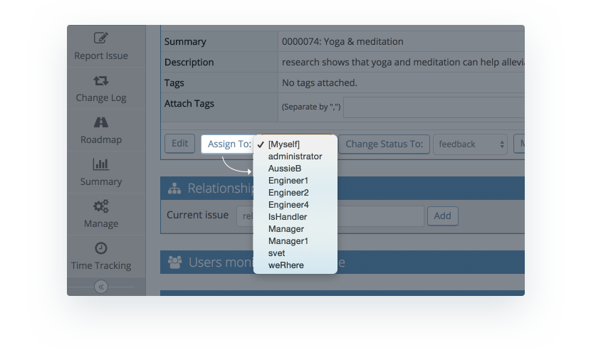
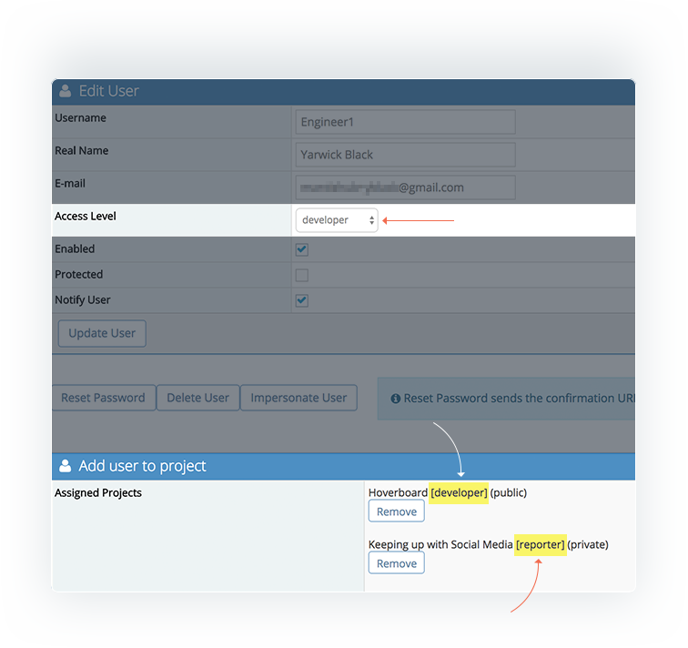
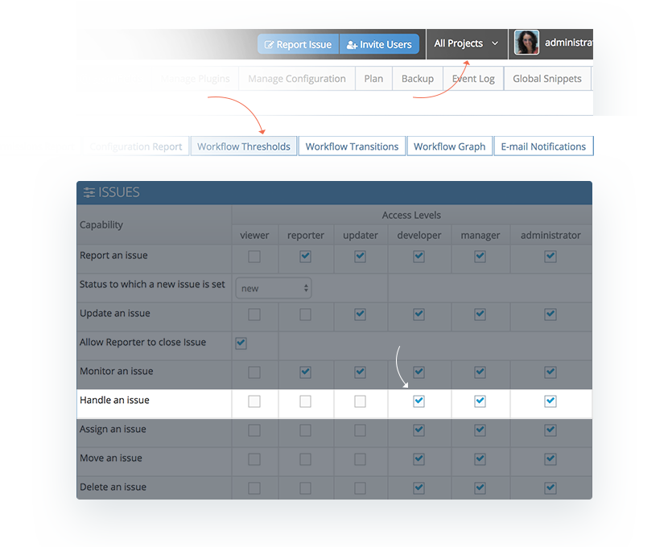

# Assigning Issues

At some point you will most likely want to assign your issues to someone to make sure they get done. By default, only users with access level **developer** or above are able to handle (be assigned) issues. Therefore when you click on the drop down menu to assign an issue, only users with these access levels for the project in which the issue has been created is going to appear in this drop down list. 

If you feel that there are users missing in this drop down list, here are a few things you can check. You should note in particular that users can have a globally defined access level that can be overridden by specific project configuration

1. Make sure the user has the access level developer or above and is enabled.
2. Is the project private? If it's private you may not have added the user to the project. You can add the user to the project either via the [user configuration](/user_management/create_user_accounts) or the [project config.](/project_management/project_config) 
3. If the project is public and the user has a global access level above developer but isn't appearing in the list, check that they haven't specifically been added to the project with a lower access level. The users access level at the project level will override their global access level (for details on defining access levels check out [this article](/user_management/auth_access_levels)).

4. Check your workflow thresholds. The default setting only allows developers or above to handle/be assigned issues. This can be overridden in the workflow thresholds and you can either further restrict or expand the access levels allowed hence impacting the assign to list`*`. Make sure your [project selector](/project_management/project_selector) is set to the relevant project.
 
 

`*` For customers on team member plans, you need to note that if you alter workflow threshhold to allow reporters or updaters to handle issues,  this will impact your team member user count and you may exceed your plan limit incurring extra user costs. 