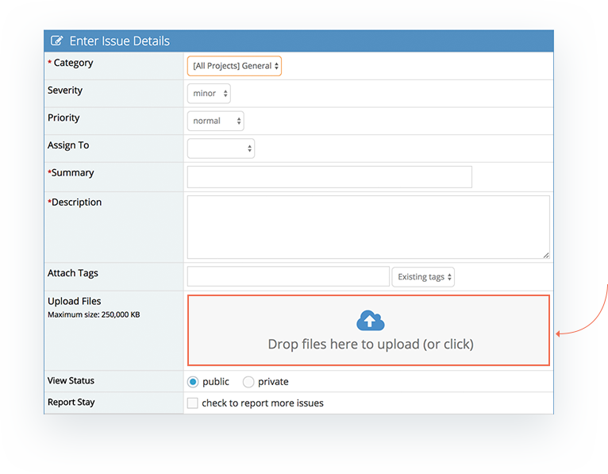
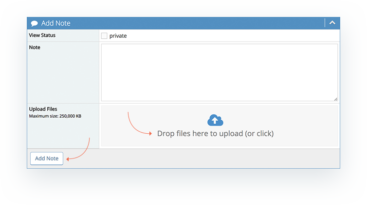
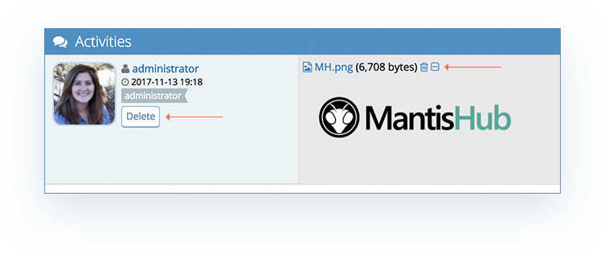

# Attaching Files

MantisHub supports attaching multiple documents to issues (default max size 250MB each). Files can be attached as part of reporting a new issue by either dragging and dropping the files into the 'Upload Files' section or clicking in the 'Upload Files' section to choose which files to attach. Upon selecting 'Submit Issue' the files will complete their upload. 

Files can also be attached later on from within the issue. Simply open the issue, go to the 'Add Note' section and either drag and drop the files or click in the 'Upload Files' area and choose which files to attach. You must select 'Add Note' in order to complete the file upload. Currently, [both public and private notes](/issue_management/privating_issues) support attachments. If changes notes from public to private and vice-versa, attachments associated with those notes will also change to have the same view status. 

By default, attachments that are image or text files smaller than 256KB are previewed inline when viewing the issue. This preview size is configurable (see configuration section below). Video and Audio files are also able to be played inline. All other attachments can be downloaded or opened when clicked by the user.

You can minimize or delete an attachment by opening the issue, going to the 'Activities' section, hover over the note and a 'Delete' button will appear. Otherwise, next to the attachment you can select the trash can icon to delete or the minimize icon to minimize an inline preview image.

**Configurations**:

You can configure the number of attachments that can be added at one time. Go to *'Manage' - 'Manage Configuration' - 'Configuration Report'* page and scroll to the *'Create Configuration Option'* section and add: 

- Username: 'All Users'
- Project Name: 'All Projects'
- Configuration Option: 'file_upload_max_num'
- Type: 'integer'
- Value: '2' (This indicates the maximum number of attachments that can be added to an issue at one time, i.e. 2 attachments)

Hit *'Create Configuration Option'*.

You can also configure the max inline preview size up to 1MB (1048576 in bytes).

Go to *'Manage' - 'Manage Configuration' - 'Configuration Report'* page and scroll to the *'Create Configuration Option'* section and add: 

- Username: 'All Users'
- Project Name: 'All Projects'
- Configuration Option: 'preview_attachments_inline_max_size'
- Type: 'integer'
- Value: '1048576'

 Hit 'Create Configuration Option'.