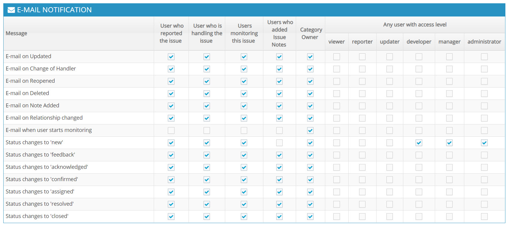
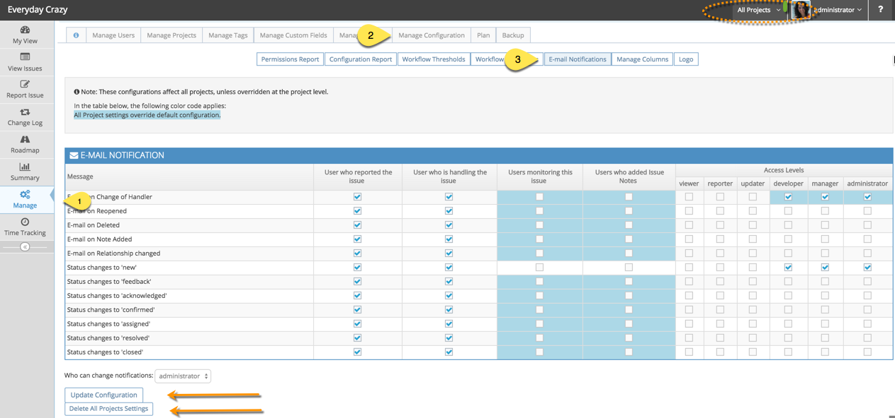
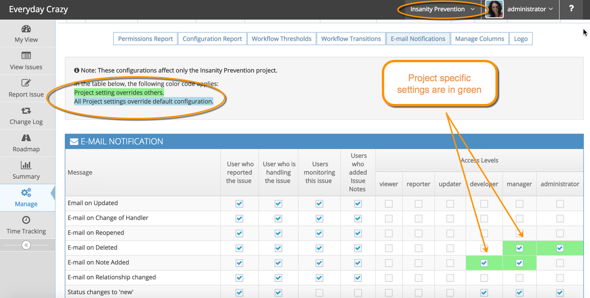
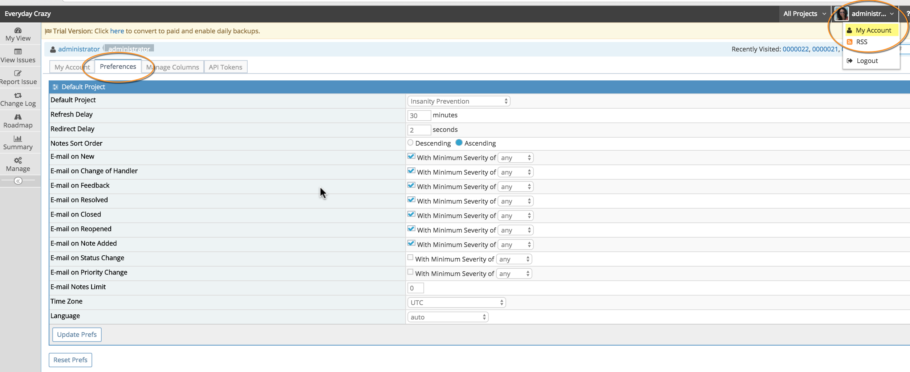

# Configuring Email Notifications

[Video Tutorial - Configuring Email Notifications](https://youtu.be/yTca_FmqiCk?si=wbHMWAiuFwXE70dp)

<iframe width="560" height="315" src="https://www.youtube.com/embed/yTca_FmqiCk?si=eepRLfSic67HVb5B" title="YouTube video player" frameborder="0" allow="accelerometer; autoplay; clipboard-write; encrypted-media; gyroscope; picture-in-picture; web-share" referrerpolicy="strict-origin-when-cross-origin" allowfullscreen></iframe>

Email notifications can be sent depending on **what** action has been taken on an issue and the access levels and preferences of users in the system. 

The actions that can trigger an email notification can be when an issue:

- Is updated
- Is re-opened
- Is deleted
- Has changed hands (assigned, unassigned or re-assigned)
- Has had its relationship changed
- Has changed to a certain status 
- Has a new note added

The users that receive email notification can be set according to if the user:

- has reported the issue
- is handling the issues
- is monitoring the issue
- has added a note to the issue OR
- has a certain access level with respect to the project containing the issue (e.g. all DEVELOPERS, MANAGERS, and ADMINISTRATORS for the project to get notified when a new issue is added).

You can set email notifications at 3 levels:

1. All Projects 
2. A specific project
3. User preference level.
 

The below settings are the default settings for email notifications.

To tailor these to your needs, go to your 'Manage' page and select the 'Manage Configuration' tab, then click the 'Email Notifications' button. You can set the default for all projects in which case you need to make sure 'All Projects' is selected in the project selector in the top right hand corner (note that this selector will be hidden if you only have a single project). 'All Projects' settings override default MantisHub settings and are displayed in blue.

You can also set email notifications specific to a single project by selecting that project in the project selector. Specific project settings override 'All Projects' settings and are displayed in green.

Lastly, a user can tailor their own individual email preferences by going to 'My Account' via the drop down box in the top right hand corner and selecting the 'Preferences' tab. Individual user preferences override project email notification settings.  Administrators can also view and manage such preferences for users through the user management page (by selecting 'Manage' - 'Manage Users' and clicking on the user to manage).

In summary, the email notifications configuration is used to select the set of users to be notified.  Then the preferences for such users are examined to figure out if they want to disable some of these notifications and in which language they want to receive them.  So user preferences can reduce the number of notifications, but can't increase them relative to the project configuration.

When configuring email notifications, we recommend by starting with the default setting for all project and then introducing any desired project specific email behavior as overrides.  Although generally, most teams use a single email notifications policy across all projects.

If you are having issues with email notifications, you can try various troubleshooting methods in our [troubleshooting article](/issue_management/troubleshoot_emailnotif) including checking out our [event log feature](http://blog.mantishub.com/2015/12/21/understanding-email-notifications-via-eventlog-plugin/).

