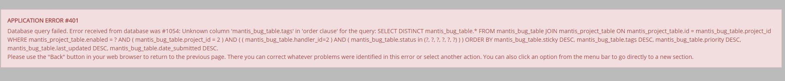

# Recovering from a Broken Filter - Error 401

If a user hits this error, then they have managed to craft a filter that triggers a bug in the system.  The user will find that they can longer access the 'View Issues' page. Instead they receive an application error #401 with a database error of #1054.

To recover from the broken filter state the user will need to reset the filter by browsing to:

*https://yourmantishubname.mantishub.io/view_all_set.php?type=3* `*`

`*`Replace "yourmantishubname" with your MantisHub URL name.

They will need to report the error to our support team and include the following information:

- A copy and paste of the error.
- Their MantisHub URL
- Their username
- Steps to reproduce (if known)

This information will help us locate the error and resolve it.

