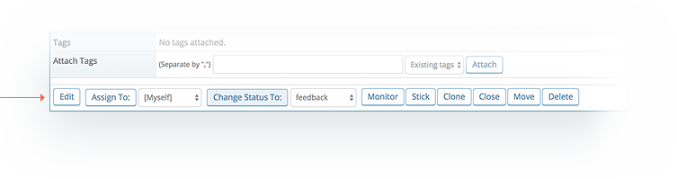
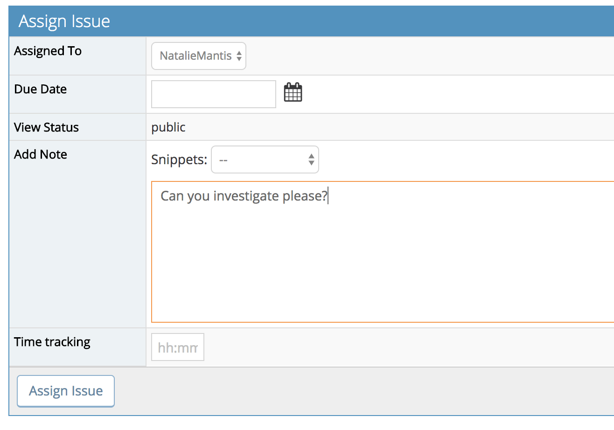
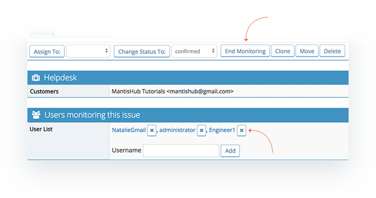
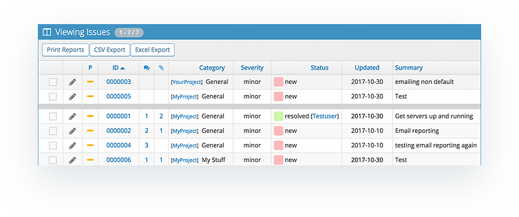
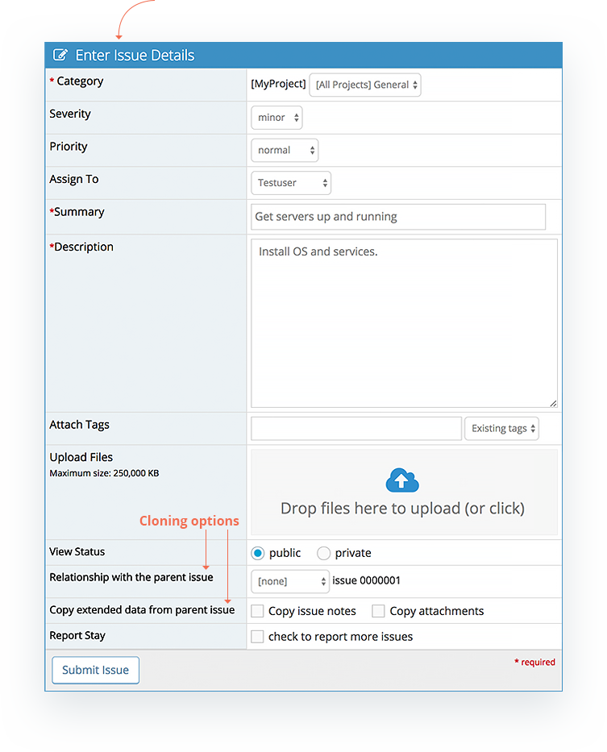
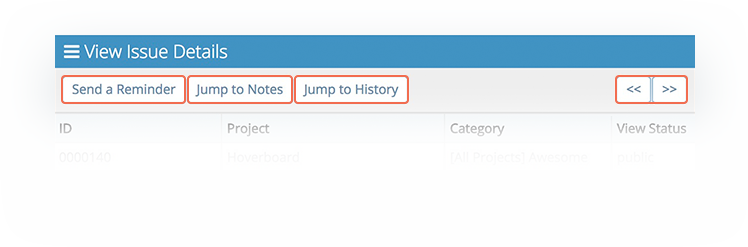

# Issue Actions

There are a number of issue actions you can perform from within the issue. When in the 'View Issues Details' view You'll see these underneath the issue details as action buttons. Note that these action buttons may or may not appear depending on the [users access](/user_management/auth_access_levels) to the issue.

  
  
**Edit**

The edit button allows you to go in an edit any of the issue fields such as severity, priority, category or any custom fields.  User can also add a note as part of editing issue details. If you need to update the same field across multiple issues, then you should look into [group actions](/issue_management/update_multiple_issues) that allows you to update multiple issues at once.  

**Assigned to**

This allows you to assign the ticket to a user from the drop down list. Only users that have permission to 'handle' or be assigned issue for that particular project will appear in this drop down list. This will typically be users with access levels developer, manager or administrator. For more details read [Assigning Issues.](/issue_management/assigning_issues)

**Change Status**

This allows you to change the status of an issue from the drop down menu.  The values displayed in the drop down menu may not include every status as it will only display status that the user is allowed to transition to. By default all transitions are allowed and developers and above only can change an issue status. But if you are seeing that some statuses are not displayed, this could be because you have made some changes to the [workflow transitions](/customizations/wf_trans) or [workflow thresholds](/customizations/wf_thres) and a specific transition is not allowed or user may not have access to change to that particular status.

When you click this button, it then takes you to the change of status form that will allow you to change other details along with the change of status. The most common is adding a note. But you also have the options to re-assign the ticket or set fields such as due-date or time tracking if this functionality is enabled.  Based on configuration, some custom fields may show up in this form.

**Closed and Reopen**

The 'Closed' button is simply a shortcut to 'Change Status'. It will do the exact same as if you chose 'Closed' in the Change Status dropdown list. If an issue is in a resolved or closed status, then you will also see the **Reopen** button which will perform a status change to the 'Feedback' status (by default or the status that you have configured as the status in which to place re-opened issues in your [workflow transitions](/customizations/wf_trans)).

**Monitor**

The monitor buttons allows the user to subscribe to activity on an issue. Where email notifications have been enabled, the user will be added to the distribution list when the issue is updated. The user will be displayed in the section "Users monitoring this issue". A user can remove themselves from monitoring at anytime by clicking the 'End Monitoring' button or by deleting themselves from monitoring users list by clicking the 'x' button next to their name. You can also see from the monitoring users section that is possible to add and remove other users to/from monitoring. 

**Monitor Configurations:**

To modify what access levels can **add a monitor to an issue**, Go to 'Mange' - 'Manage Configuration' - 'Configuration Report' add a new Configuration Option: 'monitor_add_others_bug_threshold', Value: 25 (i.e. Reporter or higher. [See all access levels).](/customizations/access_levels)  The default is to allow all users that have Developer access or higher to add a monitor. 

You can also modify what access levels can **monitor an issue** or **view the list of users monitoring** an issue by amending the workflow thresholds. See our [Workflow Thresholds article](/customizations/wf_thres) for details.

**Stick**

The Stick button allows you to have an issue stay at the top of the list in the 'View Issues' page, similar to what pin does in email. This creates demarcation with a thick gray line and the "stuck" issue is listed above this line separated from all other issues. The issue will be unaffected by the sort functionality but if there are more than 1 issues in the Stick section then all issues in the Stick section will be sorted within the section. To unstick an issue, simply click the Unstick button. Note that if you Stick an issue, it will be "stuck" for all users and not just for you your own view. 

**Clone**

The Clone button will create a duplicate of the issue within the same project. Before cloning you will be taken to the "Enter Issue Details" form so if desired, you to change some of the issue fields and details. You also have the option to copy across all issue notes and/or attachments as well as include a relationship to the cloned issue. 

As well as Clone, there is a **Copy** function available as a [group action](/issue_management/update_multiple_issues) in View Issues page. Depending on your requirements you can choose Clone or Copy, however Clone has more functionality. Copy will exactly duplicate the entire issue (notes, attachments, category) and only allows you to select the destination project. So you might want to use Copy when you need to duplicate the issue in another project. However you always have the option to Move the cloned issue to another project. 

**Move**

This option will relocate the issue to a new project. When clicking Move, you will see a drop down list with the projects you can choose from. The projects listed here will of course depend on your access level. Where the same category exists in the destination project, it will be assigned that category. If not, then it will use the [default category](/project_management/change_default_catgs) which is usually the '[All Projects] General' category. All issue details will be moved across including attachments, notes and history. 

**Delete**

This will fully delete the issue and so you will be asked for confirmation as to if you really do want to delete the issue. Note that there is NO WAY TO RESTORE a deleted issue so please be sure before deleting an issue.

There are also a few other options available to you in the issue at the top of the 'View Issue Details' page.

- There is an option to **Send a Reminder** which you can read about in the [Issue Reminders article.](/issue_management/issue_reminders)
- You can skip down to either the Notes section or the issue history with the **'Jump to Notes'** and **'Jump to History'** buttons.
- Lastly there are some navigational arrows in the top right corner which will allow you to move forward to the next issue in the list or back to the previous issue.  
 