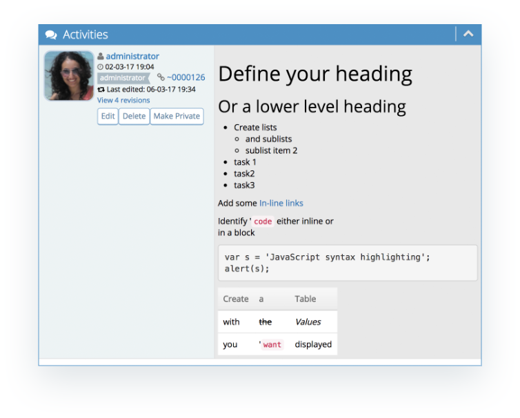

# Markdown Support

MantisHub adds support for markdown to allow you to format your issues notes and descriptions into html. Emphasis your text with italics or bold or highlight code, use lists and sublists, embed in-line links, create tables and more using markdown.

Markdown uses shorthand syntax to format text into html. For example, to have text displayed as italic, surround the text with `*`, for bold use `**`.

Full details of the Supported shorthand can be found [here](http://parsedown.org/). You can also find a handy cheat sheet [here](https://github.com/adam-p/markdown-here/wiki/Markdown-Cheatsheet).

Markdown is enabled by default but can be turned on or off by heading to Manage - Manage Configuration - Manage Plugins and click on the Formatting plugin.

Then turn Markdown Processing on or off as desired. 

Using Markdown syntax will show formatted text in the web UI but **note that for your email notifications (include Helpdesk customer updates) the markdown markup will be displayed rather than the formatted text.**

