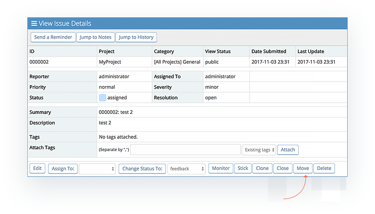
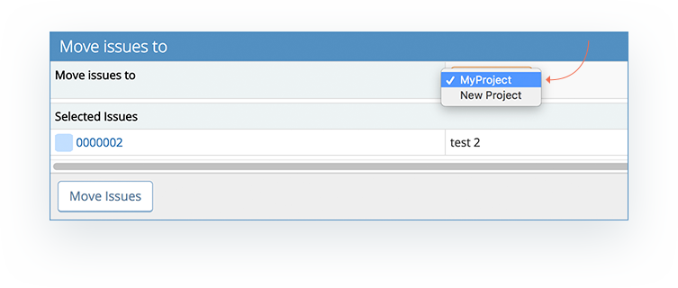
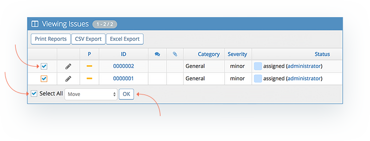

# Moving Issues Between Projects

In some cases issues are reported under the wrong project, or email reporting directs issues to an inbox project, where they need to get directed to the appropriate projects after triage. Users with Developer access level or higher have the ability to move issues from one project to another. 

Issues can be moved between projects as follows:

- **One issue at a time** - Go to the 'View Issues' page, open the issue, click the 'Move' button and then select the target project, i.e. the project you want to move it to. 

- **Multiple issues as a [group action](/issue_management/update_multiple_issues)** - Go to the 'View Issues' page, check boxes next to the issues to be moved or hit 'Select All' at the bottom of the page, select 'Move' from the drop down list on the bottom left. You will then be prompted to select the destination project.

When moving issues, the drop-down list of projects, will only show projects that you have access to. So you will not be able to move issues to private projects unless you have been added to that project. 

Issues moved will be placed in the global '[All Projects] General' category if the source category does not exist in the destination project. 