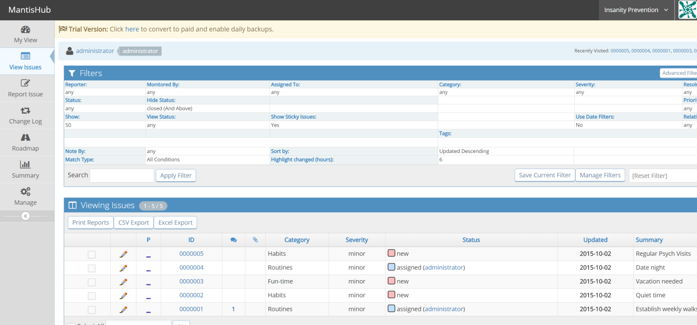
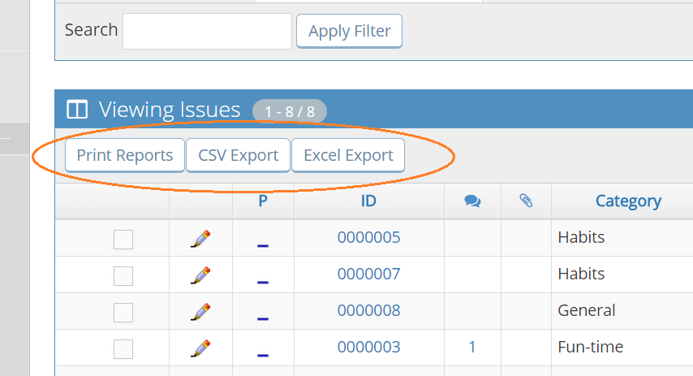
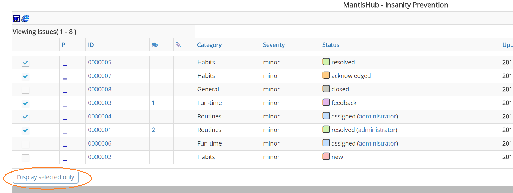
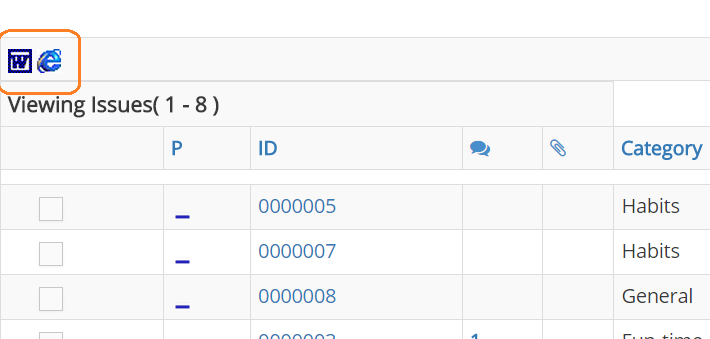
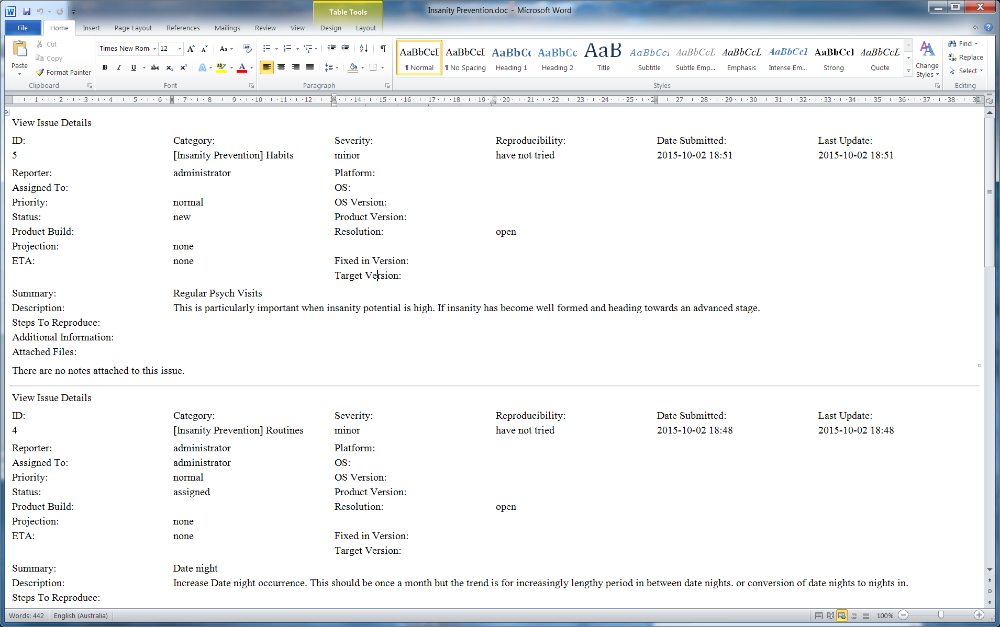
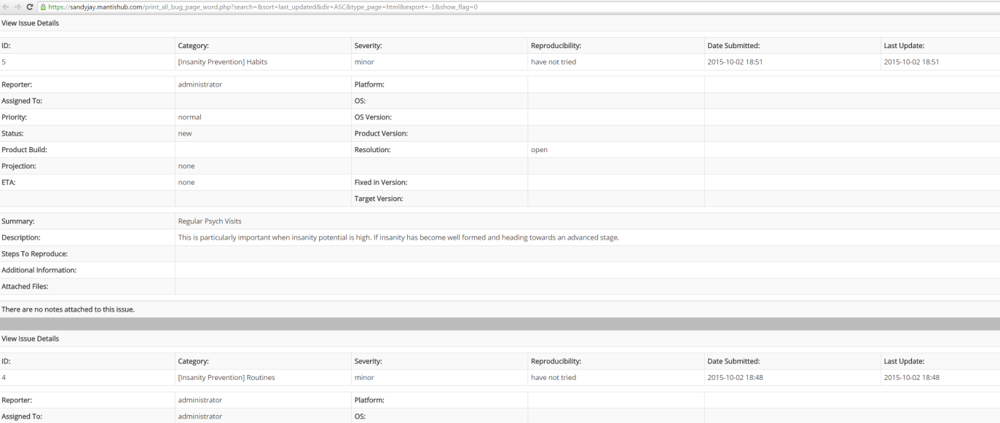

# Printing Reports

To print out a report of your issues, you'll need to head to the 'View Issues' page. You'll find a top pane displaying your filters and a lower pane displaying a list of issues. By default, this is all un-closed issues in your instance.

 

You can narrow down the issues displayed by using filters. You would have already learned all about filters by reading [Using Filters](/filters/using_filters) & [Savings & Sharing Filters](/filters/saving_sharing_filters).

Once you have the specific issues you want displayed by applying a new filter or a saved one, you have the option of printing or exporting them.

 

You can export to either CSV or Excel as per the buttons displayed. You can learn more about exporting by reading [Export issues to Excel/CSV](/issue_management/export_excel_csv). To print out the issues, click on 'Print Reports'. 

Here you can further cull the list of issues by only selecting those issues you want in your report and clicking 'Display selected only'.

  

You'll see there are 2 options for printing format: Word Document or HTML.

 

If you select Word, it will immediately download a Word document populated with the details of your chosen issues. Your Word doc will look something like this:

 

If you select the HTML option, you'll get a webpage that you can then right click and save or print as you wish. 

 

 

