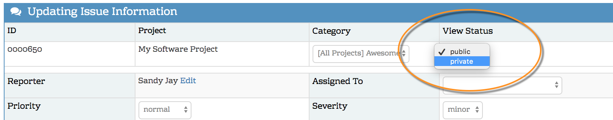
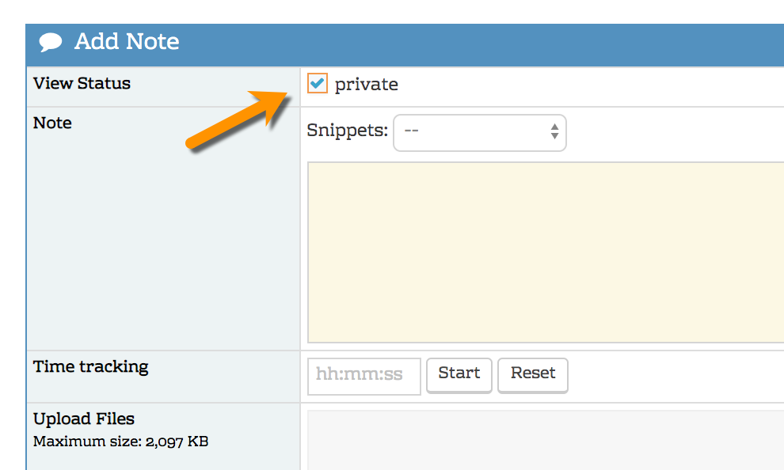

# Marking Issues and Issue Notes as Private by Default

MantisHub supports both private and public view statuses of your issues and/or your issue notes. This allows you to have greater control over access to your content. By default all issues and notes are public.

**Issues**

You can change the issue 'View Status' manually by editing the issue and changing from public to private or vice versa. Private issues are visible to your internal project team (i.e. developer access level and above) as well as the reporter of the issue.

 

**Notes**

To set a note to be private, simply check the 'private' box at the top of the note when adding it. Notice that the note text background will change color to a pale yellow. You also have the option to change the note status when editing the note. Private notes are only visible to your internal project team and will not be sent out as email notifications to unregistered reporters. 

 
In some cases it is desirable to set issues or notes as private **by default**. This can be achieved by going to *'Manage' - 'Manage Configuration' - 'Configuration Report'* and adding the following configurations:

 

### To set **issues** as private by default use:-

**config option**: default_bug_view_status

**type**:                    integer

**value**:                  50    

### To set issue **notes** private by default use:

**config option**:    default_bugnote_view_status

**type**:                    integer

**value**:                  50

`*` All incoming email notes whether sent by a registered or unregistered user will use the default note view status, i.e. if the default for notes are private then they will be private. If you want a note sent out to an unregistered user (perhaps a customer) you would need to enter the note within MantisHub and manually uncheck the 'private' box OR make the default public.

 

### **To revert back to public as default, just delete the relevant configuration options.** 

 

To disable the ability for users to set or change whether **issues** should be private or public

**config option**:    set_view_status_threshold

**type**:                    integer

**value**:                  100

And

**config option**:    change_view_status_threshold

**type**:                    integer

**value**:                  100

 

To disable the ability for users to select whether issue **notes** should be private or public use:

**config option**:   bugnote_user_change_view_state_threshold

**type**:                    integer

**value**:                  100

 

See this [article for code to access level mappings](/customizations/access_levels). You can also leave the type as 'default' and enter the access level names in uppercase e.g. MANAGER.

