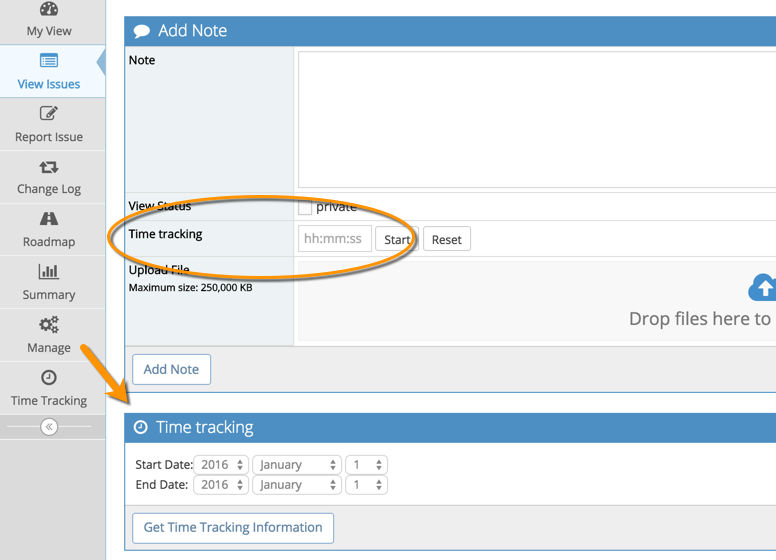
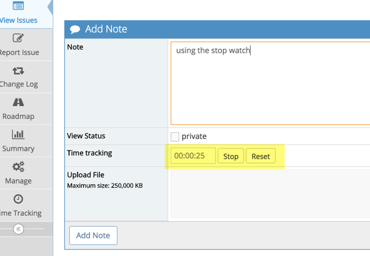
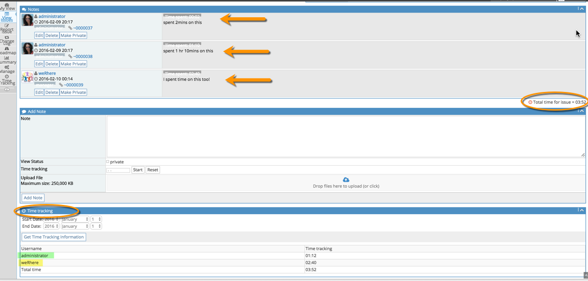
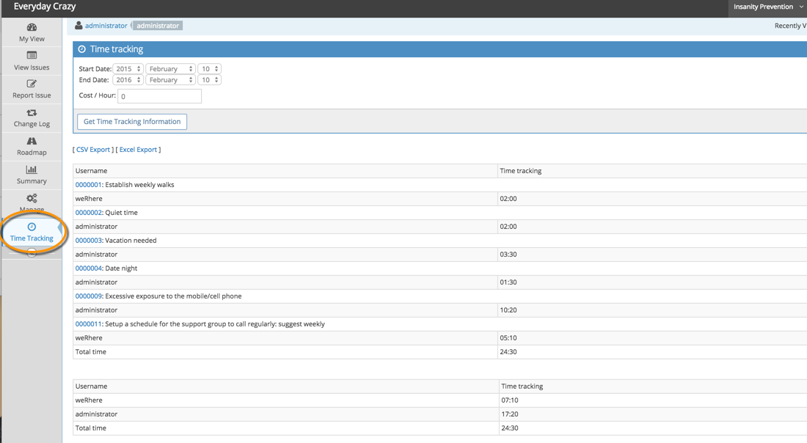

# Using Time Tracking

The time tracking feature allows you to track time spent on issues and review and report on the information. This feature is not enabled by default so you need to go and [setup time tracking](/issue_management/setup_time_tracking).

Once you've turned it on, you will now see a new "Time Tracking" field when you "View Issue Details" in the "Add Notes" section as well as a new Time Tracking Section.  

 

Simply input time spent on an issue in minutes or using the hh:mm format, update the notes field and click "Add Note" to record time.  It is possible to have a regular note, a note with time attached, or just time without a note.

If you have enabled the stopwatch feature, you will see a "Start" and "Reset" button. So you can go into an issue, press the "Start" button, which then turns into "Stop"button. When you've finished working on the issue, press the "Stop" button, update the note and click "add notes". The issue will be updated with the time spent. The "Reset" button resets the counter to zero.

 

You can see an issues time tracking information within the issue. There is a total for the issue under the notes section and you can get information for a specific period in the Time tracking section.

For more detailed time tracking information, MANAGERSs and ADMINISTRATORs will have access to another menu option. A Time Tracking page should now appear under the Manage option on the left hand side of the screen.

This allows you to run reports over a specific period for time tracking information per issue and per user and export this information to CSV or Excel. To restrict this information to a specific project, use the project selector in the top right hand of the screen.

 

If you've also enabled the billing feature in Time tracking, you will see a "Cost/Hour" field which you can populate with your hourly rate and it will calculate the cost for time spent on an issue or by user.

