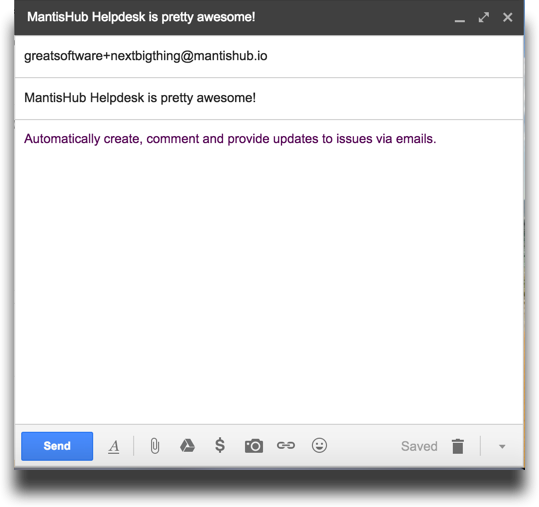
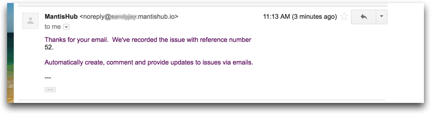

# Reporting Issues Via Email - Helpdesk

  <iframe src="https://www.youtube.com/embed/nXVQVflTrJE?rel=0" width="560" height="315" frameborder="0" allowfullscreen=""></iframe>

[Video Tutorial](https://youtu.be/nXVQVflTrJE)

MantisHub provides the ability to have your users email in issues (also known as email reporting) You may also wish to use the Helpdesk Plugin to allow emails from unregistered email addresses which allows having your customers email in help desk support issues. These emails automatically create issues within your bug tracker. You can also [comment and add notes](/mantishub_helpdesk/comment_issues) to issues by replying to email notifications.

Once you have [configured the Helpdesk plugin](/mantishub_helpdesk/config_plugin), you'll need to know how to use it.  To send an email that will result in creating the desired issue, there are several aspects that are involved: email title, recipient, body and attachments.

**Email Recipient**

The destination email address will be {your mantishub name}@mantishub.io or {your mantishub name}+{your project name}@mantishub.io.The examples below will use "greatsoftware" as the MantisHub name, hence will assume a url of https://greatsoftware.mantishub.io.  We will also assume that there is a project called "nextbigthing".

- *greatsoftware@mantishub.io* - This will target the issue for the configured default project for helpdesk email reporting.  If no default project, then user's default project is used, if not set either, then email will be rejected. 
- *greatsoftware+nextbigthing@mantishub.io* - The '+' sign separates the MantisHub name from the project name.  This recipients indicates that the issue should be reported under project "nextbigthing".  If there are non-alpha numeric characters, then replace them with underscores.  Hence "My Project" becomes "my_project".

All emailed issues will be created with the global '[All Projects] General' category. If for any reason this category is deleted, then emails will be rejected. 

To make it easier for your users and customers, it is possible to setup a forwarding email alias (e.g. nextbigthing@greatsoftware.com) to forward to the MantisHub address.  The steps to setup such a forwarding address will depend on your email service provider.

**Email Content**

- *Email Subject* - This is used as the issue Summary.
- *Body* - The text body of the email is used as the issue Description.
- *Embedded images *- are attached to the issue as files with markers in the description for their location.
- *Attachments* - are attached to the issue as files.

**Sender**

The Sender address is typically the same as the From address in your email client.

- *If sender email matches a registered MantisHub user account* - the registered user will be the reporter of the issue.
- *If sender email doesn't match and unregistered emails are enabled* - the 'Email' user account will be used as the reporter and the sender email address will be included in the "Helpdesk" section of the issue.
- *If sender email doesn't match and unregistered emails are NOT enabled* - In such case the email will be rejected.

**Enabling Unregistered for Customer Support (Helpdesk)**

If you wish to have clients who do not have an MantisHub account to be able to email in any issues to your MantisHub, you can [configure your Helpdesk plugin](/mantishub_helpdesk/config_plugin) to enable unregistered email issue submission

Your customers will now be able to email in issues to your MantisHub projects. They will also receive notifications for any notes to the issue they reported and be able to comment on these issues by replying to such notifications. These comments will be added onto the issue as notes.  The reporters will also receive notifications whenever the issue is resolved or re-opened.

**Email notifications to customer (reporter)**

The team can use **private notes** to communicate within the team without having the customer (reporter) receive such notifications.  The team can also use standard features like tagging and linking to related issues without the reporter getting notifications about such changes.

The customer (reporter) will get an email when the issue is resolved, re-opened, or a public note is added to the issue.  By resolved, we mean resolved or closed.  By re-opened, we mean moving from resolved/closed to an earlier status in the issue lifecycle.

