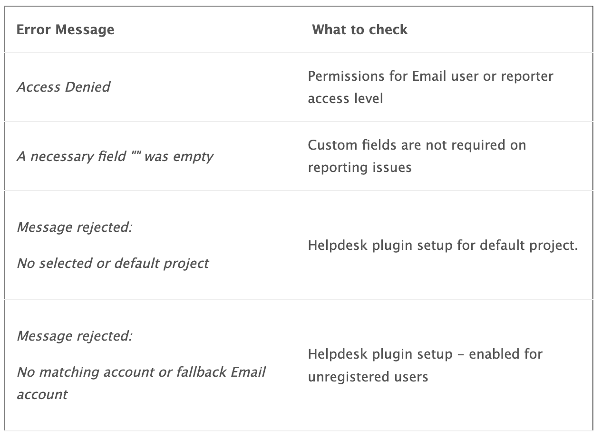
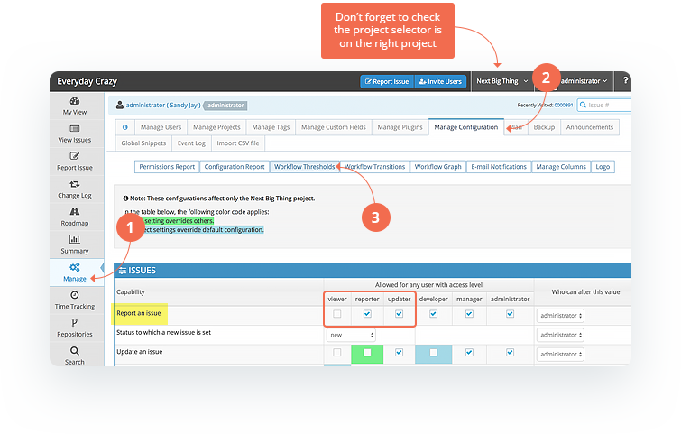
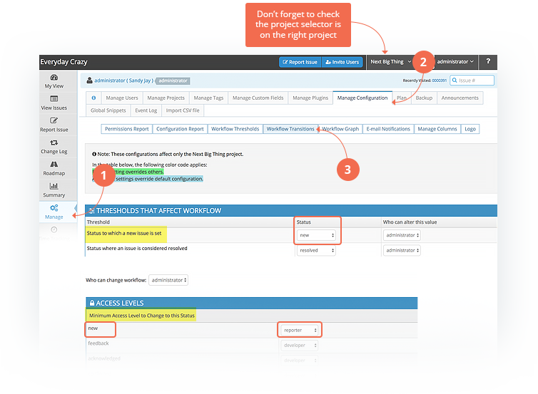

# Troubleshooting Helpdesk Problems

MantisHub's Helpdesk plugin for submitting and responding to your client emails and tickets is very [simple to set up](/mantishub_helpdesk/config_plugin). If you do come across issues with ticket submissions via email then here are a few things you can do.

1. **Check your setup* 

Within your [Helpdesk plugin configuration](/mantishub_helpdesk/config_plugin), make sure that you have the checkbox  "Enable unregistered" checked to allow non-MantisHub users to submit tickets via email. You also need to make sure to **define a default project**. Without these settings, email from unregistered users will fail.

 

2. **Configure your Failed Message and make use of the {error} placeholder**

First of all, you should always configure your *Failed Message* section in the [plugin setup](/mantishub_helpdesk/config_plugin). This will help you identify when there are failures. Make sure to provide an alternate contact method for your clients in this message otherwise you might never know about it.  

Secondly, you can use the {error} placeholder in your *Failed Message* to find out why the message failed. This will include any system error message that is generated by a failure of issue submission within the failure email that is sent. These could include the following: 

3. **Ensure correct access and permissions for "Email" user**

If you are getting an "Access Denied" error message on submission you may need to check access allowed for your Email user and for the reporter access level in general. While some access is overridden by the Helpdesk functionality (e.g. transition to assigned and/or re-opened state when clients reply to email notifications and permission to add notes to issues) you will need to make sure that they have the following:

- *'Email'* user access to any private projects used for Helpdesk.
- ***Reporter*** user level has access to report issues within the project [workflow threshold](/customizations/wf_thres)

- ***Reporter*** user level has [access to transition](/customizations/wf_trans) to the status set for **new** issues 

 

If you are concerned about granting other **reporter** users with the above access then you may want to consider upgrading the Email users **reporter** level to **updater** and granting permissions at that level. 

4. **Check that you aren't requiring custom fields on reporting**

When setting up [custom fields](/customizations/custom_fields) for projects, you have the option to make them mandatory when reporting issues. As we have no way to populate such fields via email, this setup doesn't make sense for projects where you expect ticket submissions via email. So make sure this is turned off for Helpdesk or Email reporting projects. 

5. **Email not arriving could be blocked as spam**

Outgoing Emails:

If you are concerned that emails responses aren't going back to the client you can confirm they are leaving the system by checking out the email [Event log](/system_management/event_log_email_notifs). Many times, responses can be picked up by aggressive spam rules on the client's side so make sure to have them check their spam/junk folders and whitelist emails from mantishub.io and mantishub.com. 

Incoming Emails:

If you find that emails aren't arriving from your clients into your MantisHub Helpdesk then please have a number of examples ready and [email our support team](/user_management/contact_support). If you are using a forwarding rule then try emailing directly to your MantisHub email address and bypass your forwarding rule to make sure it's not an issue with your forwarding rule. 

A common issue that results in incoming emails being caught by our spam filter is DMARC failure. When DMARC fails if the sender’s policy is “quarantine” or “reject”, emails will be quarantined. If their policy is set to “none” then messages will show as “DMARC failed” but will not be quarantined. You can provide this information to your clients and have them correct the issue at their end. 

6. **Make sure the *General* category exists.**

Helpdesk will use the global, All Projects *General* category for all incoming Helpdesk issues. If the *General* category is accidentally deleted, your email reported issues will be rejected. To correct this, you will need to follow the process to [change default category](/project_management/change_default_catgs).

7. **Was user previously registered & disabled?**

By default, any email address previously **registered** in the system as a user, that has been disabled, is blocked from submitting Helpdesk issues. Since you have disabled them, we don't allow them to circumvent access to the system by submitting issues as an unregistered user. However, if you would like to un-block them for any reason, you can configure the configuration option 'plugin_Helpdesk_block_disabled_users' and set it to off (i.e. value = 0). Check out the [Helpdesk Configuration article](/mantishub_helpdesk/config_plugin) for details.