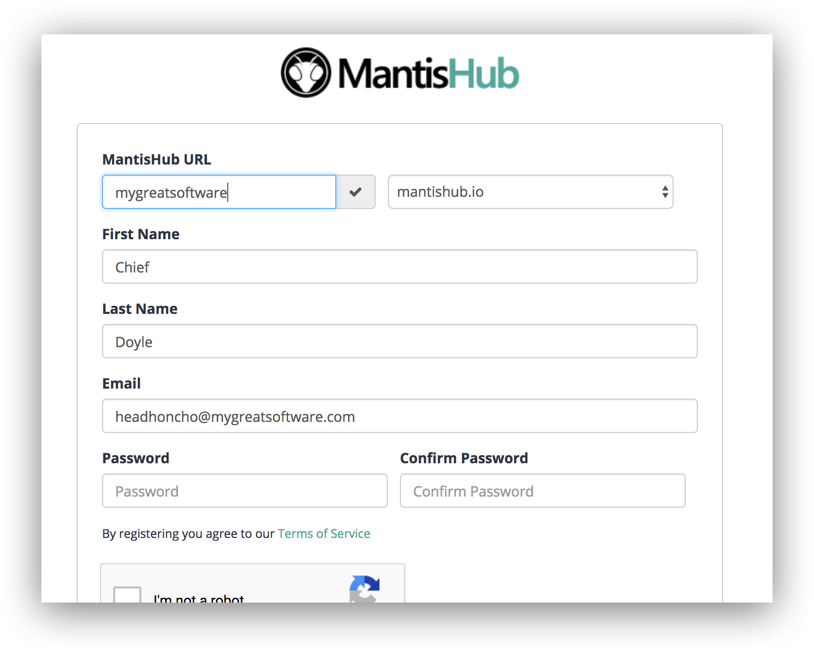

# Migrating Your Data to MantisHub

Customers can migrate their existing MantisBT (v1.0+) MySQL or MariaDB database straight into MantisHub seamlessly. For customers on our Gold or Platinum annual plans, a MantisHub engineer will work with you to manage and test migrations over a weekend for a fee of $250.

For customers based in Europe, you can request to have your service hosted on our EU (Ireland) cluster. 

Firstly, you'll need to take note of what is supported in the migration. Note that you must have a MySQL or MariaDB database with MantisBT version v1.0 or higher to have your system migrated.

Supported data for migration:

- Data like projects, versions, categories, issues, tags, etc will be migrated intact.
- Custom fields definitions and values will be migrated intact.
- Customization of visible fields on report, view, update pages.
- Customization of visible fields on View Issues page, CSV export, Print issues page, Excel export, etc.
- Most customization via config_inc.php.

What is not supported?

- Manual customization to SQL DB schema.
- Manual changes to Mantis code.
- Use of deprecated features (e.g. news, project docs, FTP attachments).
- Use of unsupported plugins. Our supported plugins are listed in our [supported plugins article](/customizations/plugins).

Customers who are not migrating data from a MantisBT MySQL or Maria database can either attempt conversion of their database to MySQL or utilize our [CSV import plugin](/import_export/importing) to migrate existing issues across to their MantisHub. For MS SQL & PostgreSQL users, you can find some guidelines [here](/migrating_to_mh/ms_sql) on how to convert to MySQL and providing attachment and configuration data needed for migration. 

Migrating to our MantisHub service from your [existing supported](/migrating_to_mh/prep_data) database is a fairly simple process.

Firstly, [sign up for a trial](https://www.mantishub.com/signup/platinum) using your preferred MantisHub name.  

Feel free to try out the MantisHub experience. Included in the trial is an email training program to help you explore the functionality and features of MantisHub. Any data entered into the trial will be discarded when your MantisBT data is migrated.

Secondly, [add a payment method](/plans_billing/adding) to your account to setup your paid plan.

 

Lastly, email our support team to get started. You'll need to arrange an appropriate weekend for migration and obtain details for the secure shared drive for uploading your data. Please also let support know if you need EU hosting. On the scheduled Friday, provide our support team with your [database and attachment data](/migrating_to_mh/prep_data) to be migrated and we'll do the rest.

Once you are migrated, you can continue to log in with the same credentials you used with MantisBT and you won’t have to worry anymore about lost data or upgrades as we perform daily backups and keep your system up to date with all security and bug fixes as well as any new features. 