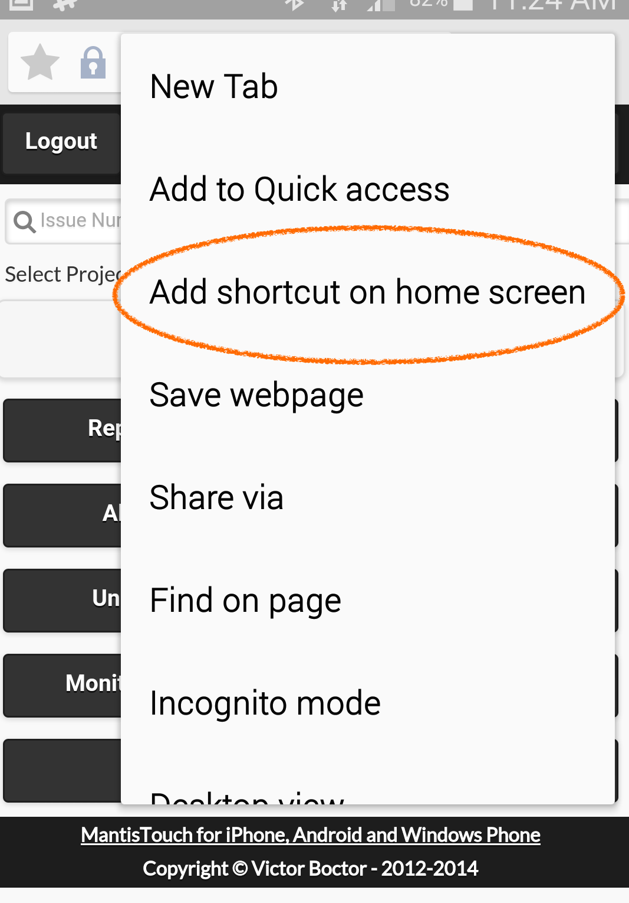

# Mobile Access on Android

To set up a web shortcut on your mobile:

- Open the standard Android browser (not chrome, it is called ‘Internet’).
- Go to `https://foo.mantishub.com/` (where 'foo' is your MantisHub name).
- Click Menu, then ‘Add Shortcut to Homepage’ and name it “MantisHub”.

 