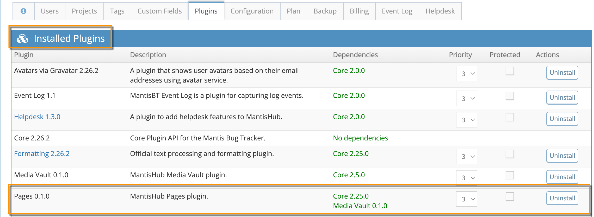
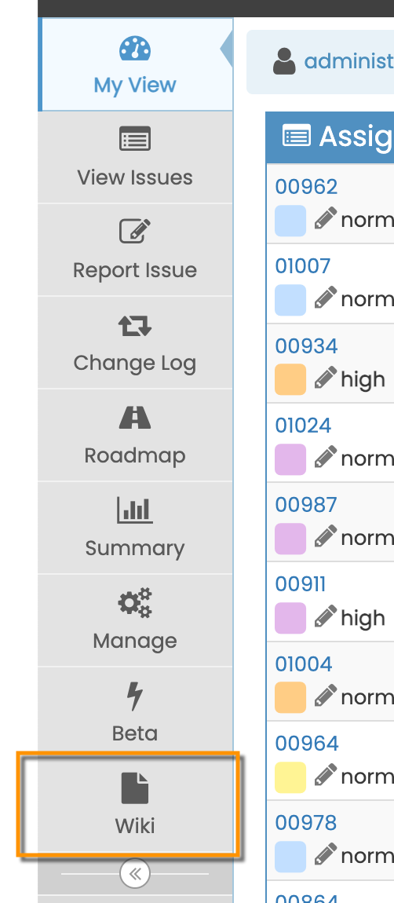
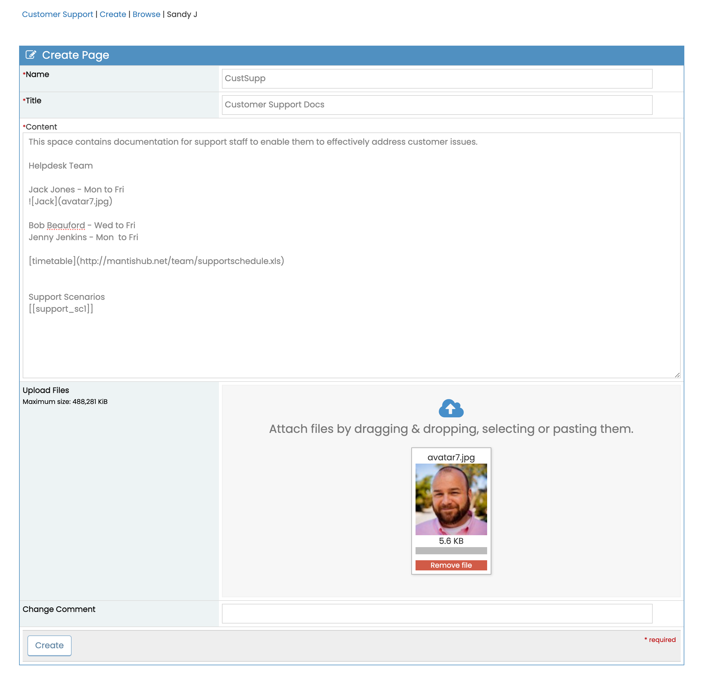
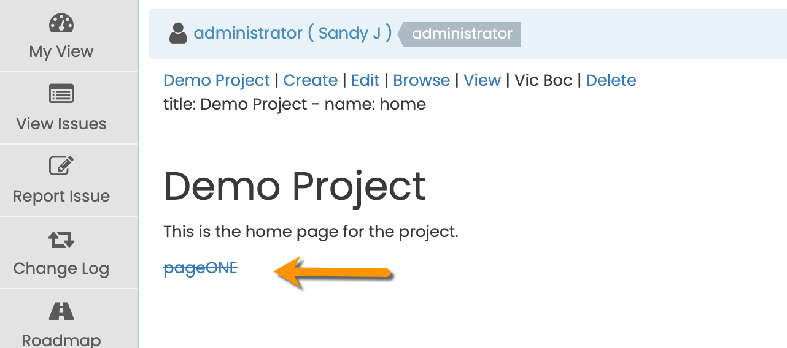
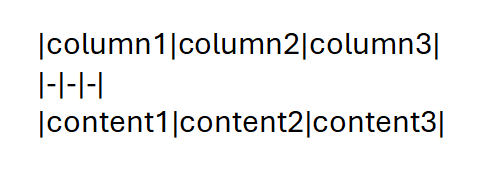
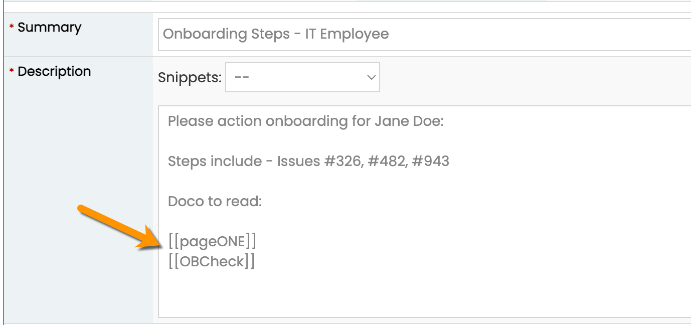
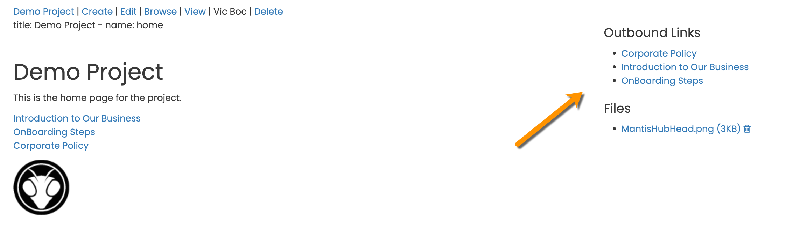

# MantisHub Pages – Markdown Wiki and Knowledge Base 

## What is Pages?

<p>
  <iframe src="https://www.youtube.com/embed/utP5cWa6Wjs?si=5aQDfOLBnm_P13CZ?rel=0" width="560" height="315" frameborder="0" allowfullscreen=""></iframe>
</p>

MantisHub exclusive **Pages** allows you to create an internal documentation repository to be used as a Wiki or Knowledge Base.

A built-in document repository that facilitates collaboration and knowledge sharing, increases efficiency and simplifies infrastructure. You have one tool, combining a wiki and documentation service with your internal issue tracker and external facing customer [Helpdesk ticketing](/mantishub_helpdesk/email_reporting.md) for a unified team collaboration environment. You can create documentation that cross-references other documents, internal issues, or customer support tickets.

Example use cases include:

* Reference test documentation in testing tasks
* Link to support processes from support tickets
* On-call playbooks
* Team onboarding
* Inviting comments on design documents

## What can you do with Pages?

Pages supports simple [Markdown formatting](/issue_management/markdown_support.md), including linking URLs and inserting local/remote images and videos. Pages can be linked to or from other Pages. You can link to any issue in any project within your MantisHub. You can also link to Pages from an issue summary, description, or note.

By default, all users with access level *viewer* and above can view Pages. All users with *updater* or higher can create, update or delete Pages.

## Installing Pages

Pages has been installed by default so you can access it straight away. If you wish to uninstall it, you may do so by navigating to Manage -> Plugins



When installed, you will see in the Main menu on the left-hand side a "Wiki" menu item where you can access documentation for each of your projects. 

 -->


## Creating New Pages

Once Pages is enabled, each project will have a Home page from which you can, and should, link to any Pages within your project. You can create a new Page in one of 2 ways.

1. Create a new page and then edit the home page to add the link to the new page. OR
2. Create a link on the home or a ‘parent’ page. A link with a strikethrough will be displayed. Click on this link which will take you to the ‘Create Page’ form where you can create the new page.

**Option 1:** From the Pages homepage in your specific project, click on the ‘Create’ button at the top of the screen.

You will be presented with the ‘Create Page’ form, where you will need to set:

1. **Name**: This must not contain spaces or special characters. This will be used within code and when linking pages.
2. **Title**: The displayed name of the Page. This can contain spaces.
3. **Content**: Enter text, tables, images, etc. using Markdown format.
4. **Upload** any related/inserted files.
5. **Click Create** and your new page is published. You can then link to this page from the Home page or a parent Page using the **name** you have specified.



**Option 2:** Edit the project's home page or another existing “parent” page and create a link to a new page. To link to a page, you type in the page's name surrounded by double brackets. For example

```
[[testPage1]].
```

If the page does not yet exist it will create the link, but it will be displayed with a strikethrough so that you know the page has not yet been created.



To create the Page, just click on the link displayed with the strikethrough and it will take you into edit mode for the new page and pre-populate the name field. You can go ahead and fill in all the other details and click Create.

## Syntax

When creating the Page, the formatting uses [Markdown](/issue_management/markdown_support.md) so any Markdown syntax will be parsed. Markdown is also able to translate some general HTML syntax.

### Some commonly used syntax

|Usage|Syntax|
|-|-|
|Headings|Use # to precede headings. One # is the highest heading level 1, ## = Heading 2, ### Heading 3 etc|
|Code Blocks|Highlight a block of text by surrounding it with three backticks e.g `` ```This is my highlighted text Follow step: 1. Step 1 2. Step 2 3. Step 3 ``` ``|
|Links|The syntax for adding a link is `[Text Displayed](URL)`. E.g. “Check out our `[support page](https://support.mantishub.com)` for more information”|
|Tables|To create a table, enter |


For more information, you can check out this shortcuts page for Markdown syntax - https://github.com/adam-p/markdown-here/wiki/Markdown-Cheatsheet

Or see our support documentation on [Markdown](/issue_management/markdown_support.md)

### Attaching/Embedding Images and Videos

To feature images on your Page, use the ‘Upload’ section to attach your file to the page. Then you can insert the file within your document with the following syntax

```

```

Syntax for embedding videos is the same but as well as attaching a file that can be quite large, we support referencing a remote URL e.g.
```

```

## Referencing Pages within an Issue and Issues within a Page

You can reference a Page from within a MantisHub issue or MantisHub Helpdesk ticket in the same way you reference it from another Page. In your issue description or notes, type in the page name surrounded by double square brackets.



You can reference a Page within another PROJECT by typing a forward slash project name forward slash page name surrounded by double square brackets.
```
[[/another-project/page-name]]
```

Linking to MantisHub issues from a Page is done by referencing the issue ID preceded by a hash symbol `#<issueID>`. For example #19724. You can link to issues or tickets in any project. Issue IDs are unique across the whole system so it doesn’t matter what project the issue belongs to.

The system will not prevent you from linking to a ticket to which you do not have access, but it will prevent you from viewing that issue according to your permission. If a user does not have access to the issue, then the link will take them to a blank page.

## Navigating within Pages

For every project, a home page is automatically created for you. This is where you can create a link to each new Page within the project. However, there is also a “Browse” menu option that will display all Pages in the project and includes a search box to allow you to search for a specific page.

From within every Page, there is an information box in the top right of the screen that will list all outbound and inbound links which can be used to navigate backwards and forwards. To create links to another page, type the page's name surrounded by double square brackets.



## Access Thresholds

By default, any user with access level ‘updater’ and above can view Pages. Any users with ‘developer’ and above can create, update, and delete a Page. To change these settings, you can create a configuration option via Manage -> Manage Configuration -> Configuration Report. Use the below configurations as needed:

#### Configuration Options:-


- *plugin_Pages_view_threshold*
- *plugin_Pages_create_threshold* 
- *plugin_Pages_update_threshold*
- *plugin_Pages_delete_threshold*

#### Type:-

- *default* or 
- *string*

#### Value:- 
Minimum access level that can perform the action :-

- *viewer*
- *reporter*
- *updater*
- *developer*
- *manager*
- *administrator*

