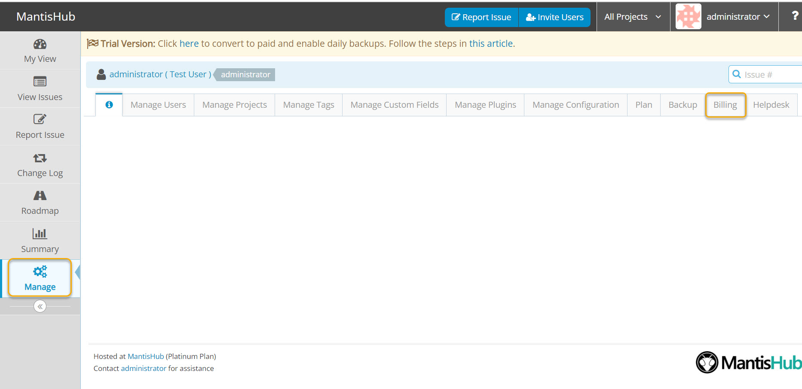
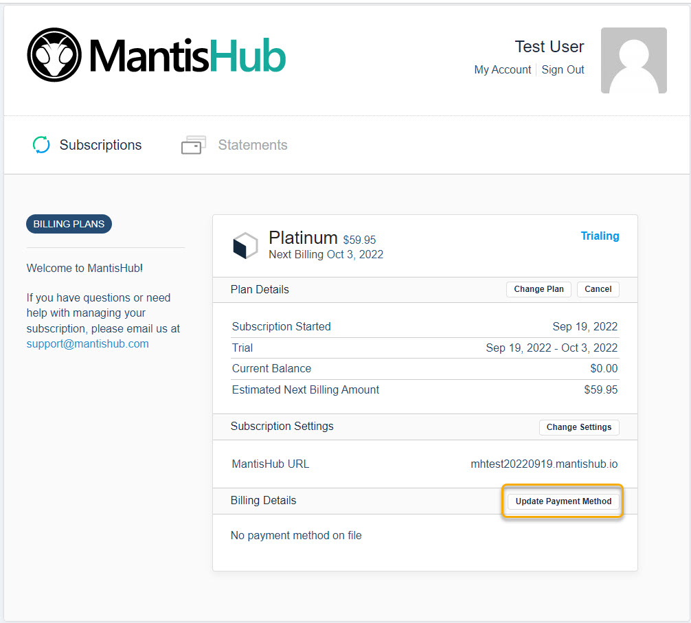
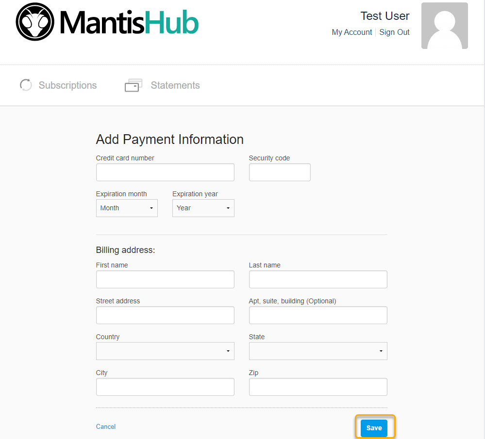

# Adding or Updating Payment Methods

MantisHub supports all major credit cards (Visa, MasterCard and American Express) for collecting payments. Credit card payments will automatically renew on your anniversary date for annual payment plans or monthly if you've opted to pay month to month. See [monthly vs annual payments](/plans_billing/monthly_annual) for the advantages of paying annually.

At this time we don’t support payment via check but for customers on annual platinum plans or larger we can arrange for [invoice billing](/plans_billing/invoice) and payment via bank transfer for an extra surcharge.

To add or update your payment method, you will need to have administrator access level. Login into your MantisHub service.

1. Go to the 'Manage' page and select the 'Billing' tab. A new window will open up with your account management interface.

2. Select 'Update Payment Method'.

3. Fill in the details and select 'Save'.

If you would like to update your account owner information, add your organization name, or VAT you can do so in 'My Account'. See [Update Customer Contact Details](/plans_billing/updating) article for more details. 