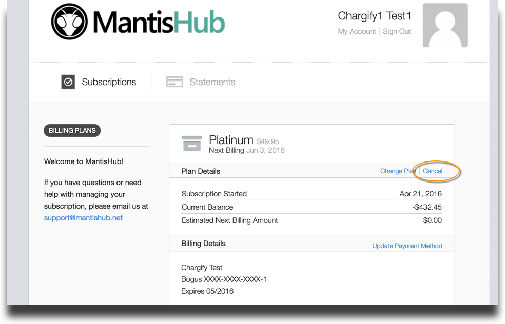
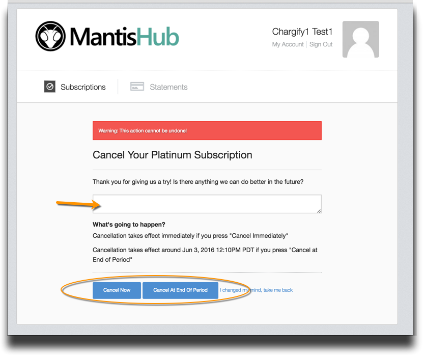

# Closing/Cancelling your MantisHub Account

It is important to note that once you close your account, all your data will be deleted from our service.  This is an irreversible action.  

It is recommended that you download a backup of your data before closing your account. See [Backing up & Downloading your Data](/import_export/backingup).  Restoring this backup later will be considered a migration and charged accordingly.

To close your account, administrators need to access the 'Billing' tab available from the 'Manage' page in your MantisHub. Then simply Click on 'Cancel'.

You can cancel immediately or if you have any credit on your account, you may wish to 'Cancel at End of Period'

Don't forget to let us know the reason you've cancelled, and any feedback you can provide on our MantisHub service would be greatly appreciated!  We are always looking for ways to improve our product.