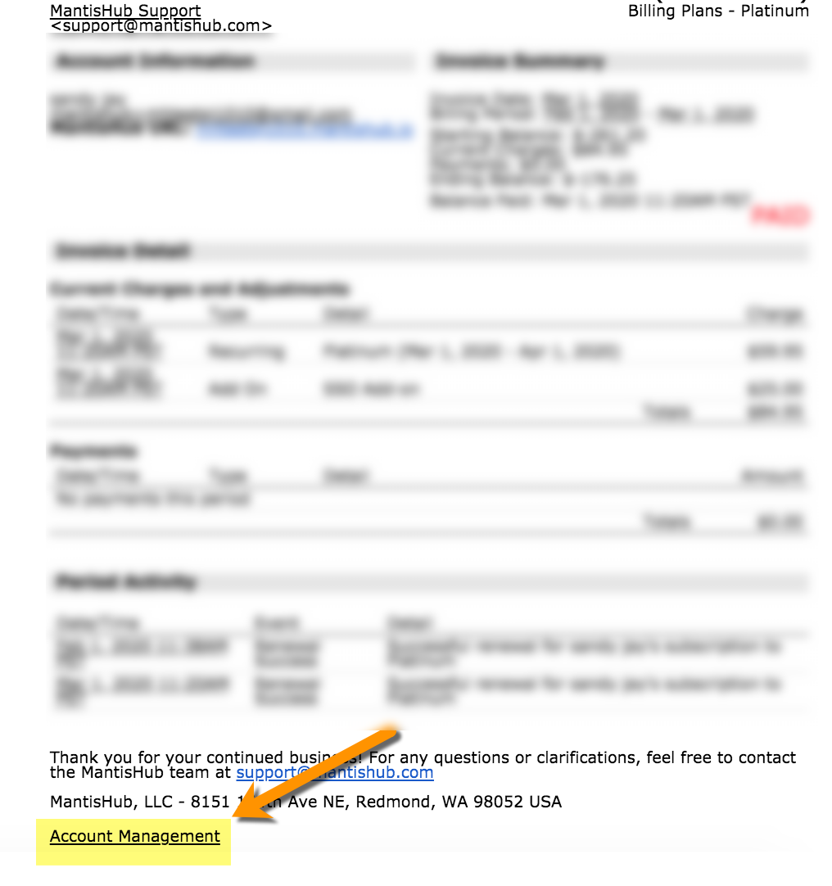
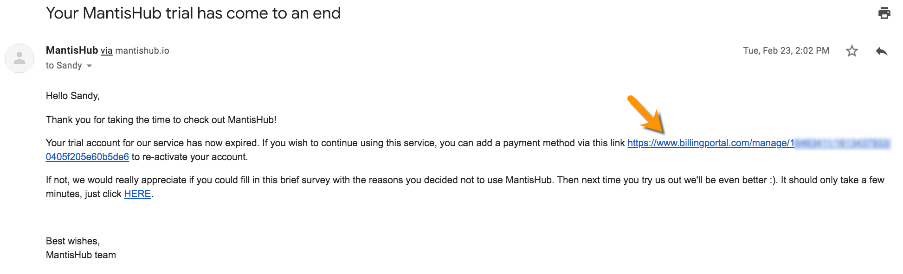

# How to Restore a Suspended or Expired Service

If you receive a suspension message when attempting to access your MantisHub, this is usually because your service has been suspended due to non-payment or you have a trial service that has expired. 

To restore your MantisHub there are a number of steps you can take.

**Suspension due to non-payment**

If the suspension is due to non-payment, your account owner will have received several emails leading up to the suspension asking them to [update the payment details](/plans_billing/adding) for your account. Only the account owner and anyone listed on the cc'd list of your account [contact details](/plans_billing/updating) will receive these notifications. 

Among these emails, there will be notification of cancellation of the service with the subject line *"URGENT NOTICE: Your MantisHub subscription has been CANCELLED."* Within this email we provide an Account Management link to your **billing portal** for you to update your payment details. You may also find them on any of your previous account statements. 

These links will still be valid up to **30 days** after your account has been suspended. You can access this link to update your payment details and once payment has been processed your MantisHub will be automatically re-activated. 

**Suspension due to Trial End**

Similarly, if you wish to re-activate your trial service, account owners will have received an email with subject *"Your MantisHub trial has come to an end"* containing a link to the billing portal.

Once a payment method has been added to your billing portal and payment has been processed, your service will be automatically re-activated.

Note that for trial services, your MantisHub account will be activated with the plan you signed up to (typically Platinum plan). If you wish to [switch plans](/plans_billing/switching) after the re-activation, you can go ahead and do so and your balance will be adjusted accordingly. That means that if you downgrade to a lower plan, you will be credited any payment difference. If you upgrade to a higher plan or an annual plan, you will only be charged the difference. 

And don't forget if anything is unclear or you need any help with the above, you can [contact our support team](/user_management/contact_support) at any time.