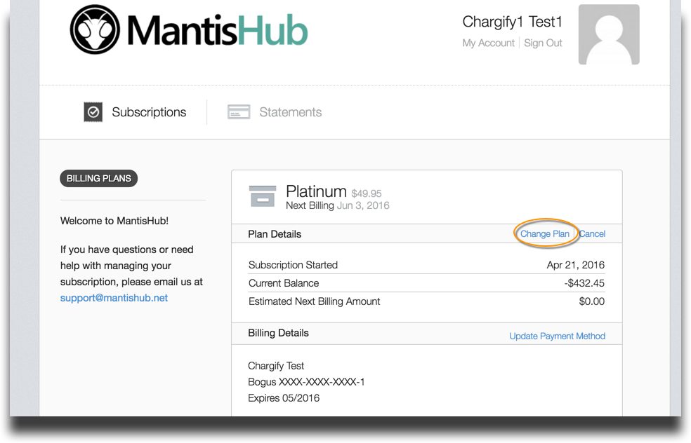
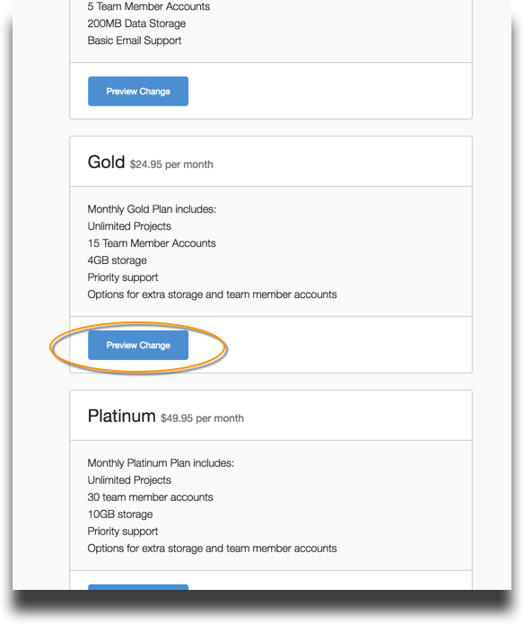
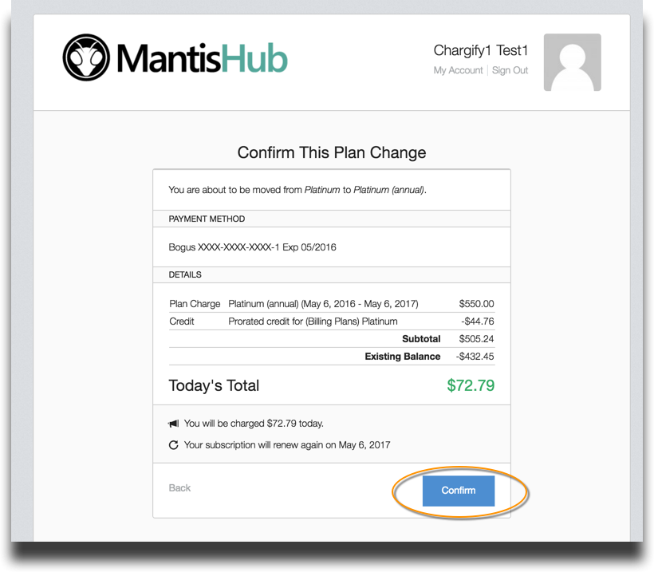

# Switching Plans

Customers can switch plans at any time from the [billing portal](/user_management/login_billing). But **before** you can change plans you will need to **make sure you have [added a payment method](/plans_billing/adding)** to the account. Otherwise you will receive an error message.

To make the change, administrators need to access the 'Billing' tab available from the 'Manage' page in your MantisHub and click on 'Change Plan'.

Select the plan you wish to change to by clicking the 'Preview Change' button.

Click 'Confirm' and your plan will be switched over. Your new billing plan will begin straight away and the billing period will start anew. Any credit you have from previous payments will be pro-rated and deducted from the balance.

You can also check your ['Plan' tab](/plans_billing/plan) within MantisHub to see your subscription details.

