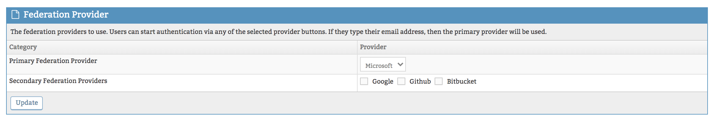
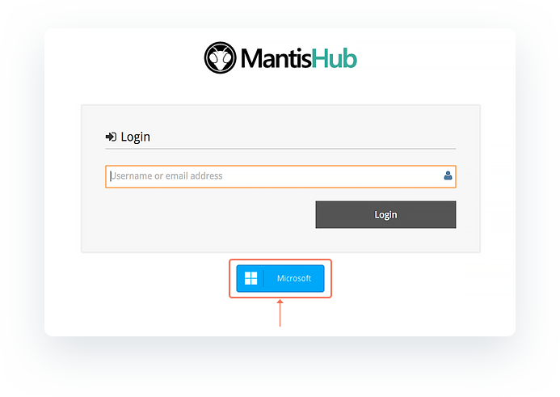

# Using Azure AD (Office 365) Authentication for SSO

By default, MantisHub has its own authentication system. It enables all users to sign-in with MantisHub specific usernames and passwords. This model is useful for the following use cases:

- Users who don't use a cloud identity provider like Azure AD that is leveraged by Office 365.
- If you have users that do not authenticate to the company identity provider. e g. 3rd party providers or external customers that are not in your directory.

For companies that use Office 365 and MantisHub, it is recommended to switch over to use of Azure AD authentication.

**Benefits for the users:**

- Users don't have to manage yet another username and password.
- Users get the advantages of single sign-on.
- User password hashes are not stored on our servers.
- User can be auto-provisioned to get instance access when they need it.

**Benefits for administrators:**

- Users authenticating via Azure AD will honor policies configured by the administrator, e.g. FIDO authentication, multi-factor authentication, password complexity, regular password change, protection against password spray attacks, etc.
- Users can't log in to MantisHub once they leave the company and Azure AD access has been revoked.
- Users can be auto-provisioned into MantisHub if they authenticate successfully with a white-listed email address domains.  This reduces manual work to onboard your team and reduces human error.

**Who can't use this feature (but can use MantisHub standard authentication):**

- Users that are not in your enterprise directory.
- Users with consumer accounts (e.g. outlook.com or gmail.com addresses)

**Implementing Office 365 authentication **

To enable the ability to authenticate MantisHub login via Office 365 (Azure AD) ensure you are on a [qualifying plan](https://www.mantishub.com/pricing). You will see the AuthHub plugin available in the 'Manage Plugins' page. Administrators can [install the plugin](/customizations/plugins) at their convenience.

Once installed, You can click on the plugin hyperlink to configure your SSO preferences. You need to define Microsoft as your primary provider in the Federation Provider section.

You will now see a Microsoft button available on your login page just below the username box. Your users can either click on that button to log in using their Office 365 credentials or simply enter their email address and password in the MantisHub login. 

When you first attempt to log in via your Microsoft Azure AD system, it may pop up with a [request for consent](https://learn.microsoft.com/en-us/azure/active-directory/develop/application-consent-experience) that you or your system administrator will need to approve. These requests can come in different forms depending on your configuration but essentially you will need to tick the appropriate checkbox and/or provide additional information to either directly consent to MantisHub access to Azure or submit a request to your administrator to provide access. Check out [Microsoft Azure support documentation](https://learn.microsoft.com/en-us/azure/active-directory/develop/application-consent-experience) for more details.

When the plugin is installed, the default settings allow users to log in using *either* their Office 365 *OR* MantisHub credentials. It is recommended to allow this for a test phase to make sure all works fine.  Once the testing is completed, you can configure further AuthHub options such as:

- Force Lists - requires a subset or all users to use their Office365 login by configuring the list of domains that are forced to use AuthHub authentication.
- Allow password login - allows a subset of users to login using their MantisHub credentials. This overrides the force list.
- Auto-Provisioning - automatic creation of a MantisHub account on successful authentication to your provider. 

For details on how to configure these options, read our [Configuring AuthHub for SSO](/plug_ins/config_authhub) article.