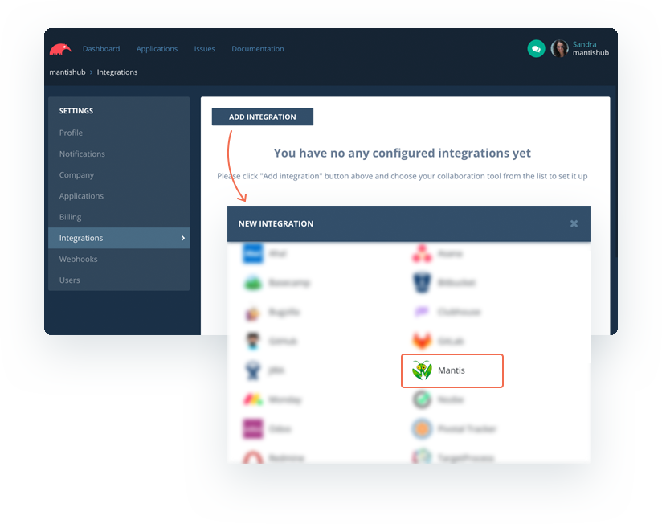
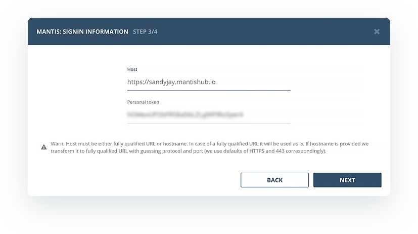
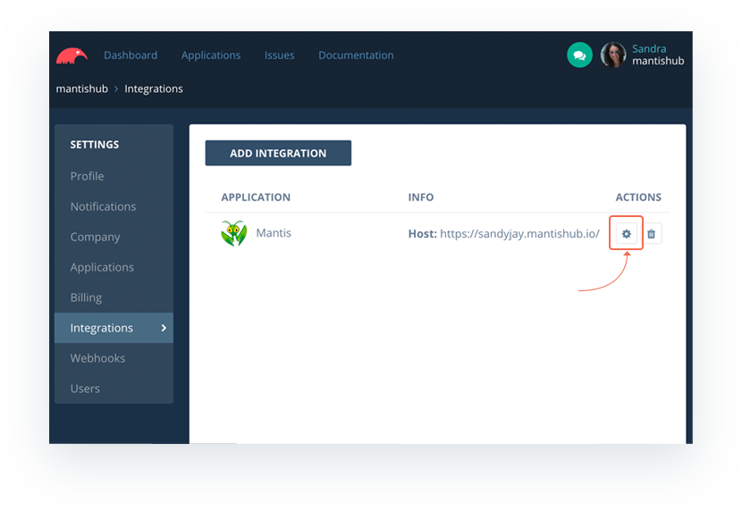
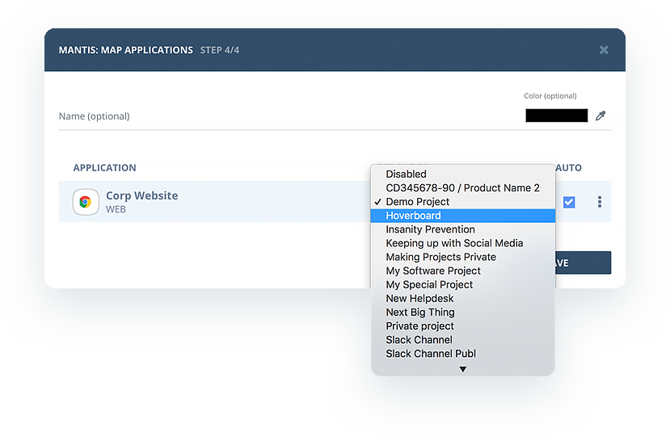
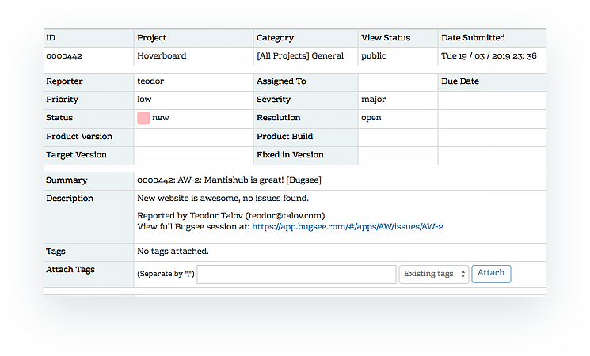

# Add In-App Feedback: Bugsee Integration

You can now integrate your MantisHub with [Bugsee](https://www.bugsee.com/) In-app feedback tool. [Bugsee](https://www.bugsee.com/) is a tool that is embedded within your web or mobile App that will capture crash and bug information at the time of the occurrence. It then stores and displays any relevant information including a video of user actions leading up to the issue, network traffic and console logs. 

With this integration, Bugsee can automatically create an issue in your MantisHub with a link to all the gathered information. This can save your developers considerable time trying to decipher the issue and reproduce it. 

To activate your MantisHub integration, you will need to:

1.  [Generate a MantisHub API token](/api/connecting_mh_api_tokens) as per our KB article. Make sure to record a copy of the generated token as it will only appear once. 

2. Within your Bugsee settings, head to Integrations and click "Add Integration"

3. You'll then need to enter your MantisHub URL and generated token into your Bugsee setup.

4. Lastly, you can map the project into which you wish to generate issues and check the box to allow issue generation to occur automatically. You can do this when adding the integration or head into the integration settings to add or change it at any time.

New bugs will now automatically generate issues withing MantisHub with a link back to the bugsee dashboard for all the information on the issue. 

Bugsee also allow you more control over the integration with the use of configuration 'Recipes". You can find information on configuration recipes and all the above in the Bugsee documentation: [MantisBT integration documentation](https://docs.bugsee.com/integrations/providers/mantisbt/). 