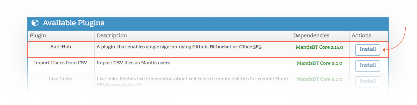
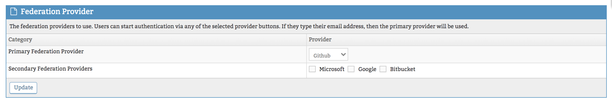
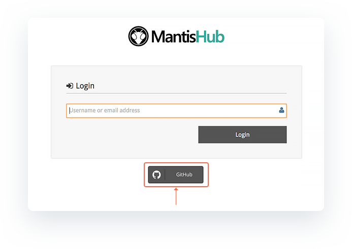

# Single Sign-On (SSO) with GitHub

MantisHub supports single sign-on (SSO) with [GitHub](https://github.com/). This allows you to access your MantisHub account using your GitHub login credentials.  

As well as adding convenience this can also provide extra security. GitHub supports two-factor authentication (2FA), so you may wish to have your users access MantisHub via GitHub for a higher level of data security.

Firstly, administrators will need to [install the AuthHub plugin](/customizations/plugins). Head to Manage - Manage Plugins and click the install button next to the AuthHub plugin listed in 'Available Plugins'.

Once installed, You can click on the plugin hyperlink to configure your SSO preferences. You need to define GitHub as your provider in the Federation Provider section. 

You'll now see the option at the bottom of your login screen to connect into MantisHub with your GitHub accounts. 

When you click on GitHub, it will require you to allow MantisHub to access your account. You'll need to allow access on the consent forms displayed.  This should be a one time prompt.

The registered email in MantisHub for a user, must match a verified email address (primary or secondary) with Github.

The default setting allows users to log in using either their GitHub account OR with their MantisHub credentials.  It is recommended to allow this for a test phase to make sure all works fine.  Once the testing is completed, you can configure further AuthHub options such as:

- Force Lists - requires a subset or all users to use GitHub login by configuring the list of domains that are forced to use AuthHub authentication.
- Allow password login - allows a subset of users to login using their MantisHub credentials. This overrides the force list.
- Auto Provisioning - automatic creation of a MantisHub account on successful authentication to your provider. 

For details on how to configure these options, read our [Configuring AuthHub for SSO](/plug_ins/config_authhub) article.