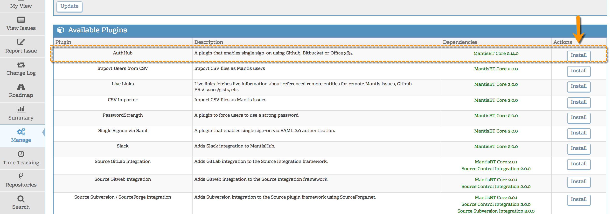
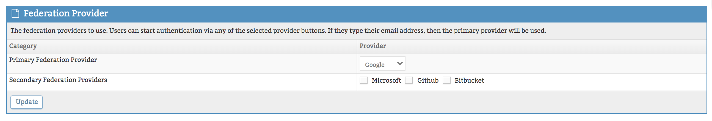
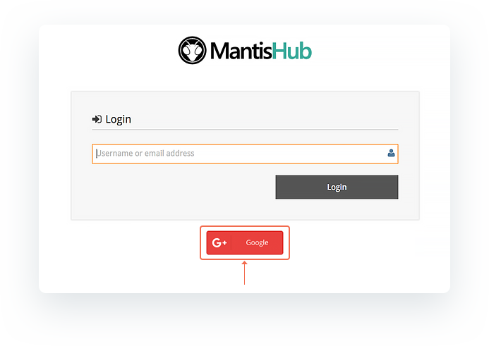

# Google & G-Suite Authentication (SSO)

By default, MantisHub has its own authentication system. It enables all users to sign-in with MantisHub specific usernames and passwords. This model is useful for the following use cases:

- Users who don't use a cloud identity provider like Google.
- If you have users that do not authenticate to the company identity provider. e g. 3rd party providers or external customers that are not in your directory.

For companies that do use Google Suite and MantisHub, it is recommended to switch over to use Google authentication.

**Benefits for the users:**

- Users don't have to manage yet another username and password.
- Users get the advantages of single sign-on.
- User password hashes are not stored on our servers.
- User can be auto-provisioned to get instant access when they need it.

**Benefits for administrators:**

- Users authenticating via Google will honour policies configured by the administrator, e.g. FIDO authentication, multi-factor authentication, password complexity, regular password change, protection against password spray attacks, etc.
- Users can be auto-provisioned into MantisHub if they authenticate successfully with a white-listed email address domains.  This reduces manual work to onboard your team and reduces human error.

**Implementing Google authentication **

To enable the ability to authenticate MantisHub login via Google, ensure you are on a [qualifying plan](/plug_ins/config_authhub). You will see the AuthHub plugin available in the '*Manage Plugins*' page. Administrators can [install the plugin](/customizations/plugins) at their convenience.

Once installed, You can click on the plugin hyperlink to configure your SSO preferences. You need to define Google as your primary provider in the Federation Provider section. 

You will now see a Google button available on your login page just below the username box. Your users can click on that button to login and will be prompted to enter their Google credentials or if they are already authenticated in the browser it will take them straight into MantisHub.

The default setting allows users to log in using either their Google account OR with their MantisHub credentials.  It is recommended to allow this for a test phase to make sure all works fine.  Once the testing is completed, you can configure further AuthHub options such as:

- Force Lists - requires a subset or all users to use Google login by configuring the list of domains that are forced to use AuthHub authentication.
- Allow password login - allows a subset of users to login using their MantisHub credentials. This overrides the force list.
- Auto Provisioning - automatic creation of a MantisHub account on successful authentication to your provider. 

For details on how to configure these options, read our [Configuring AuthHub for SSO](/plug_ins/config_authhub) article.