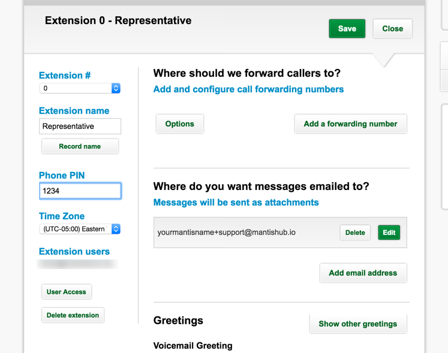
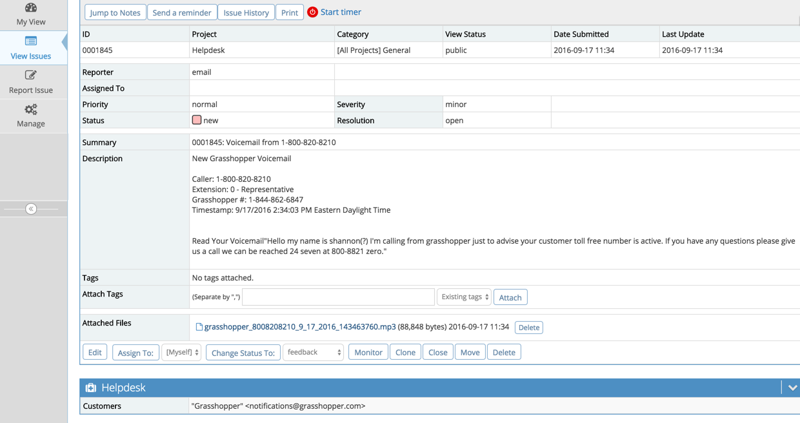

# Grasshopper Integration (Voicemails)

MantisHub can integrate with [Grasshopper phone service](http://grasshopper.com/) to capture customer communications straight into your MantisHub Helpdesk.

Grasshopper sets up local or toll-free number that you can set to forward to a voicemail service. These voicemails can then be emailed to an address of your choice.

Using [MantisHub Helpdesk](/mantishub_helpdesk/report_email), you can have emails sent to your MantisHub email address converted into issues within your system. 

So when a voicemail is left on your grasshopper number, you will automatically have an issue created in your MantisHub. It will contain a speech-to-text transcription in your issue description as well as attaching an mp3 file of the voicemail recording. 

