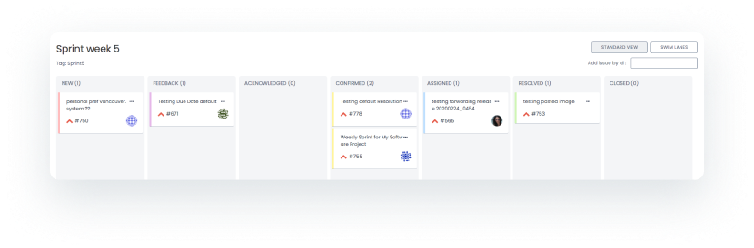
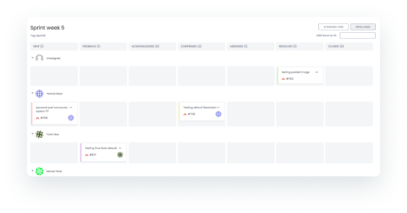
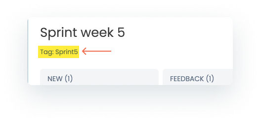
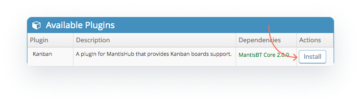
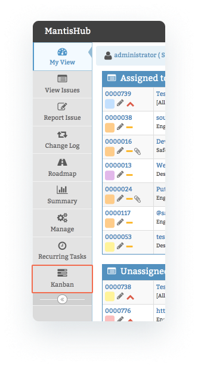
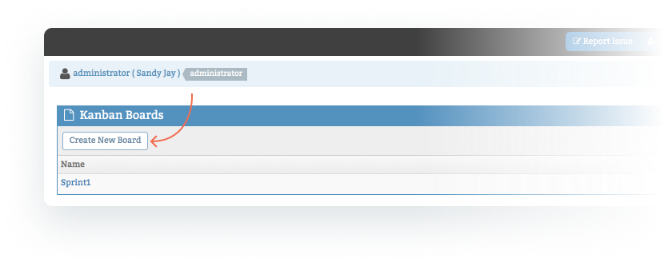
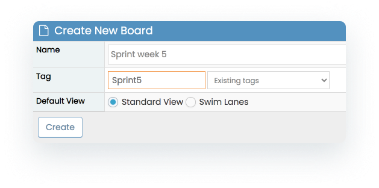
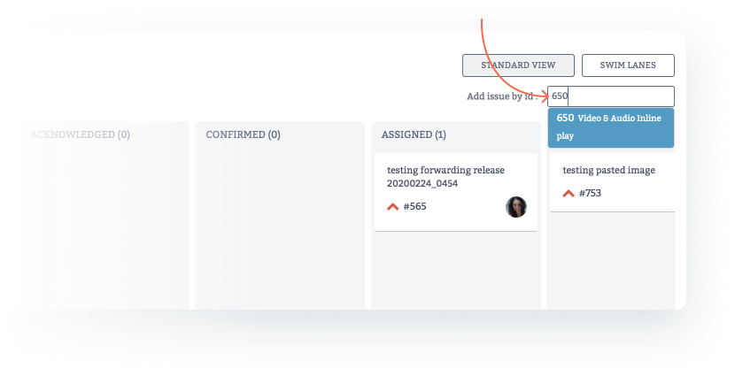
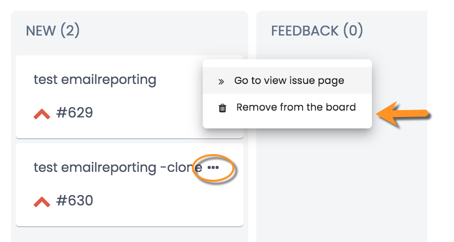

# Kanban Plugin For Agile Workflow Management

[Kanban](https://www.agilealliance.org/glossary/kanban) is a methodology adopted into Agile frameworks to allow you to place tasks on a visual 'board' and progress them through workflow statuses to completion. It works with principles of a continuous flow of work within a 'work in progress' (WIP) limit. Boards typically have a 'Standard View' that displays issues in columns that correspond to the current status of the issue, and a 'Swim Lane View' which will introduce rows according to a second property, typically the assigned user or resource. 

*Standard View* 

*Swim Lane View* 

The Kanban board format provides transparency for your team for work in progress and allows you to visualize the progress of each task through the workflows to resolution and closure. The WIP limit allows the team to feel a sense of achievement in meeting goals where work delivery is continuous and not always linked to a product 'release', it also allows you to ensure even distribution of work across your resources and identify any bottlenecks. The methodology is highly popular in project management and software development and has proven effective in eliminating bottlenecks, reducing cycle time and facilitating faster feedback and delivery of changes.

 

MantisHub supports a Kanban plugin that allows you to create and interact with Kanban boards for management of your issue workflow within your projects. Kanban boards created in Mantis are linked to a [tag](/issue_management/using_tags), and issues with the relevant tag attached would be visible on the given board as a 'card'. You can then interact with the cards (drag/drop) to make changes to your issues.

Typically you would have a board created per sprint or have a board for each of your projects. You would tag a subset of your issues within a project to place on your Kanban board, move these through you workflow statuses to resolution and then remove issues after they are closed. Once issues are closed, you can place more issues on the board or create new boards (e.g. for new sprints). 

 
**Install Kanban**

To get started using Kanban, you first need to head to the Manage Plugins tab from the Manage page to [install the plugin](/customizations/plugins). An administrator can perform this task.

Once installed, you will see a new 'Kanban" item on the main menu of your MantisHub. 

**Create a board**

Head to the Kanban page to create your new Kanban board. Users with access level updater and above can create, view and manipulate Kanban boards. Boards are restricted to one project so make sure your project selector is on the relevant project and click 'Create New Board'.

When creating a new board you will define:

- A relevant **name**,
- The **tag** that will be used to link issues to the board. You can use an existing tag by selecting from the drop down or create a new one by typing in the new tag name. 
- Your preferred default view: **Standard view** will display all issues grouped in columns according to issues status. **Swim lane view** includes rows showing user/developer assignment. 

**Adding & Removing issues**
To add or remove issues to the board, you can simply add or remove [tags](/issue_management/using_tags) to the individual issues. You can do this by editing an issue or using [group actions](/issue_management/update_multiple_issues) to change several issues at once. 

Within the board, you can also **add** issues by entering an issue ID in the box in the top right. 

And **remove** issues by clicking the ellipse in the top right of the card and selecting 'Remove from board'. 

Make sure to refresh your board after adding or removing issues. 

**Board interactions**

The board will display the issue as a 'card'. The cards show issue summary, ID, priority (as an icon) and assignment by displaying the user's avatar. You can hover over the priority icon or users avatar to display details. 

**Editing issue**: Double click on the card to open up the issue in a separate window and view issue details. You can make changes, add notes etc from here as usual. 

**Swim Lane minimize:** When setting your board to swim lane view, all users developer and above with access to the project are displayed. However, you can minimize lanes for dormant users. 

**Status Changes:** You can drag your issues across columns to update the status of your issues as it moves towards resolution. Dragging issues across status columns in the Kanban board will honor any [workflow transitions](/customizations/wf_trans) you have set as well as triggering configured [email notifications](/issue_management/config_email_notifs). Any changes to the status of your issues made outside your Kanban board will be reflected in your Kanban board (you may need to refresh). 

**Assignment Changes**: drag your issues across rows within the swim lane view to update the assignment of your issues. One benefit of the visual characteristic of the Kanban board is that it allows you to easily see if certain resources are being over or underutilized and re-assign accordingly. Changes to issue assignments will trigger [email notifications](/issue_management/config_email_notifs) as per your configuration. Any changes in assignment made outside your Kanban board will be reflected in your Kanban board (you may need to refresh). 

All changes to your issues in the Kanban board including status and assignment changes and will be reflected in your issue history. 

**Kanban Board Configurations**

If you would like to limit which users can see your Kanban board you can add a configuration to modify it. The default is set to 'Updater'. 

***Config Option:*** plugin_Kanban_access_threshold

***Value***: < minimum access level required to see Kanban boards > (e.g. 55= DEVELOPER) so any user with developer access level or higher will be able to view the Kanban boards. See the [access level article](/customizations/access_levels) for all available access levels. You can either write the name or the numeric value in the 'Value' section).
