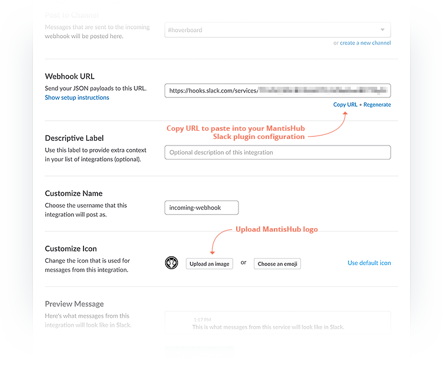
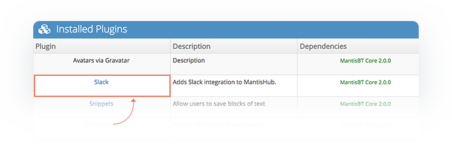
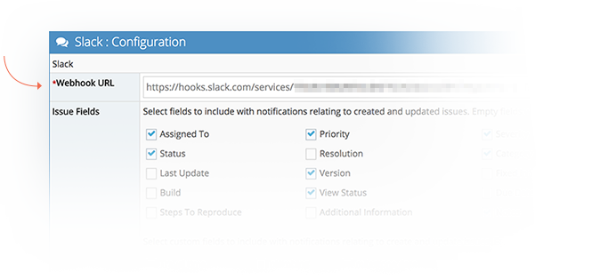
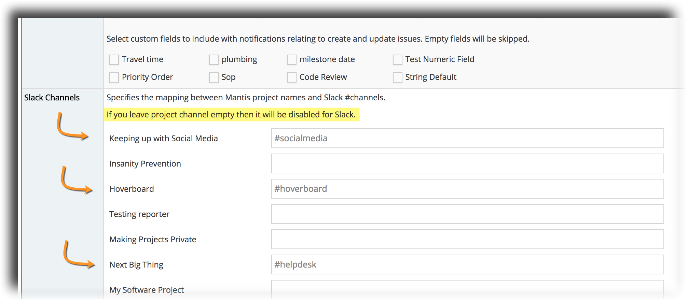
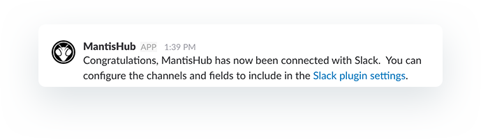
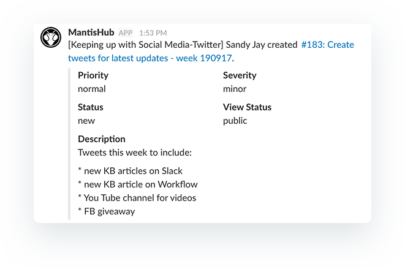
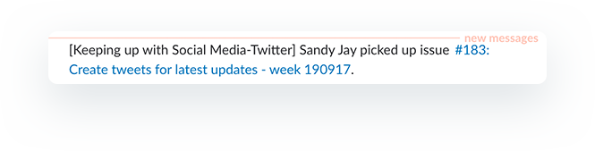
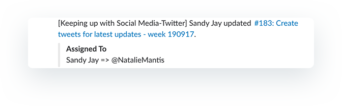
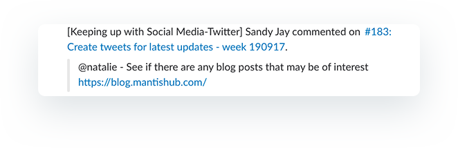
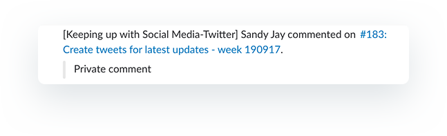

# Slack Integration for Chat

[Video Tutorial](https://youtu.be/PlJgKoV0DDU)

<iframe width="560" height="315" src="https://www.youtube.com/embed/PlJgKoV0DDU?si=cIW7-NGO6JD9QIFC" title="YouTube video player" frameborder="0" allow="accelerometer; autoplay; clipboard-write; encrypted-media; gyroscope; picture-in-picture; web-share" referrerpolicy="strict-origin-when-cross-origin" allowfullscreen></iframe>

[Slack](https://slack.com/r/02999sfh-03lgmwdg) is a chat application that provides a platform for team communication. Integrating Slack with MantisHub allows mapping MantisHub projects to Slack channels to allow receiving notifications into Slack when issues are updated. 

**Setting up MantisHub + Slack**

**1. Create Incoming Webhooks**

Firstly you should create a channel in Slack for the integration. You can name this for any Project in MantisHub that will have a mapping to a Slack channel. Then you will need to add an incoming webhook to this channel in Slack. For information on adding webhooks or enabling/installing the webhook app, head to the [Slack api site here](https://api.slack.com/incoming-webhooks). 

Click the option to add a configuration for Incoming webhooks. It will ask you for the channel for the integration. Select the channel you created from the dropdown and then click "Add incoming Webhook".

You will see a Webhook URL generated. Copy the URL and then head into your MantisHub. You also have the option to upload an icon to be displayed next to MantisHub messages, attached to this article is a jpg you can use if you wish. 

**MantisHub Plugin Configuration**

Go to Manage - Manage Plugins. If you haven't already installed it, you should see the Slack plugin in the Available Plugins section. Click install then click the Slack hyperlink to go into the plugin configuration. 

Paste in your generated webhook url into the Slack configuration. You can select here the included fields and type of updates you would like in your the Slack notifications. See the "Slack notifications" section below for details. 

The next step is to configure the project to slack channel mapping. You will need at least one mapping for the integration to work. Any project left unmapped will not broadcast any updates to slack. You can use different Slack channels for different projects or the same channel across many projects. The channels specified must already exist in Slack.  Projects that don't have a Slack channel mapping won't generate notifications in Slack.

Click update and test to save the configuration and generate a test notification to Slack. A notification like the one below will be sent to all channels in Slack with MantisHub project mappings.

**Slack Notifications**

You will receive Slack notification when: 

- Issues are created
- Issue status is changed
- Notes are added. For private notes, you will receive a simple notification that a private note has been added, the contents of the note will be hidden. For additions of public notes, the note content will be included in the notification.  
- Issue assignment is changed. 
- - An issue is deleted
An issue is moved *to* the mapped project. (At this point there is no notification when an issue is moved *out* of a project)

Note that for all Slack updates the **Issue ID** and **Summary** will always be shown and are hyperlinked. So if you click on them it will open up a new desktop or mobile browser page directly to the MantisHub issue. 

In your Slack plugin configuration you will find some options in the 'Issue Fields' section. The fields chosen here will determine what fields are displayed on issue creation. It will also determine if you are notified of a change relating to these field. For example say you have priority checked and severity unchecked, you will received notifications if the priority is changed but not if severity is changed. 

Access to project notifications to a Slack channel will be viewable by all Slack users with access to the channel, independent of their MantisHub permission to access the MantisHub project/issue.  However, if such users click through to MantisHub, their access will be validated. If MantisHub abd Slack usernames are the same, @mentions in MantisHub will also be highlighted as mentions in Slack notifications.

**Examples**

Below are some sample notifications. These are updates for the 'Keeping up with Social Media" MantisHub project for an issue in 'Twitter' category being posted to the #socialmedia Slack channel. The project name is shown in these updates as it is different from the Slack channel name:

***When an issue is created:***

***When a team member assigns an issue to themselves:***

***A team member assigns an issue to another team member:***

***A user adds a public note:***

***A user adds a private note:***
