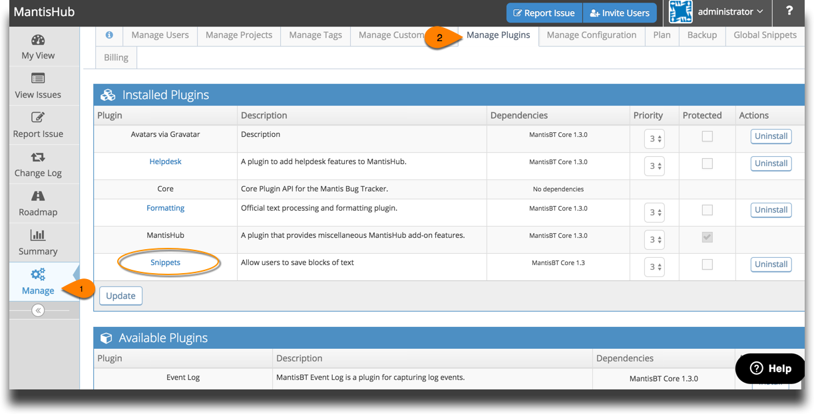
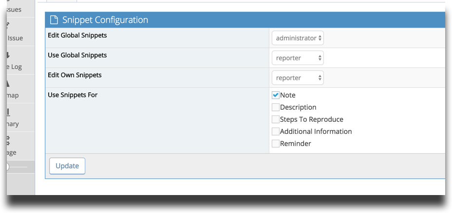
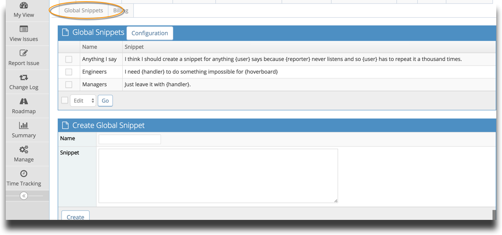
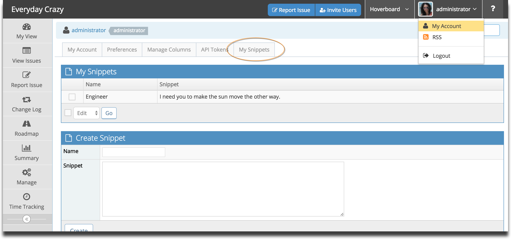
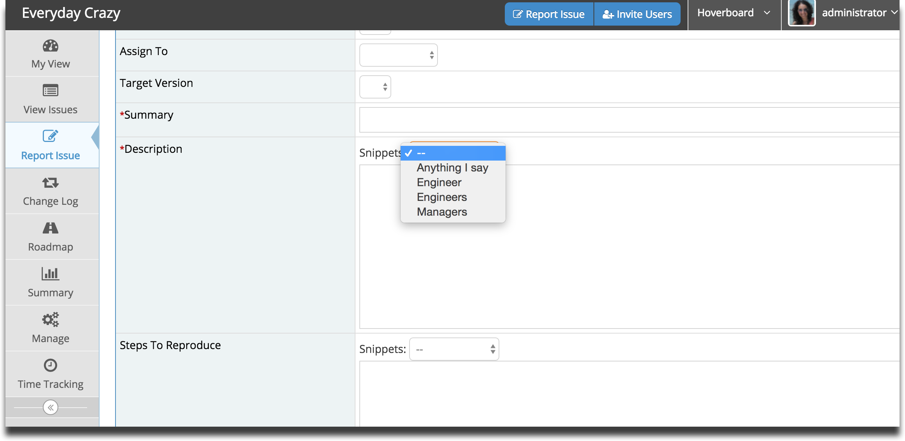

# Snippets Plugin

Do you find you're typing the same thing into tickets over and over again? Well, snippets to the rescue! 

Install the snippets plugin to enable you to populate your issues with pre-made responses and save your poor fingers. 

There are 2 types of snippets, personal (My Snippets) that are only available in your account and shared snippets (Global Snippets) which can be shared across users in the system.

**Installing Snippets**

To install the plugin go to 'Manage' - 'Manage Plugins'. You'll see it listed in the Available Plugins. After clicking Install it will show up under the Installed Plugins.

**Configuring Snippets**

To configure Snippets go to 'Manage' - 'Manage Plugins' and click on Snippets in Available Plugins. 

You can set what access levels are able to:

- configure global snippets 
- use global snippets
- create their own snippets.

You can also define where in an issue snippets can be used. 

**Creating/Editing Snippets**

To create and edit global snippets, got to 'Manage' - 'Global Snippets'.

To create and edit 'My Snippets', click on your username in the top right corner and go to 'My Account'. You'll see a tab there for 'My Snippets'

To use the snippets, you'll see a drop down box at the top of the fields that you have configured to allow snippet usage. 

