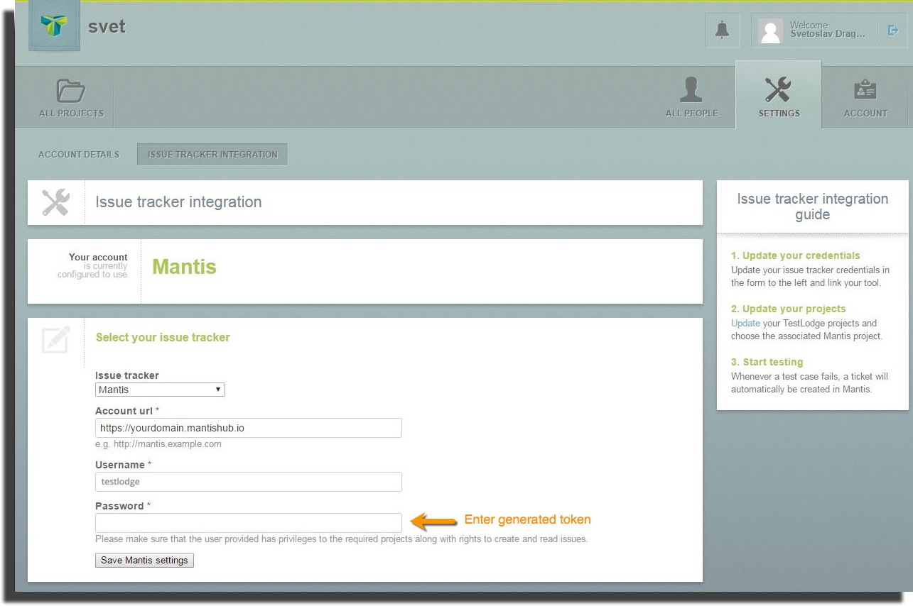
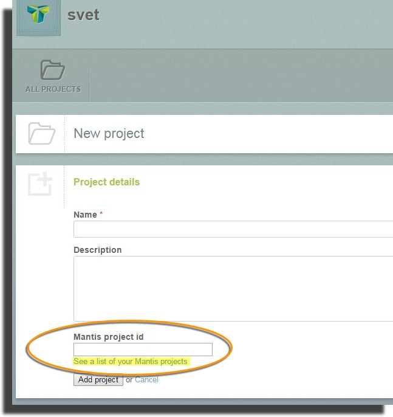
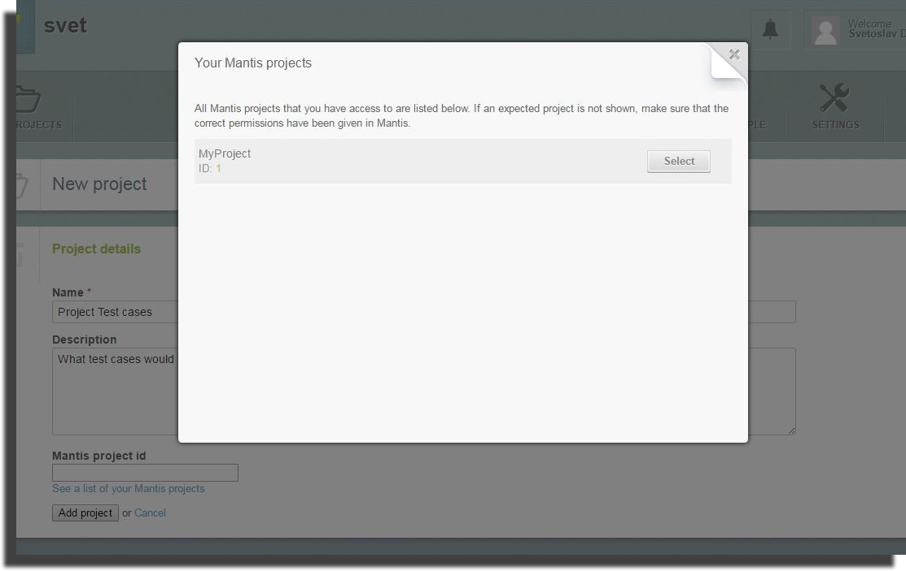
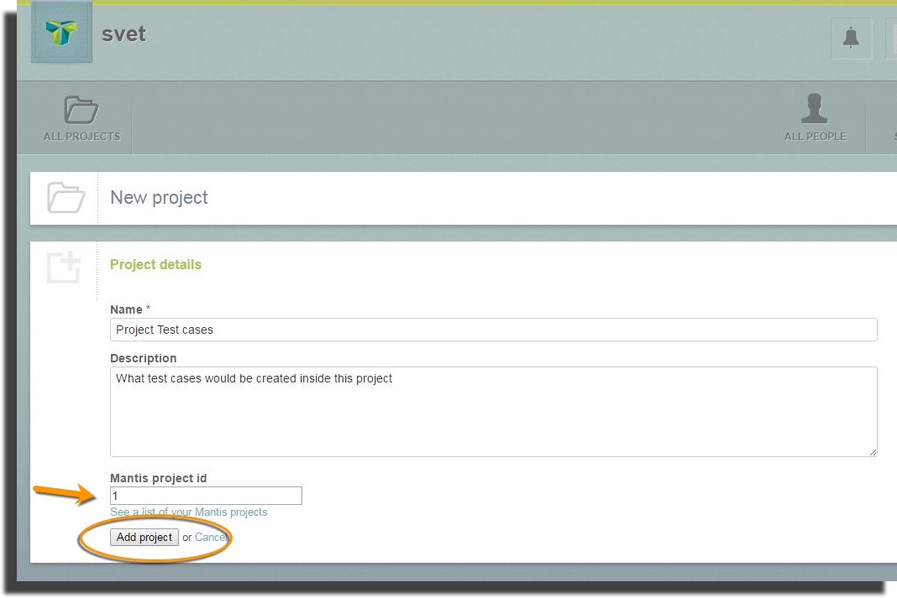
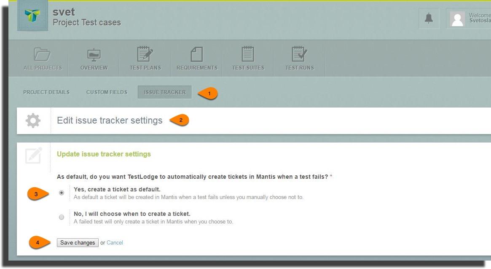
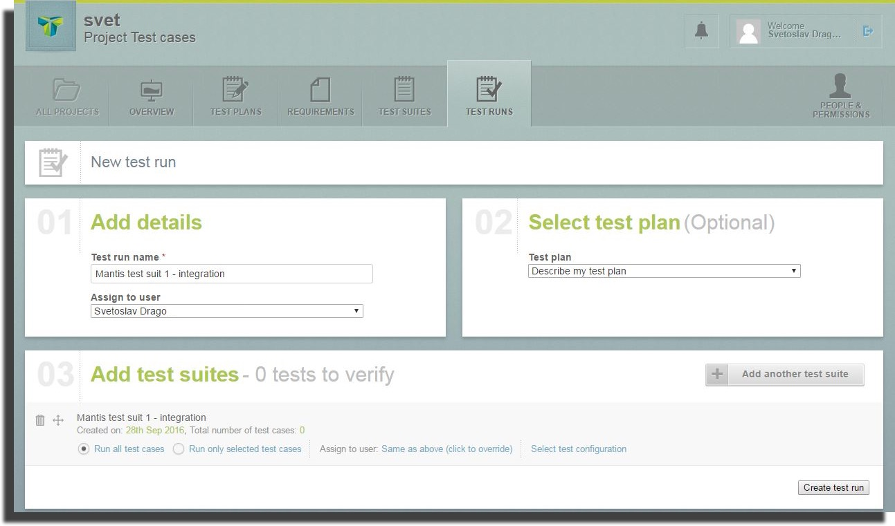
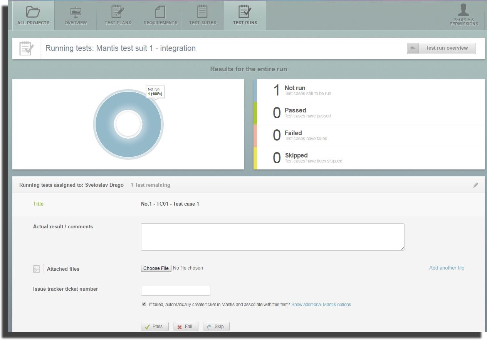
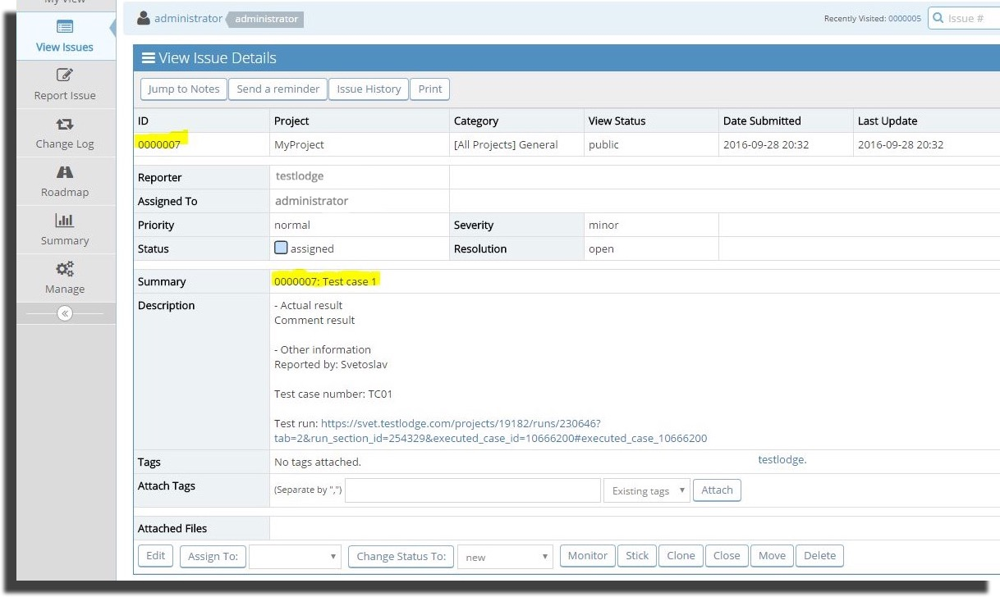

# MantisHub and TestLodge Integration

To integrate your MantisHub issue tracker with [TestLodge](https://www.testlodge.com/) online test case management tool you will need to:

1. Create a new user 'TestLodge' in your MantisHub and g[enerate an API token](/api/connecting_mh_api_tokens) for it.
2. **Link** to your TestLodge account
3. Create a **TestLodge project** and link to your MantisHub project
4. Set your **project behavior**
5. Create and run **test case**s 

Steps for each of these are listed below. You may also want to check out this [TestLodge video tutorial](https://youtu.be/QvI_6z_rdK4) on the Mantis integration.

**1. Create a User and API Token**

We suggest you create a new user account named 'TestLodge' for the API token generation and TestLodge integration. [Give it REPORTER access](/user_management/create_user_accounts) to the appropriate projects. This way issues reported from TestLodge will be easy to differentiate as they will have the 'TestLodge' user listed as the reporter.

Create an API token as per the [steps in this article](/api/connecting_mh_api_tokens) and note down the generated token.

**2. Link to your TestLodge account.**

Log into your TestLodge account and go to "Settings" - "Issue Tracker Integrations".

Select Mantis for *Tracker*, than provide the full https URL of your MantisHub (e.g. https://mymantisname.mantishub.io). 

Enter your MantisHub username (testlodge) under *username* and for *password* the Token generated in step 1.

**3. Create a TestLodge project linked to your MantisHub project**

While creating a project, TestLodge provides functionality to link to your a MantisHub Project through ID. This is done by entering the *MantisHub project ID* in the field Mantis project id. If you don’t know the project ID you can select it by clicking on the link '*See a list of Mantis projects*' below the field. It will fetch and list all projects accessible by the provided *Issue Tracker account*.

**4. Set project behavior**

Open up your newly created project and click on the 'Issue tracker' tab. Edit the Issue tracker settings and select whether or not you wish to auto create issue within your MantisHub project when a test fails. This is will be either a Yes or No setting.

**5. Create and run Test Plans**

The next step is to create a *Test plan*, a *Test suite* and *Test case* for the Test suite. Once this is all set, you can create a Test Run by clicking on the Test Run tab.

Enter the test run name, assigned user, the *Test Plan* and a T*est Suite* and Create your test run.

Once you start testing, you click ‘*Run test assigned to you*’ and fill in the details for displaying your test results. 

You will see there is also an Issue tracker ticket number where you can provide an ID of the MantisHub Issue for internal relation of this Test Run. The number is only informational and isn’t directly linked.

Below the field for Tracker Number, there is a link 'Show additional Mantis options'. This will open up the following fields:

- *Assign to user* – list of users retrieved from MantisHub, you can select one on which created issue would be assigned
- *Category* – list of categories retrieved from MantisHub
- *Ticket reporter* – Autofilled by TestLodge, using the user provided at Integration Settings for setting Mantis report.
- *If failed, automatically create ticket in Mantis* – checkbox is checked or unchecked by default depending on the settings you have set for your project in step 4. If checked and Test Run is marked as Failed, then an Issue will be opened automatically inside Mantis 

If you have any issues with the integration you can submit a request with [TestLodge help](https://help.testlodge.com/) or reach out to our support team.