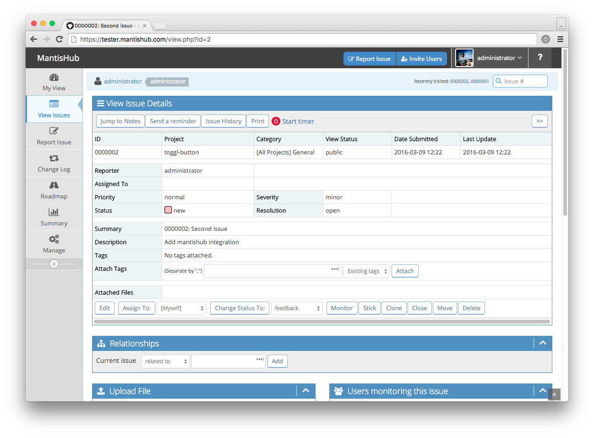
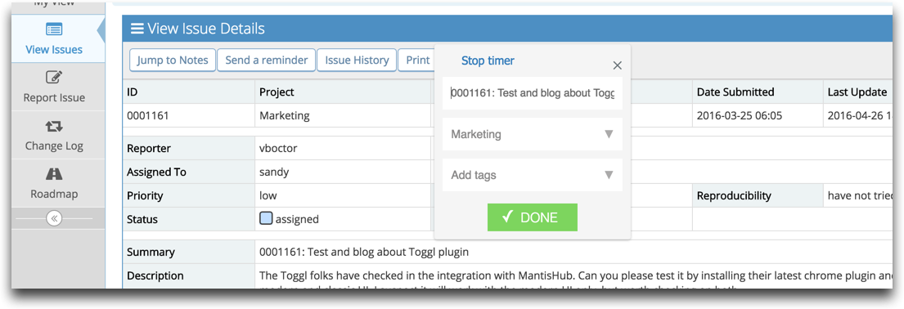
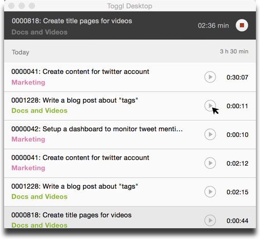

# Toggl Integration for Time Tracking

If you are not aware of [Toggl](https://toggl.com/), it's ".. *a time tracker that is built for speed and ease of use. Time keeping with Toggl is so simple that you’ll actually use it.*" 

It has native clients on Windows, Mac, iOS and Android.  In addition, it provides reporting capabilities relating to time spent by an individual or a team.  Toggl has a free plan for teams up to 5 users and offers a 30 day free trial.

MantisHub has worked with the Toggl team to provide an integration to make it seamless to record time spent on tasks in MantisHub.  This is achieved by using the Toggl button Chrome extension which enables a 'Start Timer' button on the MantisHub issue pages enabling a single click to start tracking spent on an issue with meta-data about the project and task automatically extracted from MantisHub.

You simply [add the toggl chrome extension](https://chrome.google.com/webstore/detail/toggl-button-timer-with-p/oejgccbfbmkkpaidnkphaiaecficdnfn?hl=en) and the rest is automatic.

Once installed you'll see the red toggle button at the top of the 'View Issue Detail' form. You can simply click on the red button and a new toggl timer will start with issue number and summary as the task name.

If your MantisHub project name corresponds to your Toggl project name this will automatically be populated or you can add the toggl project and tags as you start the timer.

Once they are entered in Toggl, you can switch the Toggl timer between the issue entries using your Toggl desktop client.

For more information on how Toggl and the Chrome extension work check out [this article](https://support.toggl.com/en/articles/2206984-toggl-button-browser-extension).

It is important to note that MantisHub offers some basic [in-built time tracking functionality](/issue_management/setup_time_tracking). Toggl provides an alternative that is useful for those who already uses Toggl or see it as a better fit for their needs.  For others, they can continue to use the built in functionality.
