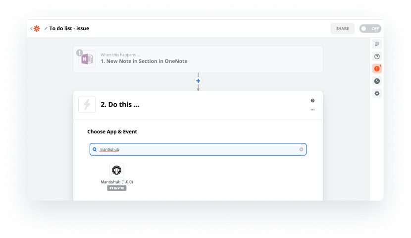

# Zapier Integration

[Zapier](https://zapier.com/home) is an app that works as a 'glue' to provide integration between over [2000 other apps](https://zapier.com/apps). Zapier allows you to created automated workflows across these apps. It does this through the concept of  'zaps'. A 'zap' is a workflow where a 'trigger' in one app will initiate an action in one or more other apps. Each action that is performed is called a 'task'. 

**Setup**

Currently, MantisHub integration is only accessibly by invitation. As usage becomes more widespread, the MantisHub app can be listed in their app database but until then, you will need to click on this link to have it added to your Zapier app list.

https://zapier.com/developer/public-invite/96112/86d25830211ac615be704a8a27e906fe/ 

Once you click the link it will appear in the list of apps when you set up your zaps. 

You will need to give Zapier access to your MantisHub and to do this you must enter an API token for authorization. Check out this article on [how to generate an API token](/api/tokens_access_mh). You can add your MantisHub manually via the 'My Apps' menu in Zapier or you will be prompted to enter your details when creating a zap with MantisHub as the target. 

**How to use it**
The MantisHub integration with Zapier will allow you to automate 2 action types:

- Create a new issue
- Create a new note to an issue

So based upon a trigger in any of the [supported apps](https://zapier.com/apps) in Zapier, you can automatically create an issue or add a note to an issue in your MantisHub.

When creating an issue via Zapier, you can specify the below issue information, and as Zapier will also collect data from the trigger app, you can use the specific information collected to enter into your MantisHub action:

- **Project**: select from a dropdown list of available projects
- **Category**: defaults to "General" but you can also enter free text
- **Summary**: free-form text as usual, don't forget you can also take data that Zapier has collected from the integrated app to enter into the issue summary and/or description.
- **Description**: as above for summary. 
- **Priority**: select from a dropdown of your MantisHub priority options. This field is optional.
- **Assign to**: free text, enter MantisHub username.

When creating a note you will need to specify:

- **Issue ID**: Can be entered free-form or select from the dropdown
- **Note content**: free-form text, as usual, you can also take data that Zapier has collected from the integrated app to enter into the issue summary and/or description
- **View Status**: This is public by default or can be set to private via the dropdown selection.

**Some integration ideas**

There are many ways the Zapier integration can be used to save you time through automation. It also means you don't have to wait for a plugin or supported one-to-one integration. Zapier lists integration with over 2000 apps but here are a few ideas of how you might want to use it:

- **Calendar integration for scheduled tasks** - Create a task within MantisHub for regularly scheduled calendar items e.g. process payroll on the 1st of the month, Performance appraisals March and September or renewing your domain once a year, etc. 
- **CI/CD for Software Development** - automatically open an issue for your specific software project when a build or deployment fails.
- **Monitoring Tools** (opsGenie, pingdom etc) - create high priority issues when monitored devices and infrastructure goes down.
- **Review / Approval Workflows** - create issues when code, documents (OneNote or Evernote) or videos (vimeo, youtube) are uploaded to request reviews/feedback. 
- **Social Media** (twitter, facebook, wordpress etc) - create issue or notes to a master issue when you are mentioned on social media channels or comments are added to your blog. 