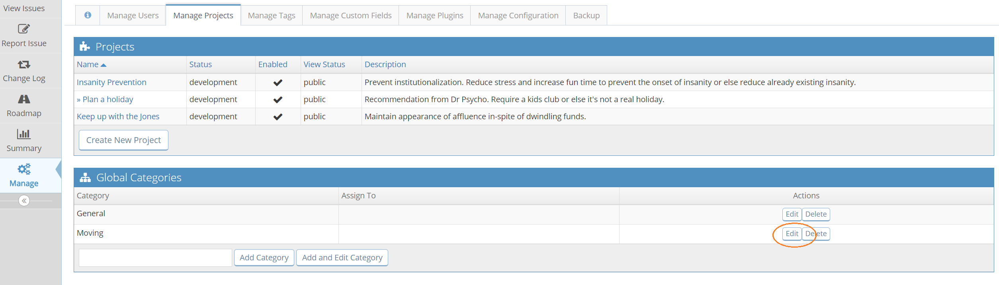
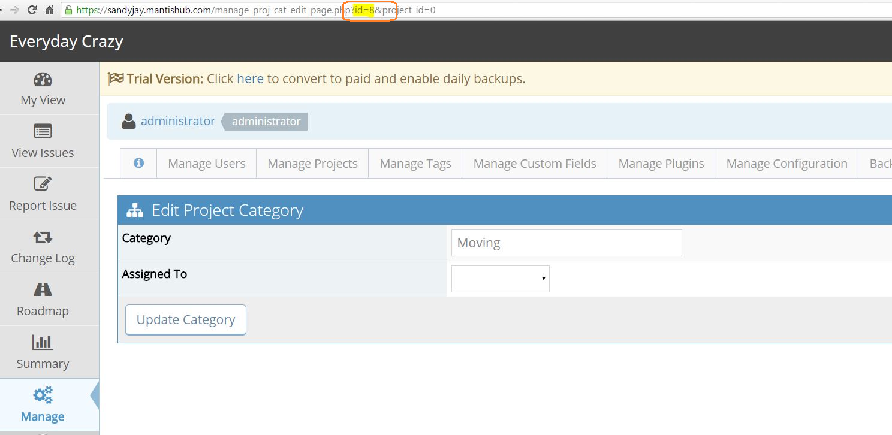
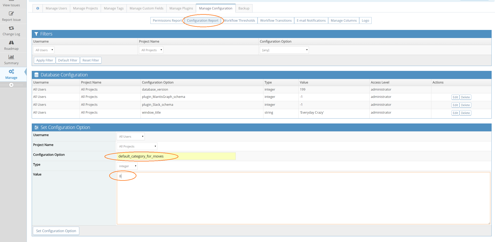

# Changing the Default Category

When using email reporting or moving issues between projects, you can’t select the issue category. When moving issues between projects, if the source category does not exist in the destination project then issues are placed in a default global category '[All Projects] General'. As are all issues that are created via email reporting. 

You can change the default category for moving issues between projects if desired. Firstly you will need to nominate the global category you wish to make the new default and determine its id. You can find out the id by going to the ‘Manage’ and select the ‘Manage Projects’ tab.

‘Edit’ the category and look at the id number displayed in the URL. In this example, it’s 8.

Once you know the id, create a configuration option via you ‘Manage’ page. Select the ‘Manage Configuration’ tab and click ‘Configuration Report’.

Fill the fields in the ‘Set Configuration Option’ pane as shown for

Username: **All Users**

Project Name: **All Projects**

Configure Option: **default_category_for_moves**

Type: **integer**

Value: **8**  *(replace 8 with the category id)*

Email reporting will always use the global General category for issue creation and if this category is deleted your email reported issues will be rejected. You can correct this by setting the default move category as per the process mentioned above. 

Please note that you will not be able to delete a category that is defined as the default move category. The system will return an error. You will have to configure a new default move category first as well as re-categorize all issues assigned this category.