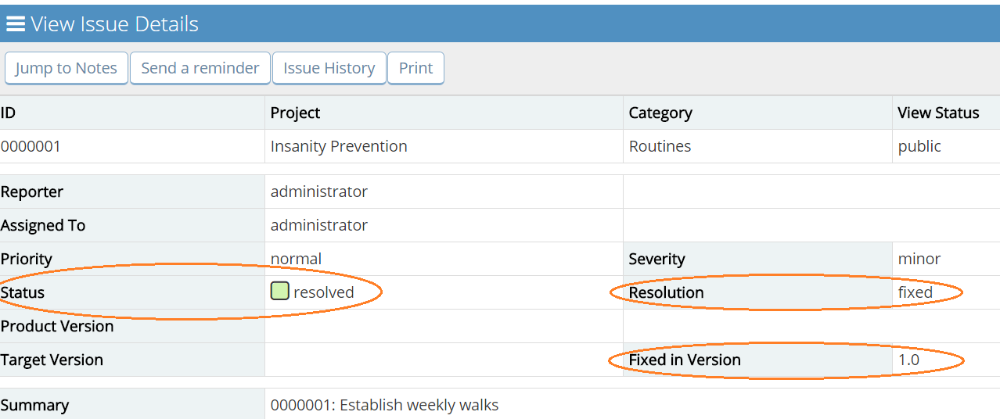
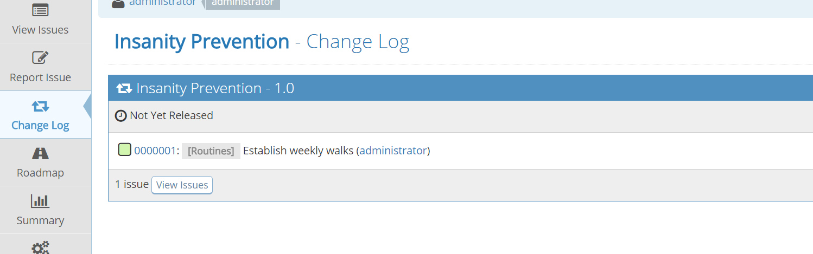
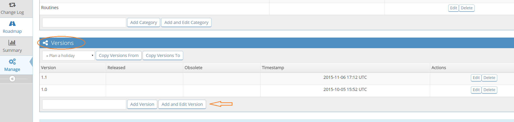
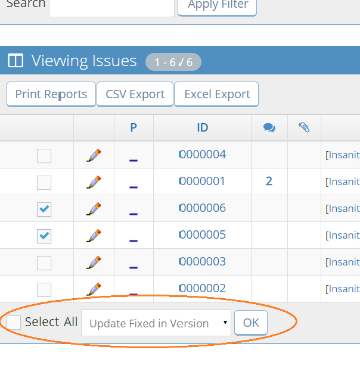

# Project Changelog

[Video Tutorial](https://youtu.be/96jLdwGeMh8)

<iframe width="560" height="315" src="https://www.youtube.com/embed/96jLdwGeMh8?si=QK8KcetuetBUHNKR" title="YouTube video player" frameborder="0" allow="accelerometer; autoplay; clipboard-write; encrypted-media; gyroscope; picture-in-picture; web-share" referrerpolicy="strict-origin-when-cross-origin" allowfullscreen></iframe>

## Using the Changelog
MantisHub allows you to not only track the status of issues; it can also relates issues to [Versions](/project_management/versions_mh) or phases and can reflect this in a Changelog to help you track progress and milestones within your projects.

The Changelog information can be included in software releases to allow users to determine the value in new releases. It answers those usual questions like: 'what’s new?', 'what’s been fixed?', and 'are there security fixes?'

Each project can have several versions. Users typically report issues against released versions (referred to as Product Version) and developers typically fix issues in version soon to be released (Fixed in Version).

In order for an issue to show up in the Changelog, it has to satisfy certain criteria.

The issue must have a:

1. **'resolved' or 'closed'** status.
2. **'fixed'** resolution, and
3. version specified in the **'Fixed in Version'** field.

Once the issue satisfies all these criteria, the issue will automatically appear in your Changelog tab. 

## Configuration
You can modify which users have access to your Changelog via [Workflow Thresholds](https://support.mantishub.com/customizations/wf_thres#workflow-thresholds). Go to 'Manage' - 'Manage Configuration' - 'Workflow Thresholds' - scroll to the bottom section 'Others' then 'View Change Log' and modify the access level. Make sure you have the correct project or 'all projects' selected in your project selector in the top right corner of your screen.

## Handy Tips
1. Make sure you have versions defined in the project. Otherwise you won’t be able to complete any of the version related fields. Check out the article [Project Configuration](/project_management/project_config) if you need help here.

2. You can set the 'fixed in version' field for multiple issues at once by using the group action on the 'View Issues' page. This option is only available when the selected project is not 'All Projects'.  

