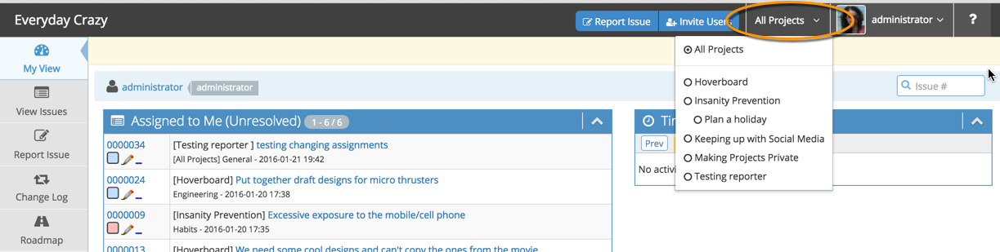

# Project Selector

A navigation feature within MantisHub that you may need to take note of is the **Project Selector**. This will appear in the top right hand corner of your screen once you have 2 or more enabled projects in your MantisHub.

The project selector can be set to display information for 'All Projects' or for a specific project listed in the drop down. This is important to note as your views and setting may be impacted by what you have in the project selector. 

Some scenarios include:

1. On the My View page if the Project Selector set to 'All Projects' it will display issues from all your projects. If you wish to only view issues within a certain project you can select that project from the drop down and only these issues will show.  

2. When using filters via the 'View Issues' page, your last filter is saved until you find the need again to change these filters or reset them. You should note that these filters can be different for each of your projects and so when moving from one project to another via your selector these filters will change. 

3. When configuring certain settings (e.g. [email notifications](/issue_management/config_email_notifs), [time tracking](/issue_management/setup_time_tracking), 'my preferences', managing column views) the configuration will apply to only a specific project OR across all projects depending on what you have in you Project selector. Anything set at a project level will override 'All Project' settings.

4. When reporting an issue you must select a specific project in your selector. If you have 'All Projects' selected, you will be prompted to select one. Only categories within the project selected will be available when creating the issue.