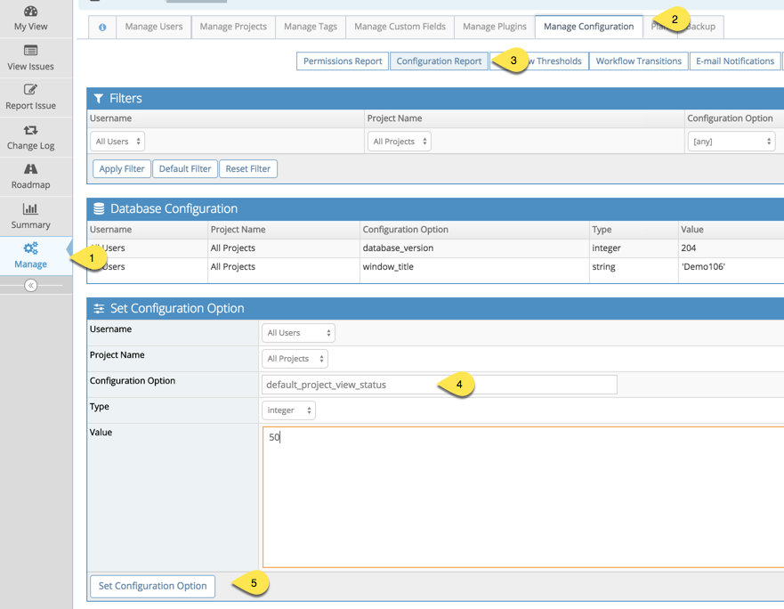

# Making Projects Private by Default

The default setting is for projects to be created as public by default.  Public projects are accessible to all users registered in the MantisHub.  In order to mark a project as private which only makes the project available for administrators and users that are added explicitly, you can add the following config:

Go to "Manage - Manage Configuration - Configuration Report" and adding the following config:

All Projects, All Users, default_project_view_status, integer, 50

This will take effect for all newly created projects.

