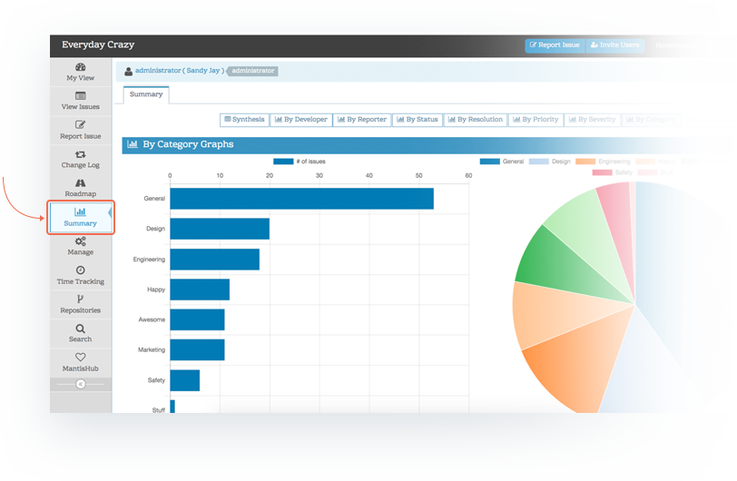
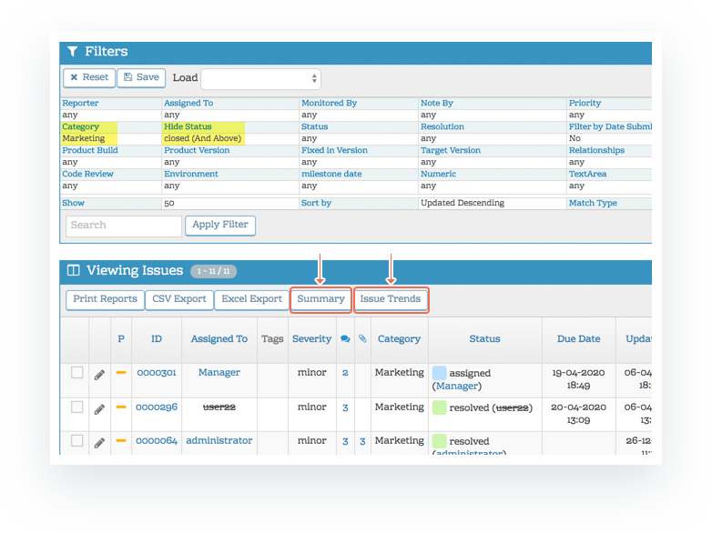
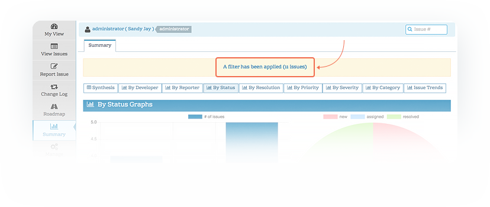
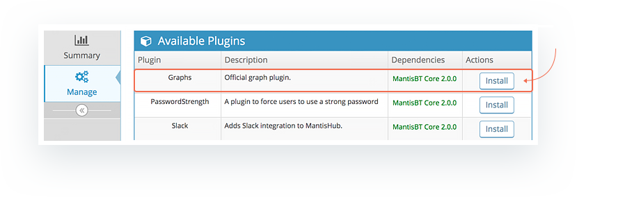

# Reporting and Statistics - Summary Page & Graphs Plugin

**Reporting in MantisHub**

MantisHub has in-built reporting to provide you with reports and statistics on your issues. Users with access level *manager* or above can view the Summary page, but this threshold is also customizable within the workflow threshold settings ('Others' -> 'View Summary' setting). Users that do have access will see a Summary option in their main menu on the left of the screen

When viewing the Summary page, make sure to take note of your [Project Selector](/project_management/project_selector) as you can display MantisHub stats across all projects or restrict the results to a single project using the project selector at the top of your screen.

**Filtering your reports and statistics**

When accessing the Summary page via the main menu, the date range is not limited so all ticket information from the life of your MantisHub will be displayed filtered only by the project selector. To tailor the tickets for which the data is calculated, you can use the [View Issues page filter](/filters/using_filters) and run Summary or Issue Trend reports directly from there. When the summary is run from the View Issues filter you'll see a message at the top of the page that filtering is on and the number of issues the data represents. 

**Summary Synthesis**

You will see a range of tabled statistics displayed when you first head to the Summary page. Most of the data displayed are self-explanatory however there are some concepts you should be aware of.

1. **Open states** - In several tables, there are references to an 'open' column. This is used in reference to resolution statistics. Status values also have a state. The state can be either open (new to assigned statuses or [code value](/customizations/stat_colors) 0 to 79) or resolved (resolved & closed or [code value](/customizations/stat_colors) 80+). Have a read of our article on [resolution and status combinations](/issue_management/combs_status_resol) for more information. 

2. **"By Date (days)" table**: This shows the number of issues created in the last 1, 2 or 3 days, 7 days, 30 (~1 month), 60 (~2 months), 90 (~3months), 180 (~6 months) and 365 (1 year) days. It also shows how many of those created issues have been resolved as well as the remaining balance of tickets still open for the specified time period.  

3. **Reporter by Resolution**: This shows the number of tickets with each resolution value tabled against the reporter of the issue. The %False shows the percentage of issues reported by a user that have a status resolved or closed  (i.e. not open) with resolution set that is not 'fixed' (i.e. with a resolution value of 'unable to reproduce', 'not fixable', 'duplicate', 'no change required', 'suspended', or 'won't fix'). This may help indicate if a reporter is submitting lots of tickets that are not replicate-able, duplicate, etc.

4. Time Stats for Resolved Issues: This table will show 4 values:

- The longest ever open issue. This includes resolved or closed issues as well as currently open issues. Closed issues will display with a strikethrough. 
- The number of days this issue was/has been open for.
- The average number of days tickets have been open.
- The total time that all tickets have been open for. 

5. **Most Active**: This lists the top 10 issue in an Open state according to their Activity score. This score is calculated by tallying the number of actions performed on an issue. This is equivalent to the number of entries in the Issues history and includes actions such as ticket creation, notes added, status changed, assignment updated etc. 

**Graphs Plugin**
For even more statistics and graphical representations of your data in the form of Bar and Pie graphs, you can install the Graphs [plugin](/customizations/plugins). Head to *'Manage' - 'Manage Plugins'* and click install on the Graphs Plugin option under Available Plugins. 

Once installed, you will see a number of tab options added to the top of your Summary page. These tabs provide bar graphs on your issue numbers as well as pie graphs showing the distribution of issues per value. You can hover over any part of the graph to get an exact count. Each of these graphs with the exception of 'By Status' and 'By Resolution' are independent of status, i.e. the issue count will include issues in all statuses. Statistics are grouped by:

- Developer 
- Reporter
- Status
- Resolution 
- Priority
- Severity
- Category 
- Issue Trends: Shows the trend of the number of issues reported, resolved and still open issues over time. The issue counts are cumulative and are not a daily count. 

**Further Information**

With the information in the Summary page you can answer questions such as: How many assigned and unassigned issues do we have in a project/category? How long have our issues been open? How many unresolved issues are my team members still working on? It will show your issue numbers grouped into status, severity and developer. You can see how long issues have been open, the most active issues and much more.

Remember you always have the option of [filtering issues](/filters/using_filters) and running more specific summary statistics on a subset of issues. And if you need to manipulate the information even further, you can [export into CSV or Excel](/issue_management/export_excel_csv) as needed. The fields that are exported can be added/removed as described in the [Manage Columns article](/customizations/column_views).