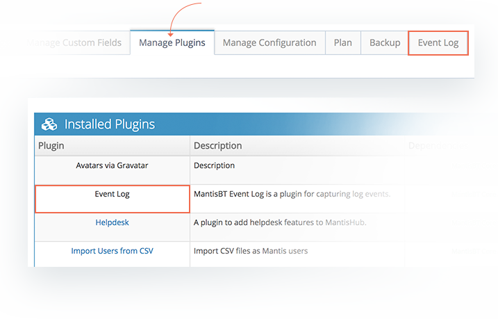
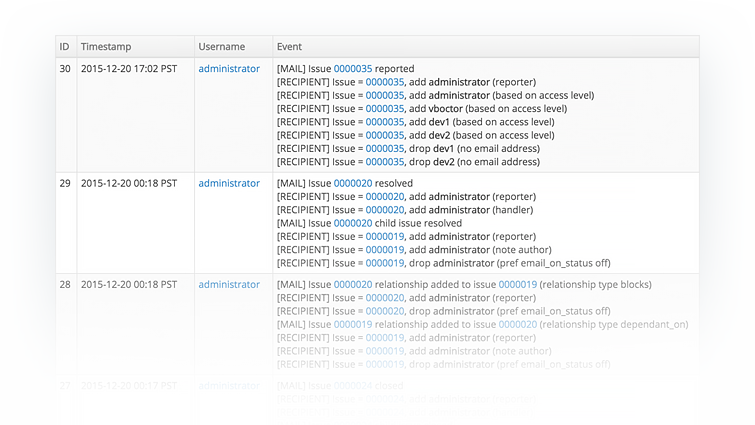

# Event Log for Email Notifications

Often users are not sure why a user did or did not receive an email notification about an action on a particular issue. There are a number of things you can check when email notifications are not working as expected. Have a read of this article [Troubleshooting Email Notifications](/issue_management/troubleshoot_emailnotif) for details. 

One of the steps listed in the troubleshooting process is to check your Event Log. To help tracking down email notification issues as well as [password reset emails](/user_management/reset_password), MantisHub provides an Event Log plugin that administrators can install and review for in-depth information on emails sent by the system. 

The Event log will identify:

- The issue action that has triggered the email notification (e.g. issue resolved),
- A timestamp
- The user that has triggered the action (listed by username)
- A high level description 
- List of users added or dropped from the email notification list and why they were added or removed (e.g. access level, relation to the issue, etc). 

You should be familiar with [Configuring Email Notifications](/issue_management/config_email_notifs) to enable you to interpret the Event Log.

Administrators can install the plugin by going to *Manage – Manage Plugins* and clicking the Install button next to the EventLog plugin listed under Available Plugins.  This will start the process of recording diagnostic information on email notifications and create a new 'Event Log' tab available in the *Manage* page. 

It is recommended that the Event Log only be enabled for troubleshooting purposes and **should not be left running for extended periods of time.** Once you have obtained the necessary information from the Event Log, you can uninstall the plugin in the Manage Plugins tab. If you feel the Event Log is becoming too congested, you have the option to 'Clear all events'.  

Below is a screenshot showing some sample output for the EventLog plugin that administrators can access by going to Manage – Event Log.

Some common messages you may come across:

- ***[MAIL] Issue `0000200` updated*** - This shows the issue and the action taken which triggered an email notification. 

- ***[MAIL] failed - invalid address*** - you will see this error if the email address for the user is found to be invalid. In some cases, the email address may have been corrected since then, but emails may have been queued for the old address and are being retried.  Contact [support](/system_management/event_log_email_notifs#:~:text=being%20retried.%20%C2%A0Contact-,support,-to%20clear%20out) to clear out emails stuck in the queue.

- ***[MAIL_VERBOSE]*** - This shows more logging information related to constructing and sending emails.

Common reasons a user is added or removed from the email notifications list:

- **Based on access level** - this shows the trigger setting for the project is based on access level and the user was added or dropped according to their project access level e.g. all managers have been configured to received this notification. 

- **Reporter, handler, monitor, category owner or note author** - this shows a user was added or removed based on their relationship to the issue e.g. the reporter or handler ('assigned to' user) of the issue.

- **No email address**  - this shows there is no email address listed for this user.  This can be fixed by user via their preferences or by the administrator.

- **Own actions** - this is generally a drop action. By default, users do not get notified of their own actions. You can however enable these notifications. Have a read of [this article](/customizations/email_own) for details on how to turn this on. 

- **Pref email_on_status off** - This shows a user has been added or dropped to a notification according to their personal account email preferences. Common reasons a user is added or removed from the email notifications list
