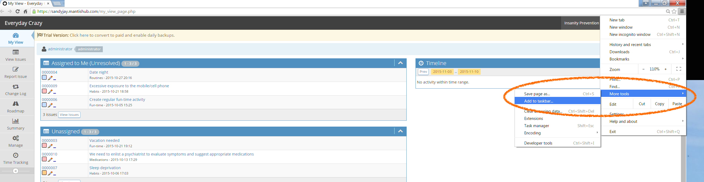
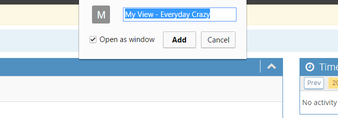
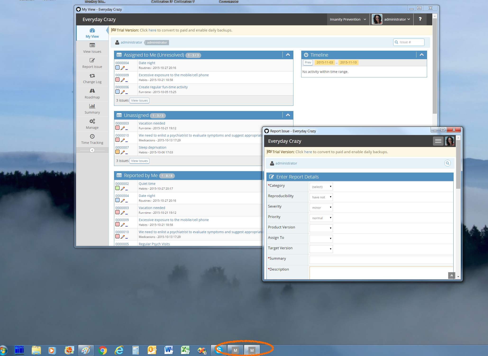
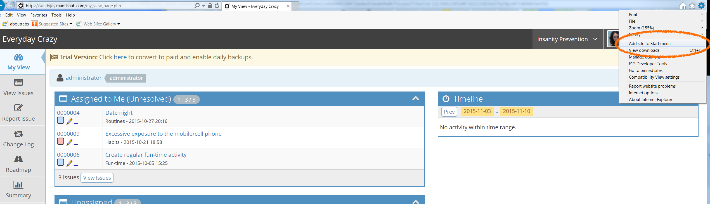

# MantisHub Web App Shortcuts

For Windows and Linux users Chrome and IE now have features that allow you to add web applications to your taskbar or start menu so that you can launch your web app straight from your desktop rather than having to open it through your browser.

This could be really useful to use with your MantisHub. It means you wont have to open your browser and enter your MantisHub address and credentials every time you need to access it. 

**For Chrome**:

Browse to your MantisHub address and log in. Go to the page you would like to launch your app from. This could be your 'My View' page or 'View Issues' page for example. 

Then go to your Chrome Settings, 'More tools' and select 'Add to taskbar'. 

`*`NB: In some Chrome versions the menu options are 'Tools' and 'Create application shortcut' and you'll be given options to add to the desktop or start menu as well.   

You can choose to have it open in it's own window. With this view, there's no address bar to allow more space for your app.   

You may want to add a few shortcuts to take you to different mantishub pages. Maybe one to take you straight to my view and another when you want to report an issues. 

Another shortcut option for you is to right click on the tab in Chrome and select 'Pin tab'. This truncates the tab title so it only shows the favicon and also will auto open with Chrome. This option is supported for MAC OS.

**For IE**:

Browse to your page of choice, go to Settings and select 'Add Site to Start Menu'. You can now launch the page directly from the Start menu or right click from there to pin it to the taskbar or create a desktop shortcut.

Another way to do it in IE is to open up a new tab and drag the page you want from the frequent pages listed down to your task bar.