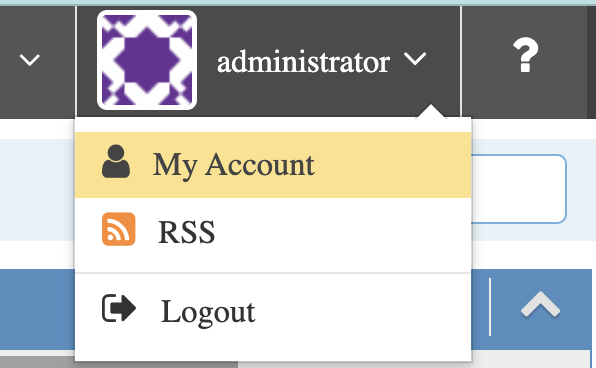
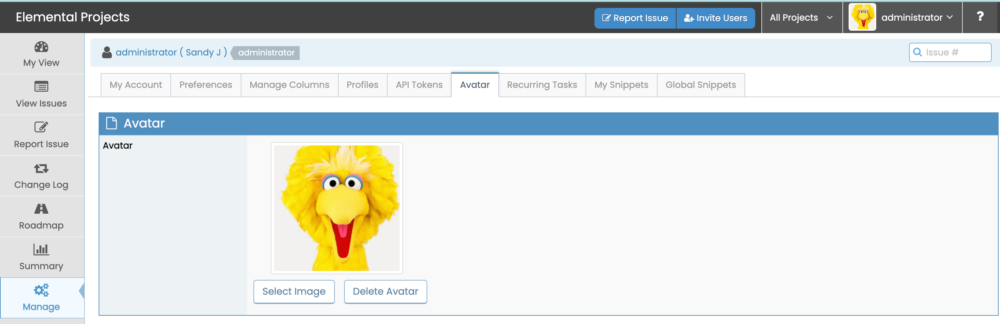

# Setup Your Avatar Image

MantisHub provides a couple of ways that users can define a profile image or avatar for their MantisHub account. The image defined will be used throughout the system along with references to the user.

## Option 1 - Local Avatar Plugin
This option is exclusive to MantisHub users and allows you to upload an image directly within your MantisHub service. Images must be no bigger than 1MB and the plugin supports jpeg and png formats. 

The plugin should be installed by default so just head to 'My Account' which you will find in the dropdown menu next to your username in the top right corner. 

Select the 'Avatar' tab and click Select Image. Browse through to select the image for upload. You'll see the new image next to your username in the top right corner.

You can go back and Select Image to upload a new one or Delete Image to go back to the default generic image or fallback to option 2 - Gravatar. 

## Option 2 - Gravatar
If you already use or would like to use the [Gravatar](http://gravatar.com/) service, Mantis will automatically retrieve user avatars linked to your registered email address for which a profile exists in Gravatar. It retrieves the data based on a one way hash of the user email address. To setup this option, you will have to be registered on Gravatar with the same email address you use on MantisHub. You can begin the sign up process via [this link](https://gravatar.com/connect). Once signed up, as long as the MantisHub email and Gravatar email match, the image will automatically start appearing in MantisHub. 

## Precedence

You can have both Gravatar setup and a local uploaded image under My Account. Note that the uploaded image via My Account will take precedence and be displayed instead of the Gravatar image. So if you wish to use the Gravatar image primarily, you will need to delete the uploaded image. 
