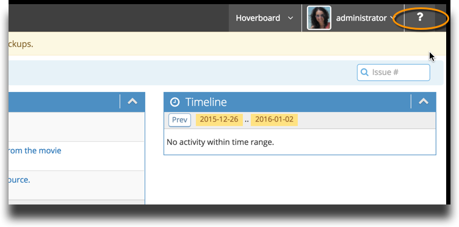

# Contacting MantisHub Support

If you have any questions when using MantisHub or if you want some more information, MantisHub has several facilities set up for you to tap into.

**How to Contact Us**

We have a friendly and helpful support team waiting to answer your queries. We love when you reach out to us, so don't be shy!

You can contact us by emailing `support@mantishub.com`

When you contact us, be sure to include your MantisHub URL name and to avoid confusion keep different issues or topics in separate email threads. 

You may want to check our [knowledge base](https://support.mantishub.com) first to see if the answer is immediately available. You can access it via the ? button in your MantisHub or directly browse to suppport.mantishub.com.

**Other Sources of Help**

Feel free to contact the support team with any questions you have but we may already have the answers for you in our [Knowledge Base Articles](/), [Video Tutorials](https://www.mantishub.com/tutorials) or on our [blog](http://blog.mantishub.com/). 

**SLA**

We aim to get back to you within 48 hrs. For customizations, expect a turn-around of up to 3 days. Migrations can be scheduled with 2 weeks notice and are done over a weekend.

 
**Keep up to date**

You can follow us on our [blog](http://blog.mantishub.com/), [twitter](https://twitter.com/mantishub), and [facebook](https://www.facebook.com/mantishub) as we're constantly posting news, tips and tricks. Or subscribe to our [YouTube channel](https://www.youtube.com/channel/UCUi5AGATm0XGUVmX2s4mvEA/featured) for tutorials and how-to videos as they post.

 

And please don't forget to provide feedback for us. We think we're pretty good ;) but we're always looking to be better. 

 

Looking forward to talking with you!