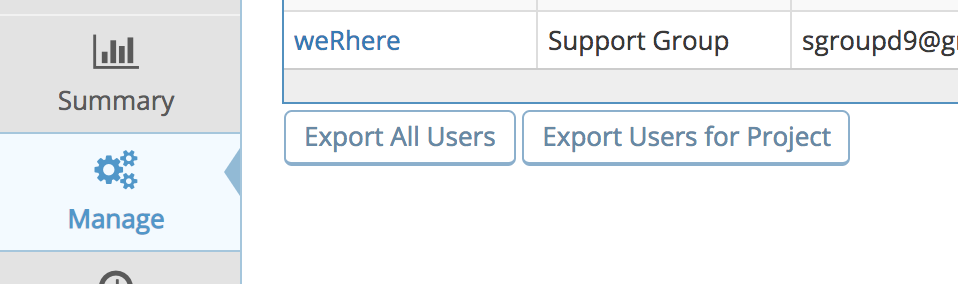

# Exporting Users Information

For easy access to information on all your users, you can utilize MantisHub's Export Users feature. Designed to help in auditing and management of user access to your system, it provides a csv file that includes information on your enabled MantisHub user accounts including:

- Username
- Real name
- Rmail address
- Global access level
- Project access level 
- Date user was created
- Last time the user logged in

To export information, head to 'Manage' -> 'Manage Users'. If you have your [project selector](/project_management/project_selector) set to "All projects", then you will only see the one option to *"Export all users"*.

If you have a specific project selected in the [project selector](/project_management/project_selector), you will see 2 options below the list of users for export. Either *"Export All Users"* which will export all your system users or *"Export Users for Project"* which will only export users with access to that project including their project level access. 

When you click the export button, a csv file will be automatically generated and downloaded which you can review and amend as you like. The file will be named "all users.csv" OR named after the project for which you exported the users.   

Note that the exported users will only be filtered based on the [project selector](/project_management/project_selector). You can not further filter the list of users to be exported using other user management filters at this stage (e.g. first letter, unused, new etc)