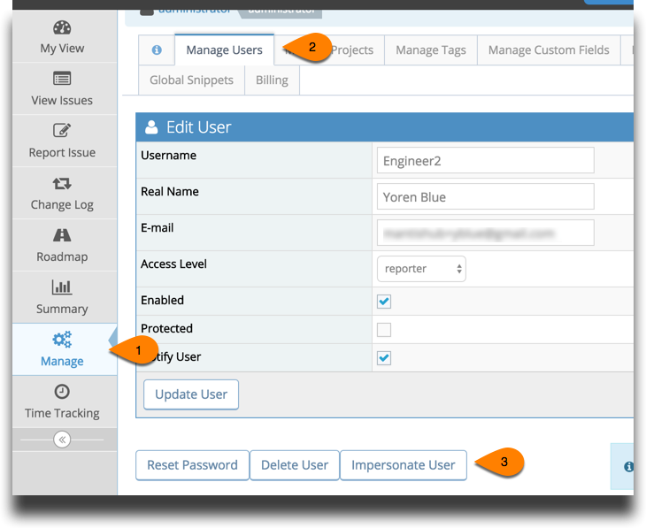

# Impersonating Users

MantisHub's flexibility in assigning [access levels](/user_management/auth_access_levels) and tailoring workflows is super useful but you will want to make sure in some cases that your users can see and do exactly what you intend.

Administrators have a tool to allow them to test users access levels. When Managing users, administrators have ability to impersonate users within their MantisHub. Go to 'Manage' - 'Manage Users' and select the user you wish to impersonate. 

You'll then be logged into the system as that user. You can test and confirm that their account acts as expected. You can also use this to reproduce any MantisHub issues your users might have.

That's a lot of power so only administrators have access to do this.  Impersonate responsibly :)